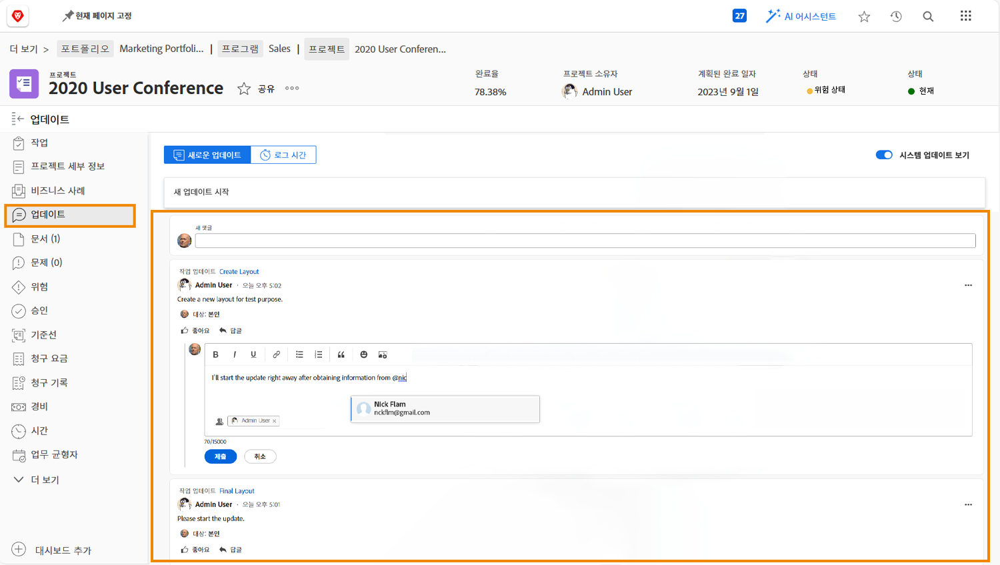

# 프로젝트 통신 이해

프로젝트 경영의 90%는 의사소통이다. 프로젝트 팀, 관리자 및 프로젝트 이해 관계자와 커뮤니케이션

하지만 프로젝트 팀이 프로젝트 커뮤니케이션에 이메일, 인스턴트 메시징, 회의, 스티커 메모 등을 사용하면 정보가 산란됩니다... 더 나빠지거나 잊혀집니다. 에서 프로젝트 자체에 대한 프로젝트 작업에 대한 커뮤니케이션을 유지합니다. [!DNL Workfront] 업데이트 사용.

프로젝트 팀 구성원이 할당에 대해 작업하면서 [!DNL Workfront] [!UICONTROL 홈] Analytics Mobile Apps 또는 Analytics Premium이 있어야 합니다.

작업, 문제 및 문서의 업데이트가 프로젝트 수준으로 롤업됩니다 [!UICONTROL 업데이트] 탭, 정보를 빠르고 쉽게 볼 수 있습니다.

그런 다음 버튼을 클릭하기만 하면 업데이트에 응답할 수 있습니다. 이렇게 하면 모든 대화가 한 곳에서 유지되므로 나중에 다시 볼 수 있습니다.

<!---
learn more urls
Communicate about work in Home
Subscribe to items in Workfront
Update work
--->
