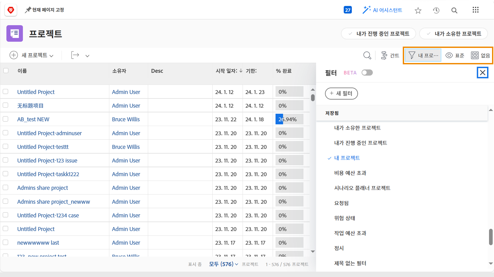
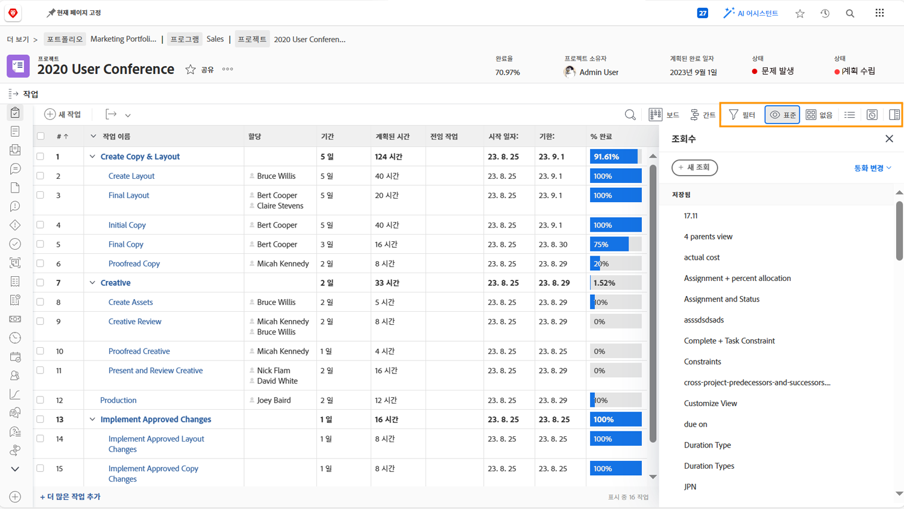

# 프로젝트 정보 보기

메인을 보고 있든 [!UICONTROL 프로젝트] 페이지 또는 개별 프로젝트에서 목록을 미세 조정하여 필요한 정보를 확인합니다 [!UICONTROL 필터], [!UICONTROL 보기], 및 [!UICONTROL 그룹화].

모든 프로젝트가 다음에서 어떻게 진행되는지 세부적으로 볼 수 있습니다. [!UICONTROL 프로젝트] 페이지를 가리키도록 업데이트하는 중입니다.

사용 [!UICONTROL 필터] 을 눌러 특정 기준에 따라 목록의 범위를 좁힙니다. 그런 다음 을 선택합니다. [!UICONTROL 보기] 프로젝트와 관련된 정보 열을 표시합니다. 마지막으로 [!UICONTROL 그룹화] 귀하가 이해할 수 있는 방식으로 프로젝트를 구성합니다.

다음에 있을 때 [!UICONTROL 작업] 프로젝트의 섹션, 활용 [!UICONTROL 필터], [!UICONTROL 보기], 및 [!UICONTROL 그룹화] 다시 한 번 진행 중인 작업을 모니터링하는 데 도움이 됩니다. 프로젝트 대신 작업을 보고 있으므로 선택 사항이 완전히 다릅니다.

많음 [!DNL Workfront] 고객은 사용자 정의 양식 정보 및 수행 중인 작업과 관련된 기타 필드를 표시하는 사용자 정의 보기를 만듭니다.

## 사용자 정의 필터, 보기 및 그룹화를 만드는 방법을 알아봅니다

[기본 필터 만들기](https://experienceleague.adobe.com/docs/workfront-learn/tutorials-workfront/reporting/basic-reporting/create-a-basic-filter.html?lang=en)

[기본 보기 만들기](https://experienceleague.adobe.com/docs/workfront-learn/tutorials-workfront/reporting/basic-reporting/create-a-basic-view.html?lang=en)

[기본 그룹화 만들기](https://experienceleague.adobe.com/docs/workfront-learn/tutorials-workfront/reporting/basic-reporting/create-a-basic-grouping.html?lang=en)
