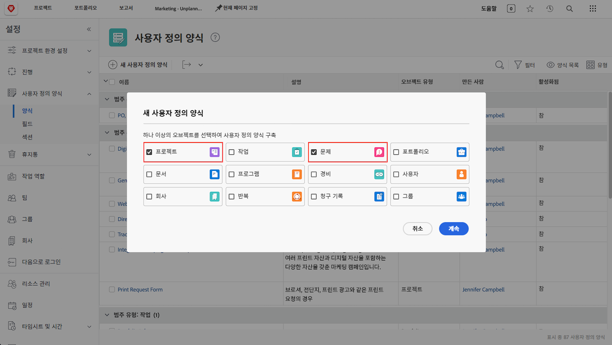
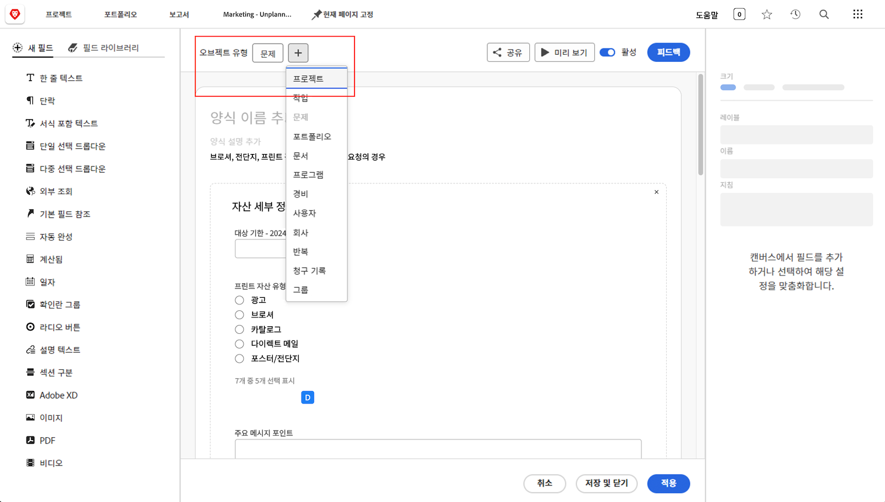

# 요청 대기열에 대한 일반적인 질문에 대한 답변

**나는 요청 대기열을 볼 수 있지만 내 사용자가 요청 대기열을 볼 수 없는 이유는 무엇입니까?**

요청 대기열/프로젝트의 [!UICONTROL 대기열 세부 사항] 탭에서 사용자가 “이 대기열에 요청을 추가할 수 있는 사람” 필드의 기준에 부합하는지 확인하십시오.

다음 비디오를 통해 자세한 내용을 살펴보십시오.

>[!VIDEO](https://video.tv.adobe.com/v/3434156/?quality=12&learn=on&enablevpops)

**사용자에게 대기열에 대한 액세스 권한을 부여했지만 사용자가 요청 대기열 프로젝트도 볼 수 있는 상태입니다. 이유가 무엇입니까?**

“누가 이 대기열에 요청을 추가할 수 있습니까?” 목록에서 “이 프로젝트에 대한 보기 액세스 권한이 있는 사람”을 선택하면 요청 대기열을 사용하기 위해 보기 권한을 부여한 모든 사람도 프로젝트 목록에서 요청 대기열을 조회할 수 있습니다. 이를 방지하려면 “이 프로젝트 회사의 사용자” 또는 “이 프로젝트 그룹의 사용자” 옵션을 사용하십시오.

**요청을 프로젝트로 전환할 수 있습니까?**

예. 필요한 항목에 따라 문제를 작업 또는 프로젝트로 전환할 수 있습니다.

다음 튜토리얼을 통해 방법을 알아보십시오.

* [문제/요청을 프로젝트로 전환](/help/manage-work/issues-requests/create-a-project-from-a-request.md)

* [문제/요청을 작업으로 전환](/help/manage-work/issues-requests/convert-issues-to-other-work-items.md)

**편집할 요청 대기열은 어디에서 찾을 수 있습니까?**

탐색 막대의 [!UICONTROL 검색] 필드를 사용하거나 [!UICONTROL 프로젝트] 영역의 목록에서 찾을 수 있습니다.

요청 대기열에서 요청을 열면 경로 영역에서 프로젝트 이름을 클릭할 수 있습니다.

**요청 사용자 정의 양식에서 프로젝트 사용자 정의 양식으로 정보를 전송할 수 있습니까?**

예. 사용자 정의 양식을 만들 때 [!UICONTROL 프로젝트]와 [!UICONTROL 문제] 모두 오브젝트 유형으로 선택하십시오. 프로젝트 사용자 정의 양식을 편집하여 문제 오브젝트 유형을 포함시킬 수 있으며, 그 반대의 경우도 가능합니다.

요청에 사용자 정의 양식을 첨부하십시오. 요청을 프로젝트로 전환하면 사용자 정의 양식이 새 프로젝트에 자동으로 첨부되고, 모든 필드에 포함된 값이 요청 및 프로젝트 사용자 정의 양식 모두에 나타납니다.

**프로젝트 또는 작업 보고서를 보고 있습니다. 한 오브젝트가 어떤 요청에서 비롯되었는지 확인하려면 어떻게 해야 합니까?**

**[!UICONTROL 전환된 문제]** 및 **[!UICONTROL 전환된 문제 제시자]** 필드 소스의 필드에 액세스하여 해당 정보를 프로젝트 및 작업 보고서에 추가할 수 있습니다.

다음 비디오를 통해 자세한 내용을 살펴보십시오.

>[!VIDEO](https://video.tv.adobe.com/v/3434176/?quality=12&learn=on&enablevpops)

**보고서에서 요청 대기열을 필터링하는 가장 좋은 방법은 무엇입니까?**

프로젝트 필터에 **대기열>>공개>>같음>>없음**&#x200B;이 포함된 경우 보고서에는 요청 대기열이 **아닌** 프로젝트만 표시됩니다.

프로젝트 필터에 **대기열>>공개>>같지 않음>>없음**&#x200B;이 포함된 경우 보고서에는 요청 대기열에 **해당하는** 프로젝트만 표시됩니다.

다음 비디오를 통해 자세한 내용을 살펴보십시오.

>[!VIDEO](https://video.tv.adobe.com/v/3434329/?quality=12&learn=on&enablevpops)

**요청 대기열에 사용자 정의 상태를 만드는 것이 좋은 방법입니까?**

일부 고객은 현재와 동일한 요청 대기열의 사용자 정의 상태를 만듭니다. 그런 다음 이들 고객은 모든 요청 대기열을 보여 주는 보고서를 실행하거나 보고서에서 요청 대기열을 손쉽게 제외시킬 수 있습니다. 이 방법은 **대기열 > 공개 > 같지 않음 > 없음**&#x200B;을 사용하는 것보다 사용자 친화적이라는 장점이 있지만, 요청 대기열을 만드는 사람들이 이를 사용하는 것을 잊을 수 있다는 단점이 있습니다. 현재 상태도 마찬가지로 제대로 작동하며 대부분의 교육 자료에서 확인할 수 있는 내용이기 때문입니다. 이러한 이유로 대다수의 고객은 요청 대기열의 사용자 정의 상태를 사용하지 않습니다.

하지만 귀사에서 이미 요청 대기열 상태를 사용 중이고 해당 상태가 올바르게 사용되는지 확인할 방법(또는 사용되지 않는 경우 해결 방법)이 필요한 경우 위 비디오에서 설명하는 바와 같이 **활성 요청 대기열** 보고서를 만들고 **프로젝트 > 동일시된 상태 > 같음 > 현재** 필터를 **프로젝트 > 상태 > 같음 > 현재**&#x200B;로 변경할 수 있습니다. 이렇게 하면 원하는 요청 대기열 상태 대신 현재 상태를 사용하는 모든 활성 요청 대기열이 표시됩니다. 표시되는 모든 프로젝트를 선택하고 일괄 편집을 수행하여 상태를 요청 대기열로 변경하십시오.

## 이 주제와 관련된 추천 튜토리얼

* [요청 대기열 이해](/help/manage-work/request-queues/understand-request-queues.md)
* [요청 대기열 만들기](/help/manage-work/request-queues/create-a-request-queue.md)
* [요청 흐름에 대한 설정 이해](/help/manage-work/request-queues/understand-settings-for-a-flow-request.md)
* [요청 흐름 만들기](/help/manage-work/request-queues/create-a-request-flow.md)
* [시스템 관리자 피드백 요청 대기열 만들기](/help/manage-work/request-queues/create-a-system-admin-feedback-request-queue.md)
