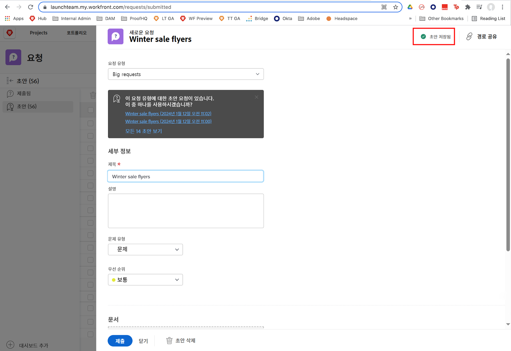
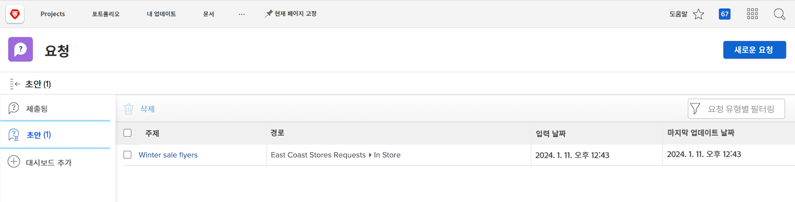

# 요청 대기열 이해

이 비디오를 통해 다음과 같은 사항을 알아볼 수 있습니다.

* 다음을 통해 요청을 제출하는 방법 [!DNL  Workfront] 요청 대기열
* 요청 대기열이 구성되는 방식

>[!VIDEO](https://video.tv.adobe.com/v/335220/?quality=12&learn=on)

## 초안 요청 자동 저장

요청 양식을 작성하기 시작하면 [!UICONTROL 제목] 필드를 입력한 후 [!DNL Workfront]에서 초안을 자동으로 저장합니다. 즉, 에서 멀리 이동해야 하는 경우 데이터가 손실되지 않습니다. [!UICONTROL 요청] 다른 작업을 수행하거나 요청 중간에 일시 중지해야 추가 정보가 수집되는 영역입니다.

창의 맨 위에 초안이 저장되었다는 표시가 나타납니다. [!DNL Workfront] 필수 필드가 아직 채워지지 않았더라도 요청 초안이 저장됩니다.

요청을 제출할 준비가 되면 [!UICONTROL 초안] 탭. 이름을 클릭하여 열고 양식 작성을 마칩니다. 그런 다음 [!UICONTROL 요청 제출] 다 끝나면.

## 사용자 차례

잠시 시간을 내어 방금 제시된 정보를 검토해 보겠습니다.

**질문:** Workfront에서 어떻게 요청합니까? 단계를 순서대로 나열하십시오.

* 필요한 요청 유형 선택
* 요청 제출 클릭
* 양식에 정보 입력
* “새 요청” 클릭
* 요청 영역으로 이동

**답변:** 요청 영역으로 이동 > 새 요청 클릭 > 필요한 요청 유형 선택 > 양식에 정보 입력 > 요청 제출 클릭

**질문:** 요청은 ...

**답변:** 문제임

<!---
You can also access request drafts from the [!UICONTROL Select a Request Type] menu at the top of the window. Select an option from the [!UICONTROL Recent Drafts] section, or start a new request by picking a queue from the [!UICONTROL New Requests] section. Fill everything out like normal, then submit the request.

<!---
image
--->

<!---
Let's take a minute to review the information you were just presented.

How do you make a request in Workfront? List the steps in order.
Choose the request type you need to make
Click Submit request
Fill out the information on the form
Click "New Request"
Navigate to the request area

Answer: Navigate to the request area>Click New Request>Choose the request type you need to make>Fill out the information on the form>Click Submit request

A request is really an......

Answer: Issue
--->
