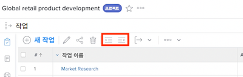
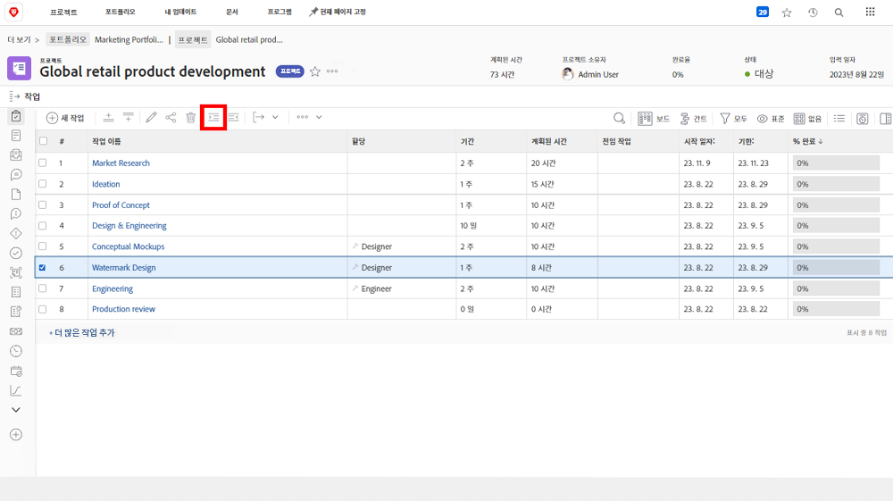
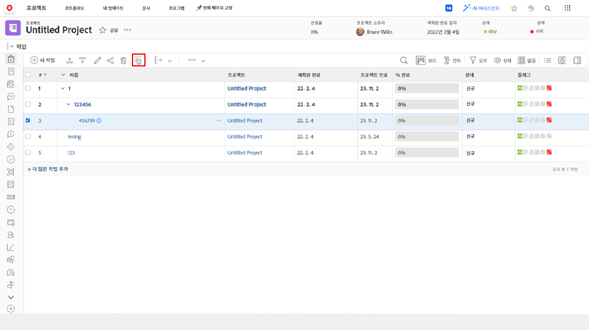

# 상위-하위 작업 이해

이 비디오를 통해 다음과 같은 사항을 알아볼 수 있습니다.

* [!DNL Workfront] 프로젝트에서 작업을 구성하는 방법

>[!VIDEO](https://video.tv.adobe.com/v/335087/?quality=12&learn=on)

## 작업을 하위 작업으로 변경한 후 되돌리기

**들여쓰기** 및 **내어쓰기** 버튼은 작업을 하위 작업으로 변경하거나 하위 작업에서 비하위 작업으로 변경하는 데 사용합니다.

“[!UICONTROL 워터마크 디자인]”을 선택하고 **들여쓰기** 버튼을 클릭합니다. “[!UICONTROL 워터마크 디자인]”은 “[!UICONTROL 개념 모형]”의 하위 작업이 되며, 해당 모형이 상위 작업이 됩니다.

하위 작업인 경우 “[!UICONTROL 워터마크 디자인]”을 선택하고 **내어쓰기** 버튼을 클릭합니다. “[!UICONTROL 워터마크 디자인]”은 “[!UICONTROL 개념 모형]”과 같은 수준의 일반 작업이 됩니다.

