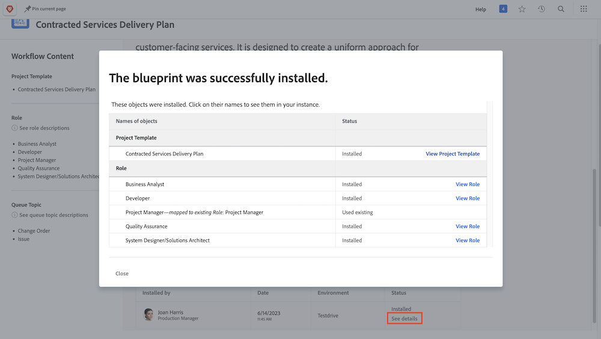

# 프로젝트 템플릿 만들기 및 [!UICONTROL 블루프린트]에 대해 알아보기

처음부터 기존 프로젝트에서 프로젝트 템플릿을 만드는 방법을 알아보고 [!UICONTROL 블루프린트]를 통해 Workfront 전문가가 만든 유용한 프로젝트 템플릿의 세계에 액세스하는 방법을 이해합니다.

## 프로젝트 템플릿 만들기

이 비디오에서는 다음 방법을 배우게 됩니다.

* 처음부터 템플릿 만들기
* 기존 프로젝트에서 템플릿 만들기

>[!VIDEO](https://video.tv.adobe.com/v/3415447/?quality=12&learn=on&enablevpops=1&captions=kor)

## [!UICONTROL 블루프린트]로 만든 템플릿

Workfront 사용자는 [!UICONTROL 블루프린트]를 사용하여 프로젝트 템플릿을 작성하는 데 도움을 받을 수 있습니다. 메인 메뉴에 있는 이 기능을 사용하면 부서 및 특정 성숙도를 대상으로 하는 사전 작성된 즉시 사용 가능한 템플릿에 액세스할 수 있습니다. 이러한 템플릿을 통해 사용자는 반복 가능한 프로젝트 만들기를 빠르게 시작하고 비슷한 범위의 프로젝트 간에 일관성을 유지할 수 있습니다.

라이선스가 있는 사용자는 누구나 Workfront에서 사용 가능한 블루프린트 목록을 찾아볼 수 있습니다. 새 프로젝트를 만들 때(예: 작업 또는 요청을 프로젝트로 전환할 때)는 블루프린트를 직접 적용할 수 없습니다. 블루프린트와 프로젝트 템플릿의 주요 차이점은 블루프린트는 템플릿을 만드는 데 사용되는 반면 템플릿은 프로젝트를 만드는 데 사용된다는 것입니다. **시스템 관리자가 블루프린트를 설치해야만 해당 템플릿을 만들 수 있습니다.**

관심 있는 블루프린트를 찾은 경우 이에 대해 자세히 알아보려면 **[!UICONTROL 세부 정보]**&#x200B;를 클릭하십시오.

[!UICONTROL 세부 사항] 화면에는 블루프린트가 설치된 경우 설치 기록을 포함하여 블루프린트에 대한 자세한 내용이 설명됩니다.

블루프린트가 설치된 경우 **[!UICONTROL 세부 사항 보기]**&#x200B;를 클릭하여 만들어진 템플릿과 해당 템플릿을 지원하기 위해 만들어진 기타 오브젝트의 링크를 가져올 수 있습니다.

블루프린트가 아직 설치되지 않은 경우 시스템 관리자에게 요청할 수 있습니다.

## 이 주제와 관련된 추천 튜토리얼

* [템플릿에서 직접 프로젝트 만들기](/help/manage-work/create-and-manage-project-templates/create-a-project-directly-from-a-template.md)
* [프로젝트 템플릿 공유](/help/manage-work/create-and-manage-project-templates/share-a-project-template.md)
* [기존 프로젝트 복사](/help/manage-work/manage-projects/copy-an-existing-project.md)
* [프로젝트 템플릿 비활성화](/help/manage-work/create-and-manage-project-templates/deactivate-a-project-template.md)
* [프로젝트 템플릿에서 프로젝트 팀 편집](/help/manage-work/create-and-manage-project-templates/edit-the-project-team-in-a-project-template.md)
