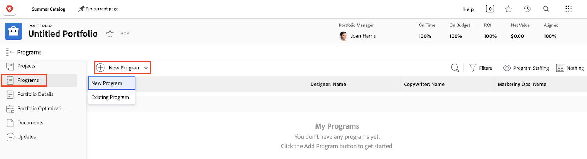

# 포트폴리오 이해

관리자는 종종 회사가 목표와 목적을 달성하는 데 가장 도움이 되는 프로젝트를 파악하는 까다로운 작업을 수행합니다. 해당 목표에 중요한 기준에 따라 현재 또는 잠재적인 프로젝트를 판단하는 것을 의미합니다. 이 기준에는 필요한 리소스의 수, 프로젝트에 드는 비용 대비 이익, 수반되는 위험 이해 등이 포함될 수 있습니다. 이 정보를 통해 관리자는 어떤 프로젝트를 언제 수행해야 할지 결정할 수 있습니다.

프로젝트를 생각하고 계획하는 것은 그다지 어려운 작업이 아니며 대부분의 관리자에게 익숙한 프로세스입니다. 프로젝트를 서로 비교하게 되면 일이 복잡해집니다. 길고 상세한 프로젝트 목록을 살펴보는 것은 시간이 많이 걸리는 작업입니다. Workfront의 포트폴리오라면 이러한 작업을 손쉽게 수행할 수 있습니다.

## 포트폴리오란 무엇입니까?

포트폴리오는 동일한 리소스, 예산, 일정 및 우선 순위에 대해 완료된 프로젝트 컬렉션입니다. 예를 들어 마케팅 대행사는 포트폴리오를 사용하여 특정 클라이언트에 대한 모든 프로젝트를 그룹화할 수 있습니다.

[!UICONTROL 메인 메뉴]에서 **[!UICONTROL 포트폴리오]** 섹션으로 이동한 다음 포트폴리오 이름을 클릭하여 엽니다.

**[!UICONTROL 새 프로젝트]** 버튼을 사용하여 기존 프로젝트를 포트폴리오에 쉽게 추가할 수 있습니다. 또는 포트폴리오에서 직접 새 프로젝트를 만들 수 있습니다.

![[!UICONTROL 새 프로젝트] 버튼의 드롭다운 메뉴 이미지](assets/01-portfolio-management3.png)

프로젝트가 포트폴리오에 추가되면 페이지 머리글의 요약 정보를 사용하여 프로젝트 컬렉션이 포트폴리오의 전체 목표에 긍정적 또는 부정적인 영향을 미치는 방식을 자세히 볼 수 있습니다.

[!UICONTROL 포트폴리오 최적화 도구]를 사용하여 순 가치, 정렬, 비용, 위험 및 ROI를 기반으로 프로젝트의 우선 순위를 지정할 수 있습니다.

## 포트폴리오 액세스

포트폴리오로 작업하려면 Workfront에서 플랜 라이선스를 할당받고, 포트폴리오를 사용할 수 있는 권한을 부여하는 액세스 수준을 할당받아야 합니다.

포트폴리오가 생성되면 포트폴리오 작성자 또는 관리자만 액세스할 수 있습니다. 포트폴리오를 공유하여 다른 사람에게 액세스 권한을 부여할 수 있습니다. 이는 포트폴리오의 모든 프로그램 및 프로젝트에 대한 액세스도 제공합니다.

포트폴리오를 열고 점 3개로 된 메뉴를 클릭한 다음 **[!UICONTROL 공유]**&#x200B;를 선택합니다. 액세스 권한이 있어야 하는 개인 사용자, 팀, 작업 역할, 그룹 또는 회사를 추가합니다. 그런 다음 각 사용자가 가져야 할 액세스 유형(관리 또는 보기)을 결정합니다.

![[!DNL Workfront] 포트폴리오의 [!UICONTROL 공유] 옵션 이미지](assets/04-portfolio-management11.png)

## 포트폴리오 만들기

포트폴리오를 만들려면 메인 메뉴에서 **[!UICONTROL 포트폴리오]**&#x200B;를 클릭합니다.

포트폴리오 영역에서 **[!UICONTROL 새 포트폴리오]**&#x200B;를 클릭합니다.

포트폴리오 이름을 지정한 다음 **[!UICONTROL 새 프로젝트]**&#x200B;를 클릭하여 포트폴리오에 프로젝트를 추가합니다. **[!UICONTROL 프로젝트]** 영역에서와 마찬가지로 다양한 방법으로 새 &#x200B;&#x200B;프로젝트를 만들 수 있습니다. 여기에서 생성하는 모든 새 프로젝트는 이 포트폴리오에 속하게 됩니다. **[!UICONTROL 기존 프로젝트]**&#x200B;를 클릭하여 목록에서 기존 프로젝트를 선택할 수도 있습니다.

## 포트폴리오 내에서 프로그램 만들기

**[!UICONTROL 프로그램]** 탭을 선택한 다음 **[!UICONTROL 새 프로그램]**&#x200B;을 클릭하여 이 포트폴리오 내에 새 프로그램을 만들거나 **[!UICONTROL 기존 프로그램]**&#x200B;을 클릭하여 다른 포트폴리오에서 기존 프로그램을 가져옵니다.

<!--
Pro-tips graphic
If a user can't access a specific portfolio, make sure it's shared with them. The Workfront access level determines that a user can access portfolios in general, but sharing makes sure they can see specific portfolios. 
-->

<!--
Learn more graphic and links to documentation articles
* Portfolio overview   
* Create a portfolio 
* Create and manage portfolios 
* Navigate within a portfolio 
* Share a portfolio   
-->
