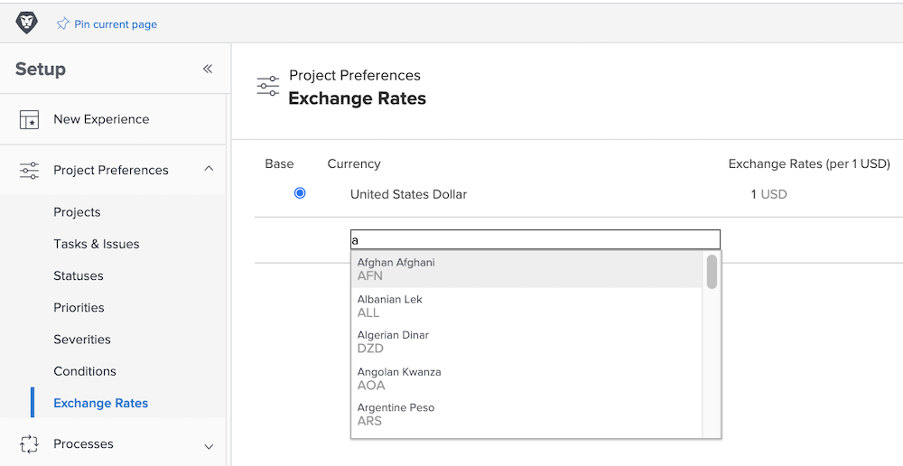

# 환율 설정

[!DNL Workfront]는 다국적 기업인 고객 조직을 위해 다양한 통화를 지원합니다. 환율은 프로젝트 및 보고서에 사용되어 전 세계의 다양한 통화로 재무 정보를 반영할 수 있습니다.

환율은 시스템 관리자가 관리합니다. 조직에 필요한 경우 추가 통화를 설정할 수 있습니다.

Workfront의 기본 통화는 미국 달러가 기본값입니다. 기본적으로 이 통화를 사용하여 재무 정보가 계산됩니다. 이 기본값은 전역적으로, 그리고 개별 프로젝트에서 변경할 수 있습니다.

## 통화 및 환율 설정

**메인 메뉴에서 [!UICONTROL 설정]을 선택합니다.**

1. 왼쪽 메뉴 패널에서 **[!UICONTROL 프로젝트 환경 설정]**&#x200B;을 확장합니다.
1. **[!UICONTROL 환율]**&#x200B;을 클릭합니다.
1. **[!UICONTROL 통화 추가]** 버튼을 클릭합니다.
1. 드롭다운에서 국가 통화를 선택합니다.
1. 통화에 대해 원하는 환율을 입력합니다.
1. 미국 달러 이외의 통화가 [!DNL Workfront] 시스템의 기본(기본값) 통화여야 하는 경우, 통화 이름 옆에 있는 버튼을 클릭합니다.
1. 모든 통화가 추가되면 **[!UICONTROL 저장]**&#x200B;을 클릭합니다.

>[!NOTE]
>
>Workfront는 환율에 대한 현재 시장 가치를 업데이트하거나 추적하지 않습니다. 필요한 경우 수동으로 업데이트해야 합니다.
