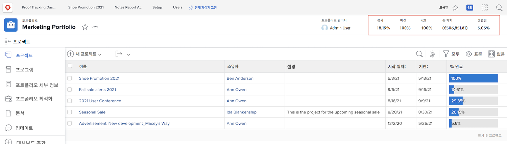
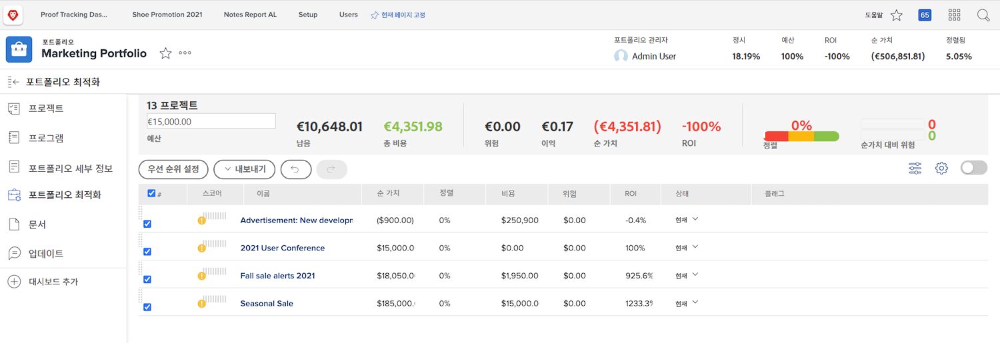

# 포트폴리오 개요

매니저들은 종종 어떤 프로젝트가 회사의 목표와 목표에 도달하는 데 가장 도움이 될 것인지를 결정하는 까다로운 일을 한다. 이는 현재 또는 잠재적 프로젝트를 해당 목표에 중요한 기준에 따라 판단하는 것을 의미합니다. 이 기준에는 필요한 리소스 수, 프로젝트 비용 및 프로젝트 비용 부담, 위험 수 등이 포함될 수 있습니다. 이런 정보를 가지고, 관리자들은 어떤 프로젝트를 먼저 해야 할지 결정할 수 있고 어떤 프로젝트를 뒤로 미뤄둘 수 있다.

프로젝트에 대한 생각과 계획은 지나치게 어려운 작업이 아닙니다. 대부분의 관리자들이 익숙한 프로세스입니다. 실제 싸움은 프로젝트 간에 비교하는 것이다. 길고 자세한 프로젝트 목록을 살펴보는 것은 시간이 많이 걸린다. 여기에서 포트폴리오는 [!DNL  Workfront] 도움이 될 수 있습니다.

## 포트폴리오란 무엇입니까?

포트폴리오는 동일한 리소스, 예산, 일정 및 우선 순위에 대해 완료되는 프로젝트 모음입니다. 예를 들어 마케팅 업체는 포트폴리오를 사용하여 특정 고객에 대한 모든 프로젝트를 그룹화할 수 있습니다.

로 이동합니다 **[!UICONTROL Portfolio]** 섹션 [!UICONTROL 기본 메뉴]를 클릭한 다음 포트폴리오 이름을 클릭하여 엽니다.

를 사용할 수 있습니다 **[!UICONTROL 새 프로젝트]** 기존 프로젝트를 포트폴리오에 쉽게 추가할 수 있는 단추입니다. 또는 포트폴리오에서 직접 새 프로젝트를 만들 수 있습니다.

![에 대한 드롭다운 메뉴의 이미지 [!UICONTROL 새 프로젝트] 버튼](assets/01-portfolio-management3.png)

프로젝트가 포트폴리오에 추가되면 페이지 헤더의 요약 정보를 사용하여 프로젝트 컬렉션이 전체 목표에 긍정적으로 또는 부정적으로 기여하는 방식에 대한 높은 수준의 보기를 얻을 수 있습니다.

또한 포트폴리오 최적화 도구를 사용하여 전반적인 전략적 목표를 지원하는 프로젝트의 우선 순위를 지정할 수 있습니다.

## 포트폴리오 액세스

포트폴리오에서 작업하려면 다음 위치에서 계획 라이센스를 지정해야 합니다. [!DNL Workfront] 포트폴리오 작업 권한을 제공하는 액세스 수준을 할당하고 있습니다.

포트폴리오가 만들어지면 포트폴리오 작성자나 관리자만 포트폴리오에 액세스할 수 있습니다. 공유하여 포트폴리오에 액세스할 수 있습니다. 또한 포트폴리오 내에서 만들어진 프로그램 및 프로젝트에 액세스할 수 있습니다.

포트폴리오를 열고 3점 메뉴를 클릭한 다음 선택합니다 **[!UICONTROL 공유]**. 액세스 권한이 있어야 하는 개인, 팀, 작업 역할, 그룹 또는 회사를 추가합니다. 그런 다음 각 액세스 유형에 대해 관리 또는 보기 유형을 결정합니다.

![의 이미지 [!UICONTROL 공유] 옵션 [!DNL Workfront] 포트폴리오](assets/04-portfolio-management11.png)

<!--
Pro-tips graphic
If a user can’t access a specific portfolio, make sure it’s shared with them. The Workfront access level determines that a user can access portfolios in general, but sharing makes sure they can see specific portfolios. 
-->

<!--
Learn more graphic and links to documentation articles
* Portfolio overview   
* Create a portfolio 
* Create and manage portfolios 
* Navigate within a portfolio 
* Share a portfolio   
-->
