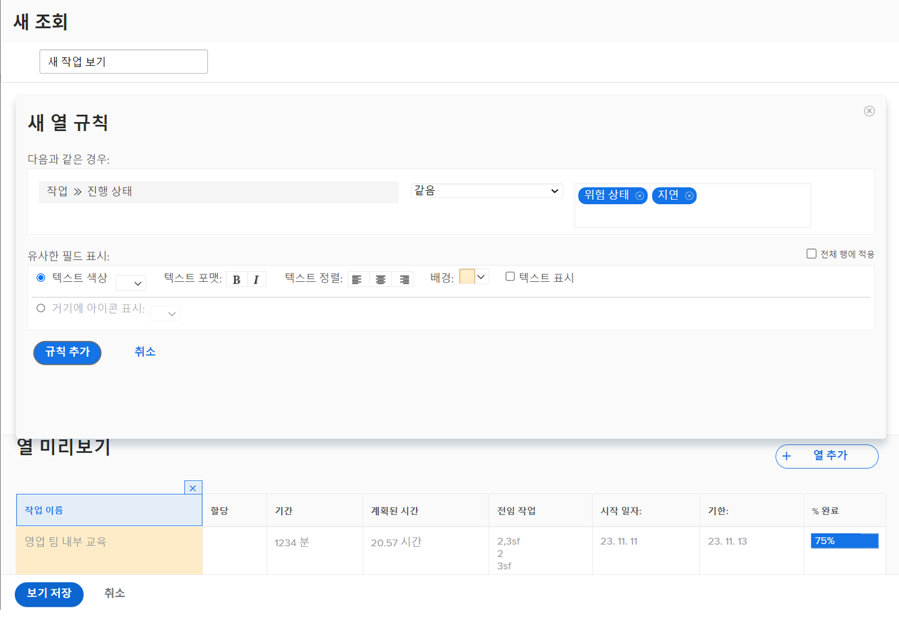

# 보기에 기본 조건부 서식 추가

조건부 서식은 열 규칙을 생성하여 수행됩니다. 열 규칙을 사용하면 설정한 기준에 따라 특정 방법으로 열 형식을 지정할 수 있습니다.

이 비디오를 통해 다음과 같은 사항을 알아볼 수 있습니다.

* 보기에 포함된 조건부 서식
* 조건부 서식을 만들고 수정하는 방법

>[!VIDEO](https://video.tv.adobe.com/v/335149/?quality=12&learn=on&enablevpops=0)

## 조건부 서식 요약

조건부 서식을 만드는 방법:

1. 서식을 표시할 열 선택
1. 서식을 변경할 상태 결정
1. 가장 효과적인 서식 유형 변경 결정

   * 배경 색상
   * 텍스트 색상
   * 대체 텍스트
   * 아이콘 표시

## “보기에 기본 조건부 서식 추가” 활동

### 활동 1: 보기에 조건부 서식 추가

기존의 표준 보기를 사용하고 [!UICONTROL 이름] 열에 이 조건부 서식을 추가하여 “표준 + 진행률”이라는 작업 보기를 만듭니다.

1. 작업의 진행 상태가 지연일 때 필드 배경을 빨간색으로 바꾸는 열 규칙을 추가합니다.
1. 진행 상태가 숨김 또는 위험 상태일 때 필드 배경을 노란색으로 바꾸는 열 규칙을 추가합니다.

이렇게 하면 보기의 일부로 진행 상태 열을 포함하지 않고 문제가 있는 작업을 찾을 수 있습니다.

### 답변 1

1. 작업 목록 보고서에서 **[!UICONTROL 보기]** 드롭다운 메뉴로 이동하고 **[!UICONTROL 새 보기]**&#x200B;를 선택합니다.
1. 보기 이름을 “표준 + 진행률”로 지정합니다.
1. 제공된 기본 열을 사용합니다.
1. [!UICONTROL 작업 이름] 열을 선택합니다. 조건부 서식을 적용하려는 열이므로, 작업의 진행 상태가 정시가 아닌 경우 빨간색 또는 노란색으로 표시됩니다.
1. Report Builder 창의 오른쪽 상단에 있는 **[!UICONTROL 고급 옵션]**&#x200B;을 클릭합니다.
1. **[!UICONTROL 이 열에 대한 규칙 추가]**&#x200B;를 클릭합니다.
1. 창 상단에 있는 [!UICONTROL 작업] > [!UICONTROL 이름]을 [!UICONTROL 작업] > [!UICONTROL 진행 상태]로 변경하여 열 규칙을 시작합니다. 필드에서 삭제하려면 [!UICONTROL 작업] > [!UICONTROL 이름] 옆에 있는 **[!UICONTROL X]** 아이콘을 클릭하기만 하면 됩니다.
1. 필드에 “진행”을 입력한 다음 [!UICONTROL 작업] 필드 소스에서 [!UICONTROL 진행 상태]를 선택합니다.
1. [!UICONTROL Equal] 한정자의 오른쪽 필드에서 **[!UICONTROL 지연]**&#x200B;을 선택합니다.
1. [!UICONTROL 텍스트 색상] 행에서 빨간색 배경을 선택합니다.
1. **[!UICONTROL 규칙 추가]**&#x200B;를 클릭하여 열 규칙을 저장합니다.
1. 이제 **[!UICONTROL 열 규칙 추가]**&#x200B;를 다시 클릭하여 다른 규칙을 추가합니다.
1. 이전과 마찬가지로 기준 필드에서 [!UICONTROL 작업] > [!UICONTROL 이름]을 삭제합니다. [!UICONTROL 작업] 필드 소스 아래의 [!UICONTROL 진행 상태]로 바꿉니다.
1. Equal 한정자 오른쪽 필드에서 [!UICONTROL 위험 상태]와 [!UICONTROL 숨김] 모두를 선택합니다.
1. [!UICONTROL 텍스트 색상] 행에서 노란색 배경을 선택합니다.
1. **[!UICONTROL 규칙 추가]**&#x200B;를 클릭하여 열 규칙을 저장합니다.
1. **[!UICONTROL 보기 저장]**&#x200B;을 클릭하여 보기를 저장합니다.
