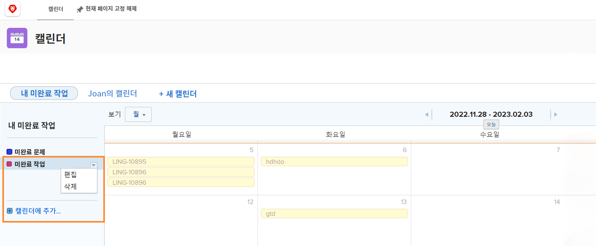

# 추가 달력 옵션 이해

이 섹션에서는 다음 방법을 알아봅니다.

* 일정 그룹 편집
* 일정 그룹 삭제
* 일정 공유

## 일정 그룹 편집

그룹을 편집하려면 캘린더의 이름 위로 마우스를 가져갑니다. 오른쪽에 표시되는 아래쪽 화살표를 클릭하고 을 선택합니다 **[!UICONTROL 편집]**.

## 일정 그룹 삭제

그룹을 삭제하려면 달력에서 해당 이름을 마우스로 가리킵니다. 오른쪽에 표시되는 아래쪽 화살표를 클릭하고 을 선택합니다 **[!UICONTROL 삭제]**.

## 달력 공유

프로젝트 관리자는 프로젝트 관리자, 팀 구성원 등과 같이 다른 사용자와 공유할 달력을 만들 수 있습니다.

1. 에서 **[!UICONTROL 기본 메뉴]**, 을 선택합니다. **[!UICONTROL 달력]** 영역.
1. 공유할 일정을 선택합니다.
1. 선택 **[!UICONTROL 공유]** 에서 **[!UICONTROL 달력 작업]** 드롭다운 메뉴
1. 일정을 공유할 사용자, 역할, 팀, 그룹 또는 회사의 이름을 입력합니다.
1. 사용자가 [!UICONTROL 보기] 또는 [!UICONTROL 관리] 달력 보고서에 대한 액세스 권한.
1. **[!UICONTROL 저장]**&#x200B;을 클릭합니다.

캘린더를 공유할 때 주목할 점은 다음과 같습니다.

* 을(를) 클릭합니다. **[!UICONTROL 톱니바퀴 아이콘]** 공유 창의 오른쪽 위 모서리에서 달력이 시스템 전체에 표시되도록 하거나 외부 사용자에게 공개되도록 합니다.
* [!UICONTROL 보기] 액세스를 사용하면 사용자가 달력을 볼 수 있지만 그룹화를 제어하는 필터를 변경할 수는 없습니다.
* [!UICONTROL 관리] 액세스를 사용하면 사용자가 달력을 보고 그룹화를 제어하는 필터를 변경할 수 있습니다.

## 공유 가능한 링크

다른 캘린더와 캘린더를 공유할 수 있습니다 [!DNL Workfront] 비공개 링크를 통한 사용자. 이렇게 하면 의 달력으로 바로 이동합니다 [!DNL Workfront].

이 작업은 **[!UICONTROL 달력 작업]** 메뉴, 선택 **[!UICONTROL 공유 가능한 링크 가져오기]**. 여기에서 **[!UICONTROL 링크 복사]** 버튼을 클릭하고 URL을 이메일이나 다른 사람과 함께 인스턴트 메시지에 붙여넣습니다.

![이미지 [!UICONTROL 공유 가능한 링크 가져오기] screen](assets/calendar-3-1.png)
