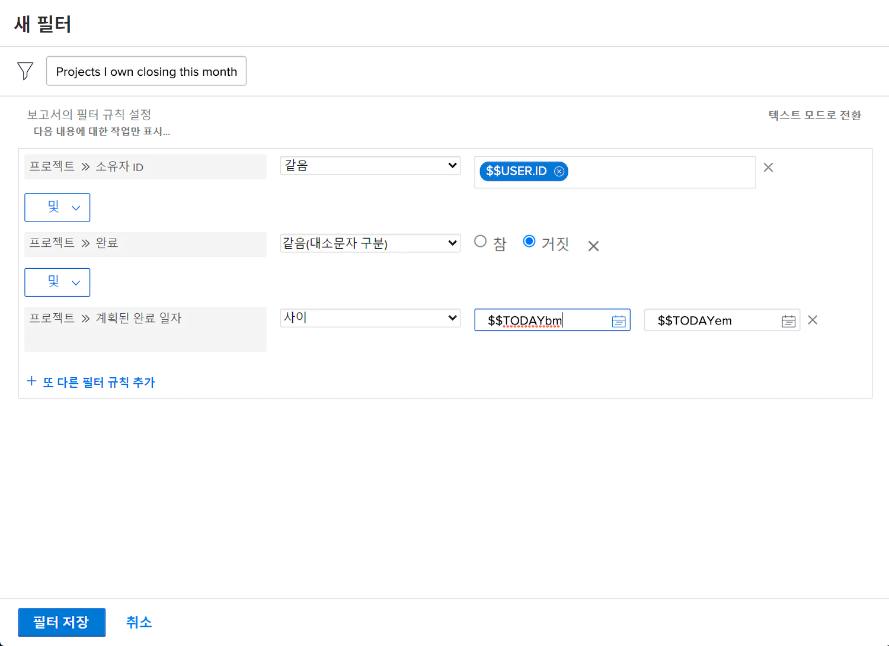

# 기본 필터 활동 만들기

## 활동 1 - 마케팅 포트폴리오의 모든 프로젝트

이 활동에서는 “마케팅 포트폴리오의 모든 프로젝트”라는 [!UICONTROL 기존 필터] 환경의 프로젝트 필터를 만듭니다. 그러면 상태에 상관없이 “마케팅 포트폴리오”라는 포트폴리오의 모든 프로젝트가 표시됩니다.

단계별 지침은 아래에 포함되어 있습니다.

## 활동 1에 대한 답변

1. [!UICONTROL 메인 메뉴]에서 [!UICONTROL 프로젝트] 영역으로 이동합니다. 그러면 프로젝트 목록이 표시됩니다.
1. **[!UICONTROL 필터]** 메뉴를 클릭하고 [!UICONTROL 기존 필터]를 선택합니다.
1. **[!UICONTROL 새 필터]**&#x200B;를 선택합니다.
1. 필터 이름을 “마케팅 포트폴리오의 모든 프로젝트”로 지정합니다.
1. **[!UICONTROL 필터 규칙 추가]**&#x200B;를 클릭합니다.
1. [!UICONTROL 필드 이름 입력 시작] 필드에 “[!UICONTROL 포트폴리오 이름]”을 입력합니다. [!UICONTROL 포트폴리오] 필드 소스 아래의 [!UICONTROL 이름]을 선택합니다.
1. [!UICONTROL 같음] 연산자를 그대로 둡니다.
1. [!UICONTROL 이름 입력 시작] 필드에 “[!UICONTROL 마케팅]”을 입력합니다.
1. 필터링할 해당 이름의 포트폴리오가 있다고 가정하고 [!UICONTROL 마케팅 포트폴리오]를 선택합니다. 그렇지 않은 경우 자동 완성 기능을 사용하여 원하는 포트폴리오를 찾습니다.
1. **[!UICONTROL 필터 저장]**&#x200B;을 클릭합니다.

## 활동 2 - 이번 달에 종료되는 내가 소유한 프로젝트

이 비디오에서는 “이번 달에 종료되는 내가 소유한 프로젝트”라는 [!UICONTROL 기존 필터] 환경의 프로젝트 필터를 만듭니다. 많은 프로젝트를 살펴보고 있다면 이 필터를 사용하여 곧 종료될 예정인 프로젝트를 확대할 수 있습니다.

단계별 지침은 아래에 포함되어 있습니다.

>[!VIDEO](https://video.tv.adobe.com/v/336807/?quality=12&learn=on&enablevpops)

## 활동 2에 대한 답변

1. [!UICONTROL 메인 메뉴]에서 [!UICONTROL 프로젝트] 영역으로 이동합니다. 그러면 프로젝트 목록이 표시됩니다.
1. **[!UICONTROL 필터]** 메뉴를 클릭하고 [!UICONTROL 기존 필터]를 선택합니다.
1. **[!UICONTROL 새 필터]**&#x200B;를 선택합니다.
1. 필터 이름을 “이번 달에 종료되는 내가 소유한 프로젝트”로 지정합니다.
1. **[!UICONTROL 필터 규칙 추가]**&#x200B;를 클릭합니다.
1. [!UICONTROL 필드 이름 입력 시작] 필드에 “소유자”를 입력합니다. [!UICONTROL 프로젝트] 필드 소스 아래의 [!UICONTROL 소유자 ID]를 선택합니다.
1. [!UICONTROL 같음] 연산자를 그대로 둡니다.
1. [!UICONTROL 이름 입력 시작] 필드에 “$$”를 입력합니다.
1. [!UICONTROL $$USER.ID]를 선택합니다. 로그인한 사용자의 와일드카드입니다.
1. 다시 [!UICONTROL 필터 규칙 추가]를 클릭합니다.
1. [!UICONTROL 필드 이름 입력 시작] 필드에 “완료됨”을 입력합니다. 그런 다음 프로젝트 필드 소스 아래의 [!UICONTROL 완료됨]을 선택합니다.
1. [!UICONTROL 같음] 연산자를 그대로 둡니다.
1. “False”를 선택합니다.
1. 다시 [!UICONTROL 필터 규칙 추가]를 클릭합니다.
1. [!UICONTROL 필드 이름 입력 시작] 필드에 “계획됨”을 입력한 다음 [!UICONTROL 프로젝트] 필드 소스 아래의 [!UICONTROL 계획된 완료 일자]를 선택합니다.
1. [!UICONTROL 같음] 연산자를 [!UICONTROL 이번 달]로 변경합니다.
1. **[!UICONTROL 필터 저장]**&#x200B;을 클릭합니다.
