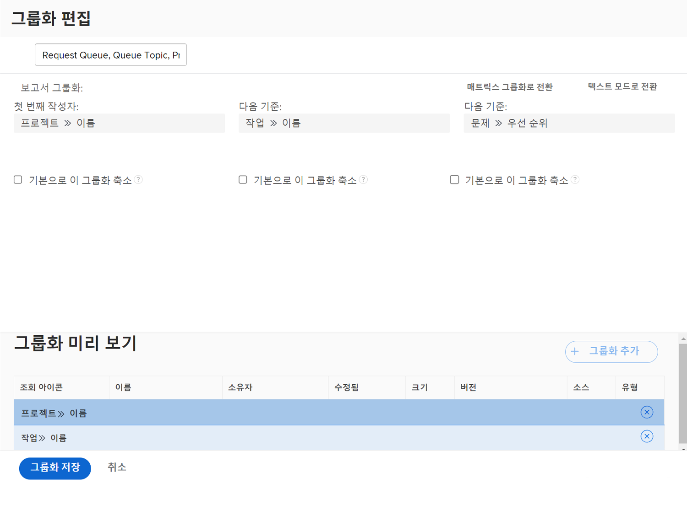

# 기본 그룹 만들기

이 비디오에서는 다음을 학습합니다.

* Workfront의 그룹화 기능
* 그룹을 만드는 방법
* 다른 Workfront 사용자와 그룹을 공유하는 방법

>[!VIDEO](https://video.tv.adobe.com/v/335147/?quality=12)

## 활동: 기본 그룹 만들기

보고서에서 요청 큐를 통해 들어오는 요청을 추적하는 데 사용할 문제 그룹을 만듭니다. 이 그룹화를 사용하면 우선 순위별로 그룹화된 유사한 유형의 문제/요청을 쉽게 볼 수 있습니다. 그룹화 이름을 &quot;요청 큐, 큐 주제, 우선 순위&quot;로 지정합니다.

문제 보고서를 다음 기준에 따라 그룹화합니다.

1. 요청 큐의 이름(프로젝트 이름)
1. 큐 항목
1. 요청의 우선순위

## 답변

1. 문제 목록 보고서에서 **[!UICONTROL 그룹화]** 메뉴 및 선택 **[!UICONTROL 새 그룹화]**.
1. 그룹화 이름을 &quot;요청 큐, 큐 주제, 우선 순위&quot;로 지정합니다.
1. 클릭 **[!UICONTROL 그룹화 추가]**.
1. 에서 [!UICONTROL 시작 기준] 필드. &quot;project name&quot;을 입력한 다음 **[!UICONTROL 이름]** 프로젝트 필드 소스 아래에 표시됩니다.
1. 클릭 **[!UICONTROL 다른 그룹화 추가]**.
1. 에서 [!UICONTROL 그리고 다음] 필드에 &quot;queue&quot;를 입력한 다음 **[!UICONTROL 이름]** 아래에 [!UICONTROL 큐 항목] 필드 소스.
1. 클릭 **[!UICONTROL 다른 그룹화 추가]**.
1. 에서 [!UICONTROL 그리고 다음] 필드에서 &quot;priority&quot;를 입력하고 **[!UICONTROL 우선순위]** 아래에 [!UICONTROL 문제] 필드 소스.
1. 클릭 **[!UICONTROL 그룹화 저장]**
