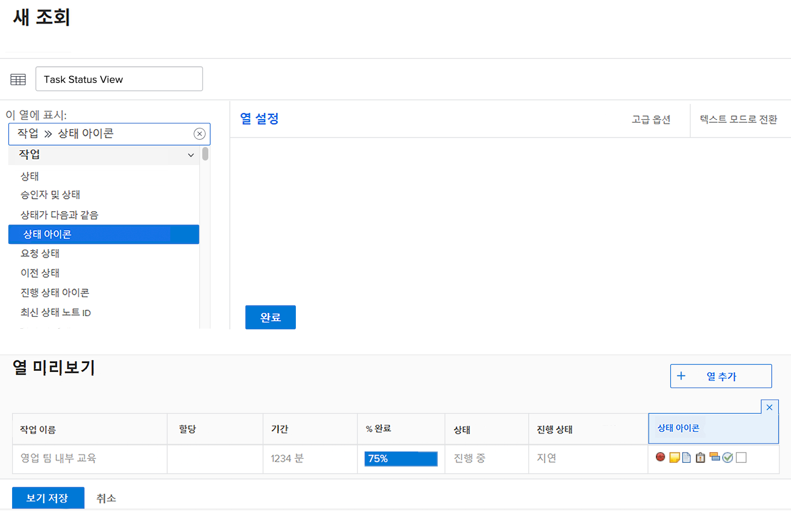
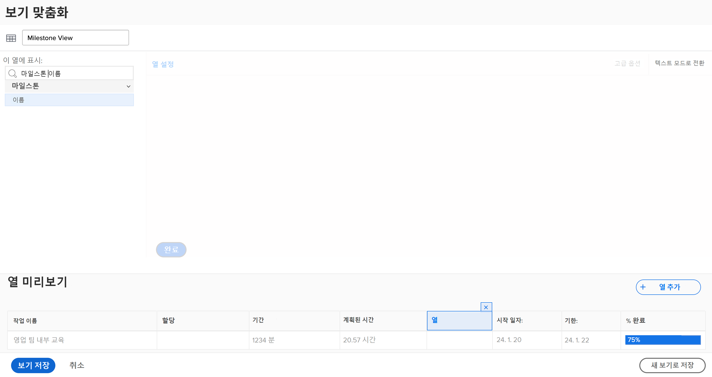
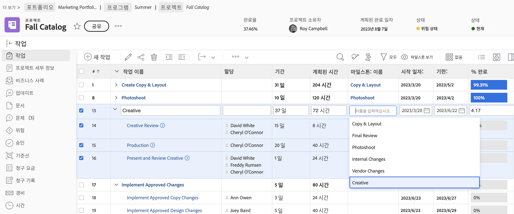
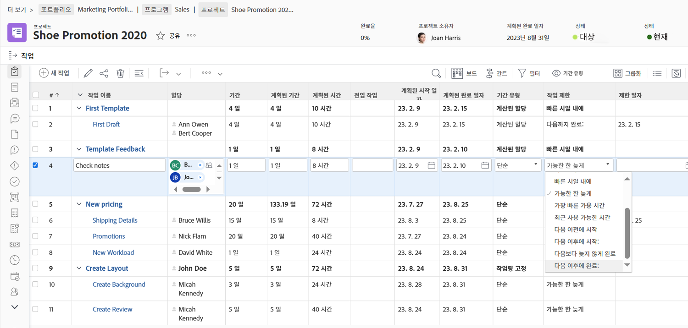

# 기본 보기 만들기

이 비디오를 통해 다음과 같은 사항을 알아볼 수 있습니다.

* Workfront에서 보기란
* 보기를 만들고 수정하는 방법
* 다른 Workfront 사용자와 보기를 공유하는 방법

>[!VIDEO](https://video.tv.adobe.com/v/335148/?quality=12&learn=on)

## 기본 보기 활동 만들기

이 페이지의 PDF를 다운로드하려면 [여기를 클릭](/help/assets/create-basic-view-activities.pdf)하십시오.

### 활동 1: 작업 상태 보기 만들기

프로젝트 관리자, 팀 리드 또는 리소스 관리자로서 작업 진행 상황을 추적하려고 합니다. 이 보기를 사용하면 목록 또는 보고서의 한 행에서 작업의 여러 상태 표시기를 모두 볼 수 있습니다.

다음 열을 사용하여 “작업 상태 보기”라는 작업 보기를 만듭니다.

* [!UICONTROL 작업 이름]
* [!UICONTROL 할당]
* [!UICONTROL 기간]
* [!UICONTROL 완료율]
* [!UICONTROL 상태]
* [!UICONTROL 진행 상태]
* [!UICONTROL 상태 아이콘]

### 답변 1

1. 작업 목록 보고서에서 **[!UICONTROL 보기]** 드롭다운 메뉴로 이동하고 **[!UICONTROL 새 보기]**&#x200B;를 선택합니다.
1. 보기 이름을 “작업 상태 보기”로 지정합니다.
1. [!UICONTROL 계획된 시간], [!UICONTROL 전임 작업], [!UICONTROL 시작 일자] 및 [!UICONTROL 기한] 열을 제거합니다.
1. **[!UICONTROL 열 추가]**&#x200B;를 클릭합니다.
1. [!UICONTROL 이 열에 표시] 필드에 “상태”를 입력한 다음 [!UICONTROL 작업] 필드 소스 아래에서 “상태”를 선택합니다.
1. 다시 **[!UICONTROL 열 추가]**&#x200B;를 클릭합니다.
1. [!UICONTROL 이 열에 표시] 필드에 “상태”를 입력한 다음 [!UICONTROL 작업] 필드 소스 아래에서 “진행 상태”를 선택합니다.
1. 다시 **[!UICONTROL 열 추가]**&#x200B;를 클릭합니다.
1. [!UICONTROL 이 열에 표시] 필드에 “상태”를 입력한 다음 작업 필드 소스 아래에서 “상태 아이콘”을 선택합니다.
1. **[!UICONTROL 저장]**&#x200B;을 클릭합니다.

[!UICONTROL 상태 아이콘] 열의 각 아이콘 위로 마우스를 가져가면 해당 아이콘이 무엇을 나타내는지 확인할 수 있습니다. 회색으로 표시된 아이콘은 작업에 메모, 문서, 승인 프로세스 등이 없음을 의미합니다. 아이콘이 컬러로 표시되어 있으면 작업과 관련된 해당 항목이 하나 이상 있는 것입니다. 메모 또는 문서 아이콘을 클릭하여 해당 항목으로 이동할 수 있습니다.

### 활동 2: 마일스톤 보기 만들기

마일스톤을 사용하는 경우 이 보기는 마일스톤을 이름별로 보고 인라인 편집을 사용하여 추가하거나 편집하는 가장 쉬운 방법입니다.

다음 열을 사용하여 “마일스톤 보기”라는 작업 보기를 만듭니다.

* [!UICONTROL 작업 이름]
* [!UICONTROL 할당]
* [!UICONTROL 기간]
* [!UICONTROL 계획된 시간]
* [!UICONTROL 마일스톤: 이름]
* [!UICONTROL 시작 일자:]
* [!UICONTROL 기한:]
* [!UICONTROL 완료율]

### 답변 2

1. 프로젝트 작업 목록에서 **[!UICONTROL 보기]** 드롭다운 메뉴로 이동하고 **[!UICONTROL 새 보기]**&#x200B;를 선택합니다.
1. 보기 이름을 “마일스톤 보기”로 지정합니다.
1. [!UICONTROL 전임 작업] 열을 클릭하여 선택합니다.
1. [!UICONTROL 이 열에 표시] 필드에서 [!UICONTROL 작업 >> 전임 작업] 필드의 X 아이콘을 클릭한 다음 “[!UICONTROL 마일스톤 이름]”을 입력하고 목록에서 “[!UICONTROL 이름]”을 클릭합니다.
1. **[!UICONTROL 저장]**&#x200B;을 클릭합니다.

### 활동 3: 기간 유형 및 작업 제한 사항 보기 만들기

이 보기를 통해 프로젝트의 모든 기간 유형 및 작업 제한 사항을 검사하고 편집할 수 있습니다.

다음 열을 사용하여 “기간 유형 및 작업 제한 사항 보기”라는 작업 보기를 만듭니다.

* [!UICONTROL 작업 이름]
* [!UICONTROL 할당]
* [!UICONTROL 기간]
* [!UICONTROL 계획된 기간]
* [!UICONTROL 계획된 시간]
* [!UICONTROL 전임 작업]
* [!UICONTROL 시작 일자:]
* [!UICONTROL 기한:]
* [!UICONTROL 기간 유형]
* [!UICONTROL 작업 제한 사항]
* [!UICONTROL 제한 일자]

[!UICONTROL 시작 일자] 및 [!UICONTROL 기한] 열에서 [!UICONTROL 필드 형식]을 일자와 시간을 모두 표시하도록 변경합니다.

### 답변 3

1. 프로젝트 작업 목록에서 **[!UICONTROL 보기]** 드롭다운 메뉴로 이동하고 **[!UICONTROL 새 보기]**&#x200B;를 선택합니다.
1. 보기 이름을 “기간 유형 및 작업 제한 사항 보기”로 지정합니다.
1. [!UICONTROL 완료율] 열을 제거합니다.
1. **[!UICONTROL 열 추가]**&#x200B;를 클릭합니다.
1. [!UICONTROL 이 열에 표시] 필드에서 [!UICONTROL “기간”]을 입력한 다음 [!UICONTROL 작업] 필드 소스 아래에서 [!UICONTROL “계획된 기간”]을 선택합니다.
1. 이 열을 [!UICONTROL 기간] 열과 [!UICONTROL 계획된 시간] 열 사이로 이동합니다.
1. 다시 **[!UICONTROL 열 추가]**&#x200B;를 클릭합니다.
1. [!UICONTROL 이 열에 표시] 필드에서 [!UICONTROL “기간 유형”]을 입력한 다음 [!UICONTROL 작업] 필드 소스 아래에서 [!UICONTROL “기간 유형”]을 선택합니다.
1. 다시 **[!UICONTROL 열 추가]**&#x200B;를 클릭합니다.
1. [!UICONTROL 이 열에 표시] 필드에서 [!UICONTROL “제한”]을 입력한 다음 ‘작업’ 필드 소스 아래에서 [!UICONTROL “작업 제한 사항”]을 선택합니다.
1. 다시 **[!UICONTROL 열 추가]**&#x200B;를 클릭합니다.
1. [!UICONTROL 이 열에 표시] 필드에서 [!UICONTROL “제한”]을 입력한 다음 ‘작업’ 필드 소스 아래에서 [!UICONTROL “제한 일자”]를 선택합니다.
1. [!UICONTROL 시작 일자] 열을 선택한 다음 [!UICONTROL 고급 옵션]을 클릭합니다.
1. [!UICONTROL 필드 형식] 드롭다운 아래에서 [!UICONTROL “10/17/60 3:00 AM”]을 선택합니다.
1. [!UICONTROL 기한] 열을 선택한 다음 [!UICONTROL 고급 옵션]을 클릭합니다.
1. [!UICONTROL 필드 형식] 드롭다운 아래에서 [!UICONTROL “10/17/60 3:00 AM”]을 선택합니다.
1. **[!UICONTROL 저장]**&#x200B;을 클릭합니다.

### 활동 4: 프로젝트 템플릿 활성 상태 보기 만들기

프로젝트 템플릿 관리자는 목록에 있는 각 템플릿의 활성 상태(True 또는 False)를 확인할 수 있습니다. 심지어 필드를 인라인 편집할 수도 있습니다.

다음 열이 포함된 “표준+활성 상태”라는 이름의 프로젝트 템플릿 보기를 만듭니다.

* [!UICONTROL 이름]
* [!UICONTROL 소유자]
* [!UICONTROL 기간]
* [!UICONTROL 계획된 시간]
* [!UICONTROL 계획된 비용]
* [!UICONTROL 플래그]
* [!UICONTROL 그룹 이름]
* [!UICONTROL 활성화됨]

### 답변 4

1. 프로젝트 템플릿 목록에서 **[!UICONTROL 보기]** 드롭다운 메뉴로 이동하고 **[!UICONTROL 새 보기]**&#x200B;를 선택합니다.
1. 보기 이름을 “표준+활성 상태”로 지정합니다.
1. **[!UICONTROL 열 추가]**&#x200B;를 클릭합니다.
1. [!UICONTROL 이 열에 표시] 필드에 “is”를 입력한 다음 [!UICONTROL 템플릿] 필드 소스 아래에서 “활성화됨”를 선택합니다.
1. **[!UICONTROL 보기 저장]**&#x200B;을 클릭합니다.
