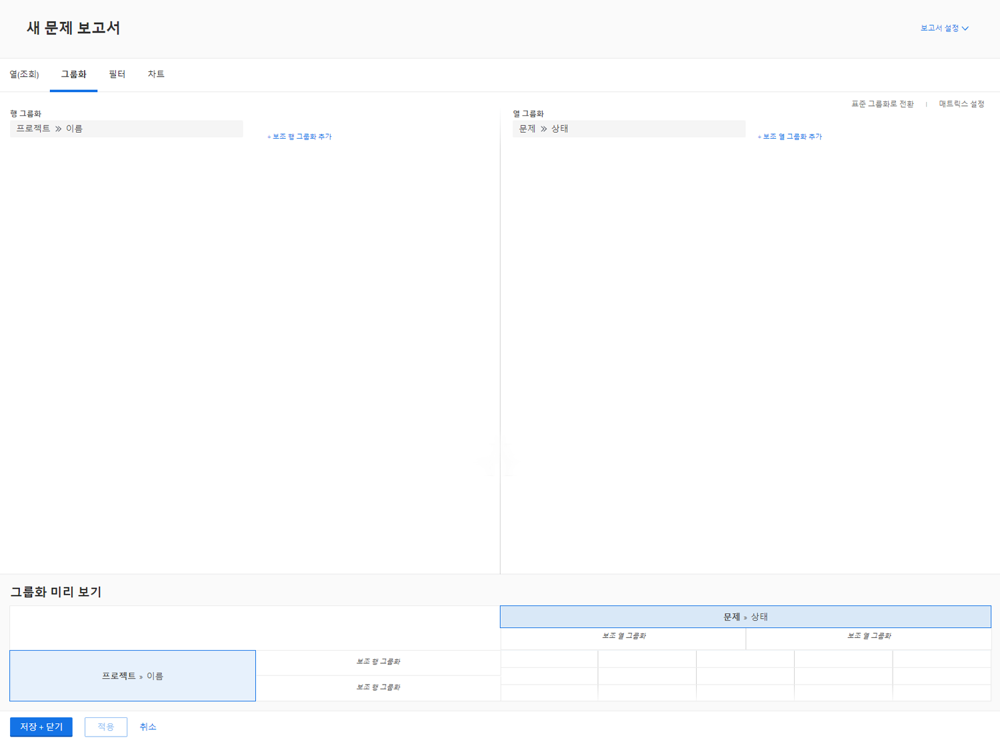
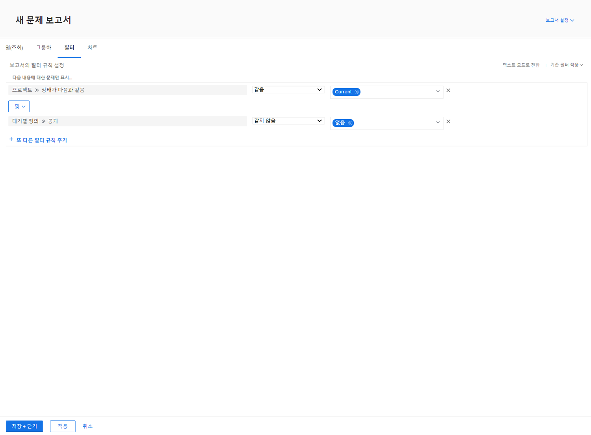

# 매트릭스 보고서 만들기

이 비디오를 통해 다음과 같은 사항을 알아볼 수 있습니다.

* 매트릭스 보고서가 유용할 수 있는 경우
* 매트릭스 보고서를 만드는 방법

>[!VIDEO](https://video.tv.adobe.com/v/335156/?quality=12&learn=on)

## 활동: 매트릭스 보고서 만들기

요청 대기열별로 정렬된 각 상태의 요청 수를 보여 주는 매트릭스 보고서를 만듭니다. 수신 작업량과 진행 상황에 대한 빠른 스냅샷을 제공합니다.

요청 대기열을 행 그룹화에 표시하고자 합니다. 상태는 열 그룹화로 나타납니다. 보고서 이름을 “상태 및 요청 대기열별 요청”으로 지정합니다.

## 답변

1. **[!UICONTROL 메인 메뉴]**&#x200B;에서 **[!UICONTROL 보고서]**&#x200B;를 선택합니다.
1. **[!UICONTROL 새 보고서]** 옵션을 클릭하고 **[!UICONTROL 문제]**&#x200B;를 선택합니다.
1. **[!UICONTROL 그룹화]** 탭으로 이동하여 **[!UICONTROL 매트릭스 그룹화로 전환]**&#x200B;을 클릭합니다.
1. [!UICONTROL 행 그룹화]의 경우, **[!UICONTROL 프로젝트]** > **[!UICONTROL 이름]**&#x200B;을 선택합니다.
1. [!UICONTROL 열 그룹화]의 경우, **[!UICONTROL 문제]** > **[!UICONTROL 상태]**&#x200B;를 선택합니다.

   

1. **[!UICONTROL 필터]** 탭으로 이동합니다.
1. 활성 요청 대기열의 요청만 표시되도록 하려면 다음 필터 규칙을 추가합니다.

   * [!UICONTROL 프로젝트] > [!UICONTROL 동일시된 상태] > [!UICONTROL 같음] > [!UICONTROL 현재]
   * [!UICONTROL 대기열 정의] > [!UICONTROL 공개] > [!UICONTROL 같지 않음] > [!UICONTROL 없음](공개 옵션 중 하나에 할당된 대기열 정의를 통해 프로젝트가 실제로 요청 대기열이라는 것을 알 수 있음)

1. **[!UICONTROL 저장 및 닫기]**&#x200B;를 클릭합니다. 보고서 이름을 입력하라는 메시지가 표시되면 “상태 및 요청 대기열별 요청”을 입력합니다.

   
