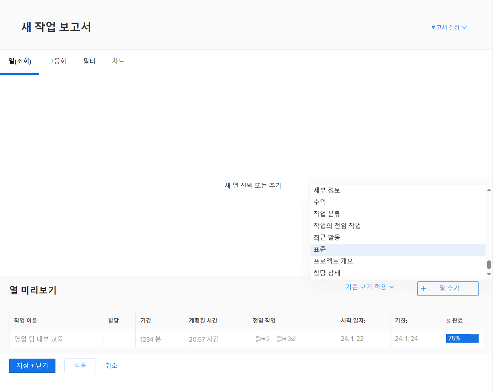
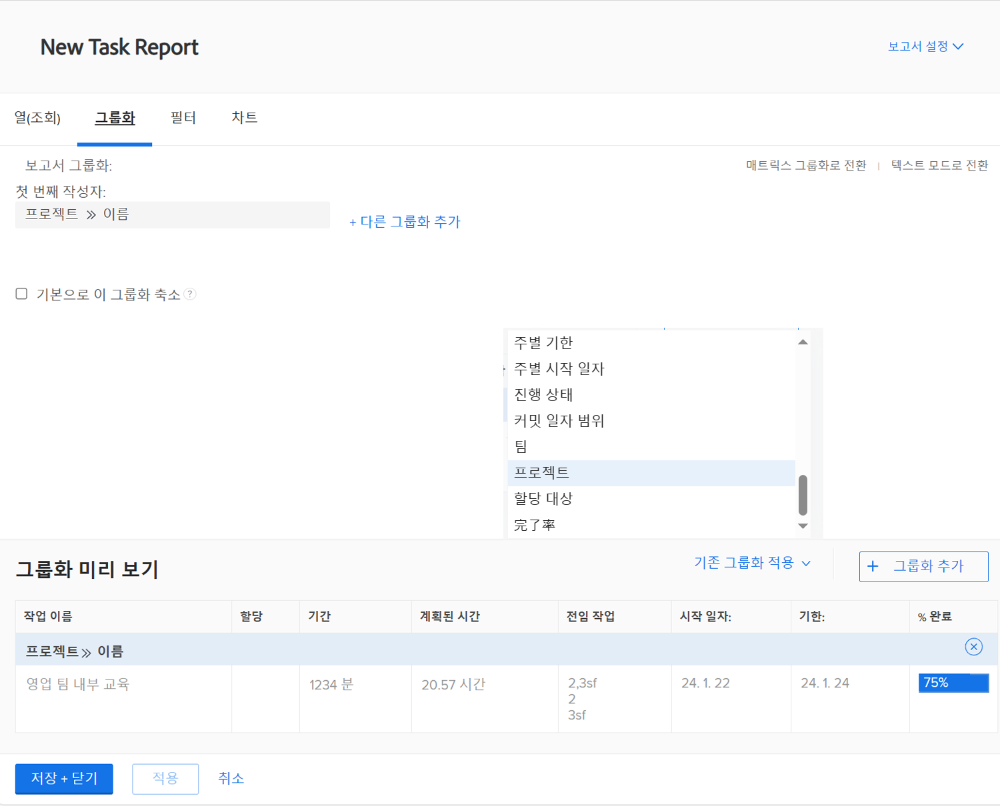
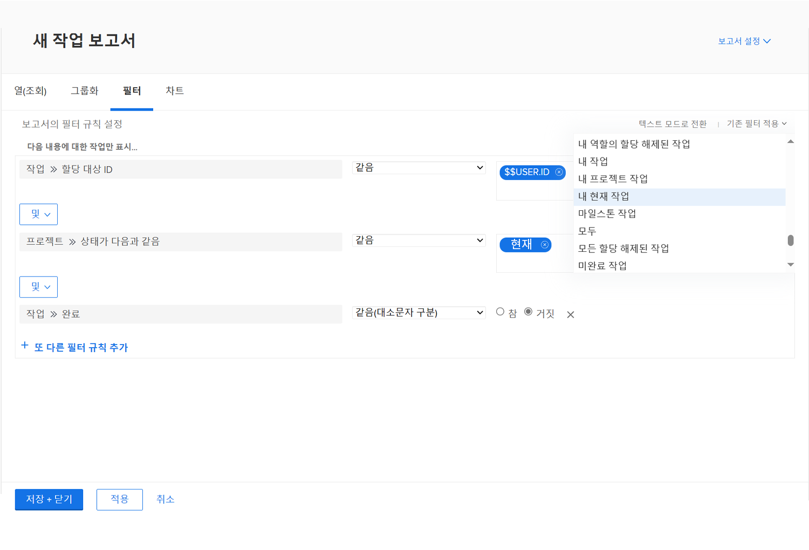
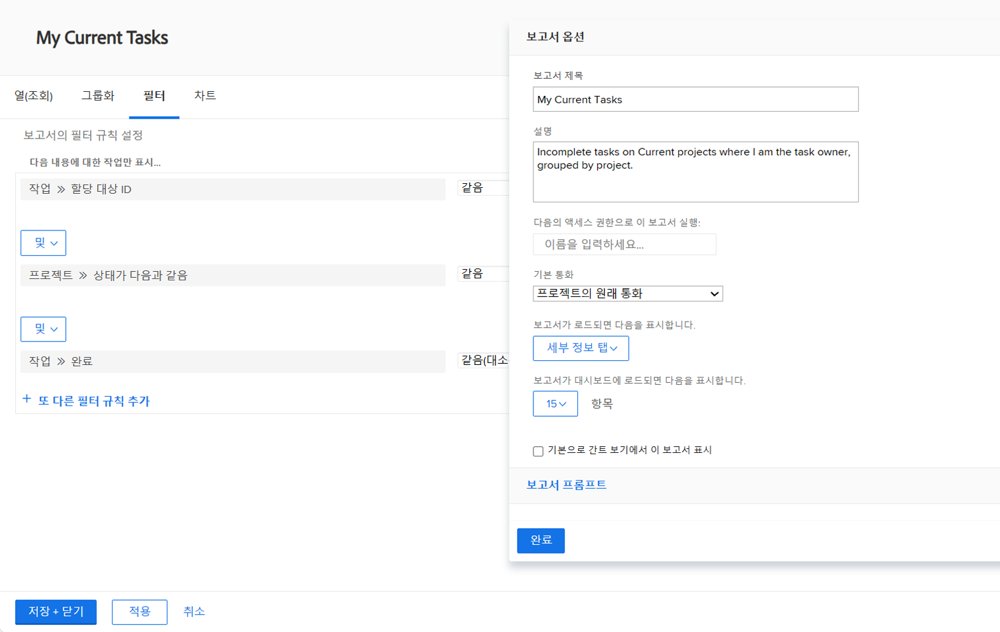

# 단순 보고서 만들기

이 비디오에서는 다음 방법을 배웁니다.

* 기존 필터, 보기 및 그룹을 사용하여 간단한 보고서 만들기

>[!VIDEO](https://video.tv.adobe.com/v/335153/?quality=12)

## 활동: 간단한 작업 보고서 만들기

하나의 보고서에서 모든 활성 작업을 추적하려고 합니다. 다음을 사용하여 &quot;My Current Tasks&quot;라는 작업 보고서를 만듭니다.

* 열(보기) = 표준
* 그룹화 = 프로젝트
* 필터 = 내 현재 작업
* 설명 = 현재 프로젝트에서 완료되지 않은 작업이며, 이 경우 작업 소유자가 프로젝트별로 그룹화됩니다.

## 답변

1. 로 이동합니다. **[!UICONTROL 기본 메뉴]** 을(를) 선택합니다. **[!UICONTROL 보고서]**.
1. 을(를) 클릭합니다. **[!UICONTROL 새 보고서]** 드롭다운 메뉴를 선택하고 **[!UICONTROL 작업 보고서]**.
1. in [!UICONTROL 열(보기)]를 클릭하고 **[!UICONTROL 기존 보기 적용]** 메뉴 및 선택 **[!UICONTROL 표준]**.

   

1. 에서 **[!UICONTROL 그룹화]** 탭에서 **[!UICONTROL 기존 그룹 적용]** 메뉴 및 선택 **[!UICONTROL 프로젝트]**.

   

1. 에서 **[!UICONTROL 필터]** 탭에서 **[!UICONTROL 기존 필터 적용]** 메뉴를 선택하고 내 현재 작업을 선택합니다.

   

1. 열기 **[!UICONTROL 보고서 설정]** 보고서 이름을 &quot;My Current Tasks&quot;로 지정합니다.
1. [설명] 필드에 &quot;Uncomplete tasks on Current projects(현재 프로젝트의 미완료 작업, 여기서 내가 프로젝트 별로 그룹핑된 작업 소유자)를 입력합니다.&quot;

   

1. 보고서를 저장하고 닫습니다.
