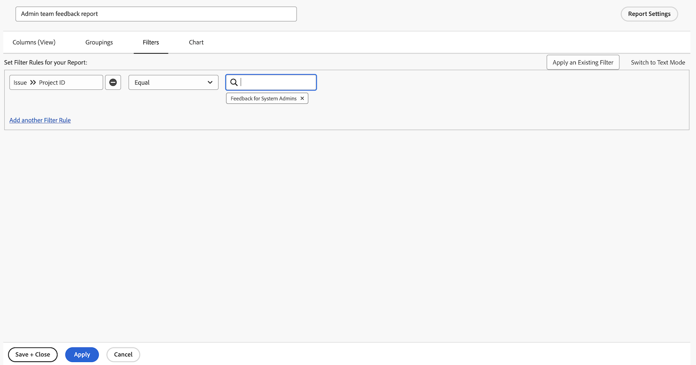

# 작업 보고서 만들기

이 비디오를 통해 다음과 같은 사항을 알아볼 수 있습니다.

* 복잡한 필터로 작업 보고서를 만드는 방법
* 생성한 보고서를 찾는 방법

>[!VIDEO](https://video.tv.adobe.com/v/335154/?quality=12&learn=on)

>[!TIP]
>
>주걱과 믹싱 볼을 꺼내서 [Adobe Workfront Customer Reporting Cookbook](/help/assets/workfront-customer-reporting-cookbook.pdf)의 “레시피”를 만들 준비를 합니다. 이 안에는 내 환경을 바로 적용할 수 있는 10개의 보고서에 대한 단계별 지침이 있습니다.
>고객이 좋아하는 요리 목록을 쉽고 빠르게 사용할 수 있는 Cookbook에 담아 Workfront 주방에서 다시 꺼내 테스트할 수 있습니다.
>이 10개의 보고서는 고객 여러분이 직접 작성한 것입니다. 여러 업체, 부서, 팀, 업종과 다양한 기업에서 고객이 좋아하는 보고서를 공유해 주셔서 감사드립니다. 일부 보고서는 간단하지만(매우 유용함), 일부 보고서는 매우 복잡하여 보고 수준을 새로운 차원으로 끌어올릴 수 있습니다.

## 활동 1: 프롬프트가 있는 메모 보고서 만들기

메모 콘텐츠, 작성자, 입력 일자, 프로젝트 이름 또는 감사 유형을 기반으로 사용자 메모(예: 댓글 또는 업데이트) 또는 시스템 메모를 검색하는 데 사용할 수 있는 메모 보고서를 만듭니다. 보고서 이름을 “메모 검색”으로 지정합니다.

메모 텍스트 프롬프트를 사용할 때 이 보고서는 업데이트 스레드 내에서 검색하여 프롬프트에 지정된 기준을 충족하는 항목을 신속하게 추출합니다. 보고서를 실행할 때 모든 프롬프트를 입력할 필요는 없으며 관심 있는 프롬프트만 입력하면 됩니다. 빈 항목은 자동으로 무시됩니다.

보기에는 다음에 대한 열이 포함되어야 합니다.

* 메모 텍스트
* 감사 텍스트
* 입력 일자
* 소유자: 이름
* 감사 유형
* 작업 이름
* 문제 이름

필터 탭을 비워 둡니다.

프로젝트 이름의 그룹입니다.

다음에 대한 프롬프트를 포함합니다.

* 감사 텍스트
* 메모 텍스트
* 소유자 이름
* 입력 일자
* 프로젝트 이름
* 감사 유형

## 활동 1 답변

1. **[!UICONTROL 메인 메뉴]**&#x200B;에서 **[!UICONTROL 보고서]**&#x200B;를 선택합니다.
1. **[!UICONTROL 새 보고서]** 메뉴를 클릭하고 **[!UICONTROL 메모]**&#x200B;를 선택합니다.
1. **[!UICONTROL 열(보기)]**&#x200B;에서 다음을 포함하도록 열을 설정합니다.

   

   * [!UICONTROL 메모] > [!UICONTROL 메모 텍스트]
   * [!UICONTROL 메모] > [!UICONTROL 감사 텍스트]
   * [!UICONTROL 메모] > [!UICONTROL 입력 일자]
   * [!UICONTROL 소유자] > [!UICONTROL 이름]
   * [!UICONTROL 메모] > [!UICONTROL 감사 유형]
   * [!UICONTROL 작업] > [!UICONTROL 이름]
   * [!UICONTROL 문제] > [!UICONTROL 이름]

1. **[!UICONTROL 입력 일자]** 열을 선택하고 **[!UICONTROL 내림차순으로 정렬]**&#x200B;을 변경합니다.
1. **[!UICONTROL 그룹화]** 탭에서 보고서를 [!UICONTROL 프로젝트] > [!UICONTROL 이름]별로 그룹화하도록 설정합니다.

   

1. [!UICONTROL 필터]는 비워 둡니다.
1. **[!UICONTROL 보고서 설정]**&#x200B;을 열고 보고서의 이름을 “메모 검색”으로 지정합니다.
1. [!UICONTROL 설명] 필드에서 “선택한 감사 유형 및 기타 프롬프트에 따라 시스템 또는 사용자 메모를 검색합니다. 시스템 메모는 감사 텍스트 열에 나타나고 사용자 메모는 메모 텍스트 열에 나타납니다”와 같은 항목을 입력합니다.”

   

1. 보고서가 로드될 때 표시되도록 **[!UICONTROL 세부 정보 탭]**&#x200B;을 선택합니다.
1. 보고서가 대시보드에 포함될 때 200개 항목을 표시하도록 보고서를 설정합니다.
1. **[!UICONTROL 보고서 프롬프트]**&#x200B;를 클릭하고 다음과 같이 추가합니다.

   

   * [!UICONTROL 메모] > [!UICONTROL 감사 텍스트]
   * [!UICONTROL 메모] > [!UICONTROL 메모 텍스트]
   * [!UICONTROL 소유자] > [!UICONTROL 이름]
   * [!UICONTROL 메모] > [!UICONTROL 입력 일자]
   * [!UICONTROL 프로젝트] > [!UICONTROL 이름]
   * [!UICONTROL 메모] > [!UICONTROL 감사 유형]

1. **[!UICONTROL 대시보드에 프롬프트 표시]** 확인란을 선택합니다.
1. 보고서를 저장하고 닫습니다.

## 활동 2: 관리팀 피드백 보고서 만들기

이 문제 보고서에는 시스템 관리자를 위해 만든 피드백 요청 대기열의 모든 문제가 표시됩니다. [시스템 관리자 피드백 요청 대기열 만들기](https://experienceleague.adobe.com/docs/workfront-learn/tutorials-workfront/manage-work/request-queues/create-a-system-admin-feedback-request-queue.html) 튜토리얼에서 이 요청 대기열을 만드는 방법을 확인할 수 있습니다.

이 보고서는 사용자 정의 양식을 사용하기도 합니다. 사용자 정의 양식을 만드는 방법을 알아보려면 [사용자 정의 양식 만들기 및 공유](https://experienceleague.adobe.com/docs/workfront-learn/tutorials-workfront/custom-data/custom-forms/custom-forms-creating-and-sharing-a-custom-form.html) 튜토리얼을 참조하십시오.

이 사용자 정의 양식은 다음과 같이 만들어야 합니다.

이름: 관리자 프로세스 피드백

1. 프로세스 유형(드롭다운 필드)
   * 액세스 수준
   * 승인 프로세스(글로벌에만)
   * 이메일 알림
   * 레이아웃 템플릿
   * 마일스톤 경로
   * 프로젝트 템플릿
   * 미리 알림
   * 요청 대기열
1. 프로세스 이름(한 줄 텍스트 필드)
1. 프로세스 등급(드롭다운 필드)
   * 1 - 전혀 쓸모 없음
   * 2 - 매우 유용하지 않음
   * 3 - 양호하지만 개선될 수 있음
   * 4 - 우수함
1. 문제 또는 좋은 소식(단락 텍스트 필드)

**관리팀 피드백 보고서**&#x200B;라는 이름의 문제 보고서를 만듭니다.

보기에는 다음 열이 있어야 합니다.

* 문제: 이름
* 기본 담당자: 이름
* 문제: 프로세스 유형
* 문제: 프로세스 이름
* 문제: 프로세스 등급
* 문제: 문제 또는 좋은 소식
* 문제: 입력 일자
* 문제: 연령
* 문제: 할당
* 문제: 상태

프로세스 유형의 그룹입니다.

피드백 문제가 있는 요청 대기열 프로젝트의 ID를 필터링합니다.

## 활동 2 답변

1. **[!UICONTROL 메인 메뉴]**&#x200B;에서 **[!UICONTROL 보고서]**&#x200B;를 선택합니다.
1. **[!UICONTROL 새 보고서]** 메뉴를 클릭하고 **[!UICONTROL 문제]**&#x200B;를 선택합니다.
1. **[!UICONTROL 열(보기)]**&#x200B;에서 다음을 포함하도록 열을 설정합니다.

   

   * [!UICONTROL 문제] > [!UICONTROL 이름]
   * [!UICONTROL 기본 담당자] > [!UICONTROL 이름]
      * 메모: 이는 열 레이블로 “소유자:이름”과 함께 표시됩니다. 고급 옵션을 클릭하고 **사용자 정의 열 레이블** 필드에 “보고자”를 입력하여 이를 “보고자”로 변경할 수 있습니다.
   * [!UICONTROL 문제] > [!UICONTROL 프로세스 유형]
   * [!UICONTROL 문제] > [!UICONTROL 프로세스 이름]
   * [!UICONTROL 문제] > [!UICONTROL 프로세스 등급]
   * [!UICONTROL 문제] > [!UICONTROL 문제 또는 좋은 소식]
   * [!UICONTROL 문제] > [!UICONTROL 입력 일자]
   * [!UICONTROL 문제] > [!UICONTROL 연령]
   * [!UICONTROL 문제] > [!UICONTROL 할당]
   * [!UICONTROL 문제] > [!UICONTROL 상태]

1. **[!UICONTROL 입력 일자]** 열을 선택하고 **[!UICONTROL 내림차순으로 정렬]**&#x200B;을 변경합니다.
1. **[!UICONTROL 그룹화]** 탭에서 보고서를 **[!UICONTROL 문제] > [!UICONTROL 프로세스 유형]**&#x200B;별로 그룹화하도록 설정합니다.

   

1. **[!UICONTROL 필터]** 탭에서 피드백 문제가 있는 요청 대기열 프로젝트와 동일하도록 **[!UICONTROL 문제] > [!UICONTROL 프로젝트 ID]**&#x200B;를 추가합니다.

   

1. 보고서를 저장하고 닫습니다.
