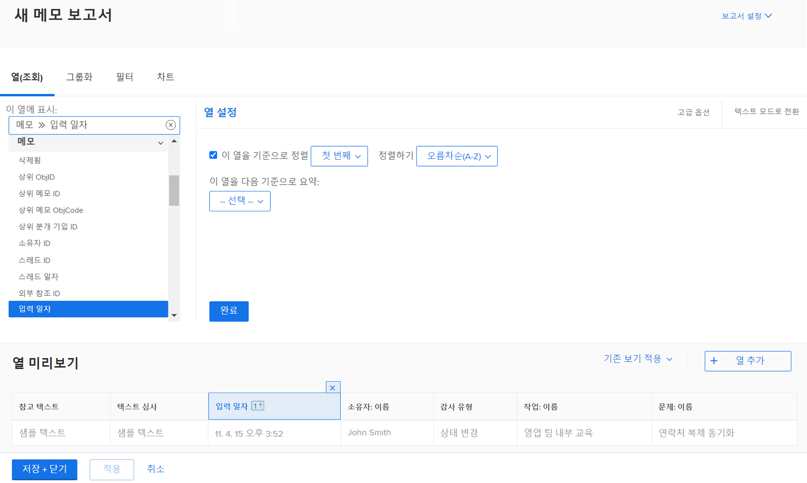
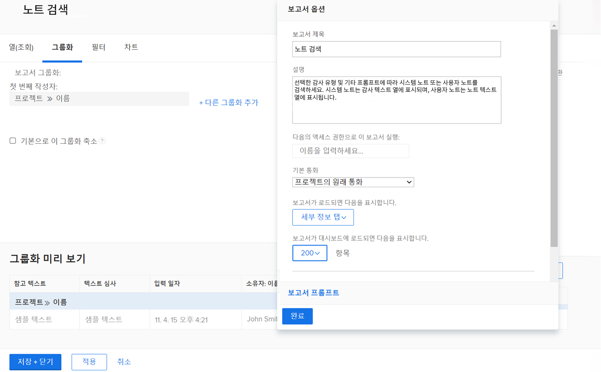
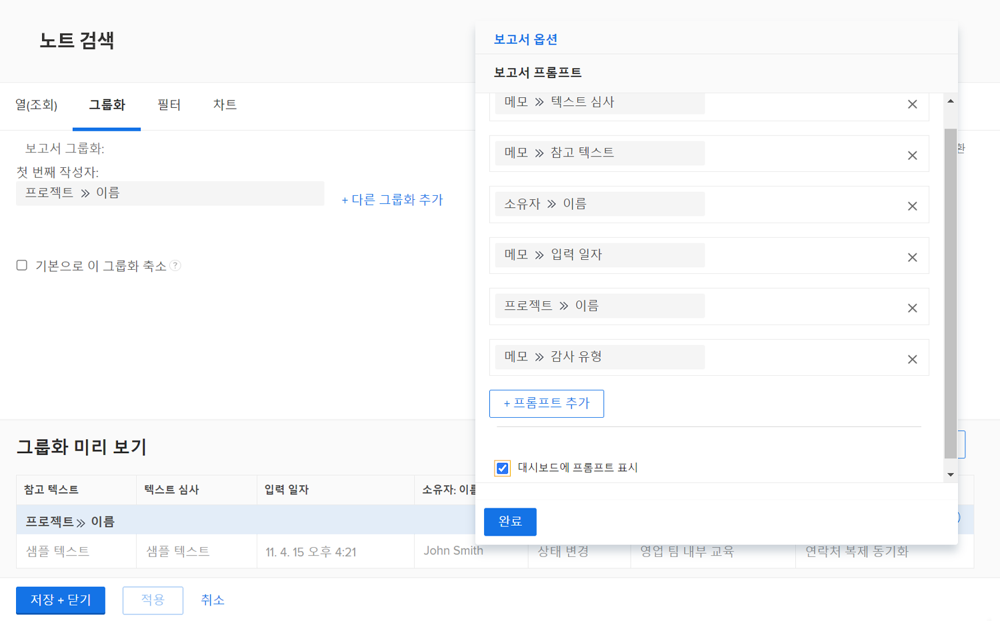

# 작업 보고서 만들기

이 비디오에서는 다음을 학습합니다.

* 복잡한 필터를 사용하여 작업 보고서를 만드는 방법
* 생성한 보고서를 찾는 방법

>[!VIDEO](https://video.tv.adobe.com/v/335154/?quality=12)

## 활동: 프롬프트가 있는 메모 보고서 생성

메모 컨텐츠, 작성자, 시작 날짜, 프로젝트 이름 또는 감사 유형을 기반으로 사용자 노트(즉, 댓글 또는 업데이트)나 시스템 노트를 검색하는 데 사용할 수 있는 노트 보고서를 만듭니다. 보고서 이름을 &quot;Note Search&quot;로 지정합니다.

참고 텍스트 프롬프트를 사용할 때 이 보고서는 업데이트 스레드 내에서 검색하여 프롬프트에 지정된 조건을 충족하는 모든 항목을 빠르게 추출합니다. 보고서를 실행할 때 필요한 모든 메시지를 입력할 필요가 없습니다. 빈 항목은 자동으로 무시됩니다.

보기에는 다음에 대한 열이 포함되어야 합니다.

* 참고 텍스트
* 텍스트 심사
* 시작 날짜
* 소유자: 이름
* 감사 유형
* 작업 이름
* 문제 이름

필터 탭을 비워 둡니다.

프로젝트 이름의 그룹입니다.

다음에 대한 프롬프트를 포함합니다.

* 텍스트 심사
* 참고 텍스트
* 소유자 이름
* 시작 날짜
* 프로젝트 이름
* 감사 유형

## 답변

1. 선택 **[!UICONTROL 보고서]** 에서 **[!UICONTROL 기본 메뉴]**.
1. 을(를) 클릭합니다. **[!UICONTROL 새 보고서]** 메뉴 및 선택 **[!UICONTROL 참고]**.
1. in **[!UICONTROL 열(보기)]** 다음을 포함하도록 열을 설정합니다.

   

   * [!UICONTROL 참고] > [!UICONTROL 참고 텍스트]
   * [!UICONTROL 참고] > [!UICONTROL 감사 텍스트]
   * [!UICONTROL 참고] > [!UICONTROL 시작 날짜]
   * [!UICONTROL 소유자] > [!UICONTROL 이름]
   * [!UICONTROL 참고] > [!UICONTROL 감사 유형]
   * [!UICONTROL 작업] > [!UICONTROL 이름]
   * [!UICONTROL 문제] > [!UICONTROL 이름]

1. 을(를) 선택합니다 **[!UICONTROL 시작 날짜]** 열 및 변경 **[!UICONTROL 내림차순으로 정렬]**.
1. 에서 **[!UICONTROL 그룹화]** 탭에서 보고서를 그룹화 기준으로 설정합니다 [!UICONTROL 프로젝트] > [!UICONTROL 이름].

   

1. Leave [!UICONTROL 필터] 비어 있습니다.
1. 열기 **[!UICONTROL 보고서 설정]** 보고서 이름을 &quot;Note Search&quot;로 지정합니다.
1. 에서 [!UICONTROL 설명] 필드에 &quot;선택한 감사 유형 및 기타 프롬프트에 따라 시스템 또는 사용자 노트 검색&quot;과 같은 작업을 추가합니다. 시스템 메모는 감사 텍스트 열에 나타나고 사용자 메모는 메모 텍스트 열에 나타납니다.&quot;

   

1. 선택 **[!UICONTROL 세부 사항 탭]** 보고서가 로드될 때 표시되도록 합니다.
1. 보고서가 대시보드에 포함될 때 200개의 항목을 표시하도록 보고서를 설정하십시오.
1. 클릭 **[!UICONTROL 보고서 프롬프트]** 및 추가:

   

   * [!UICONTROL 참고] > [!UICONTROL 감사 텍스트]
   * [!UICONTROL 참고] > [!UICONTROL 참고 텍스트]
   * [!UICONTROL 소유자] > [!UICONTROL 이름]
   * [!UICONTROL 참고] > [!UICONTROL 시작 날짜]
   * [!UICONTROL 프로젝트] > [!UICONTROL 이름]
   * [!UICONTROL 참고] > [!UICONTROL 감사 유형]

1. 다음에 대한 상자를 선택합니다. **[!UICONTROL 대시보드에 프롬프트 표시]**.
1. 보고서를 저장하고 닫습니다.
