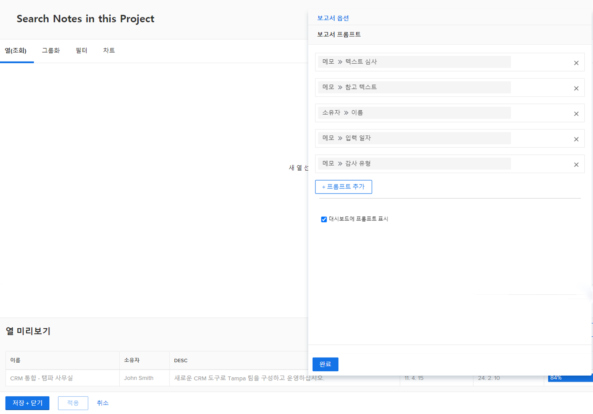
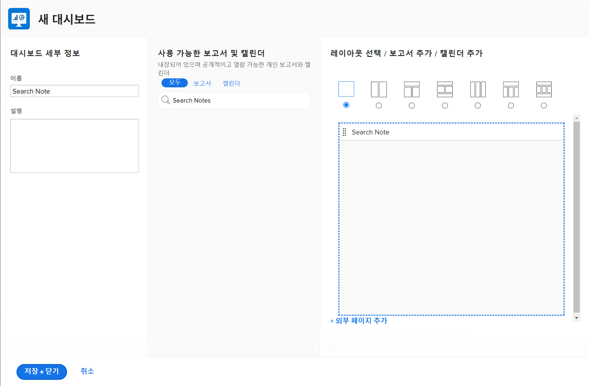
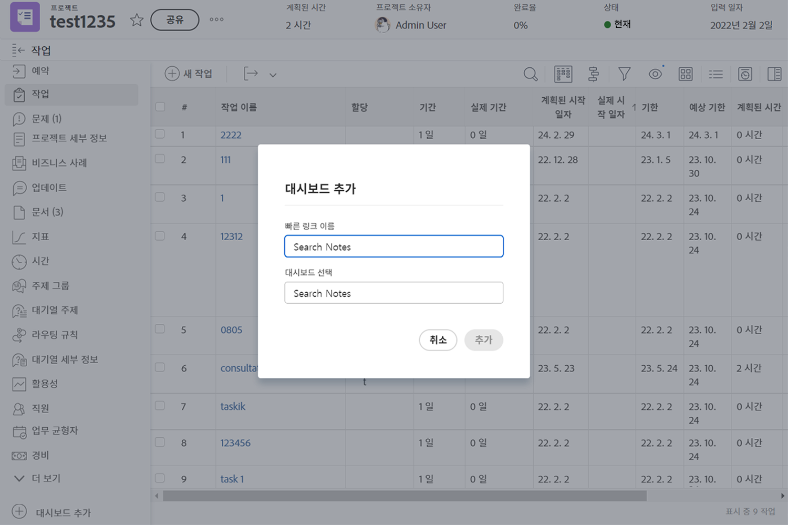

# 대시보드 만들기

이 비디오에서는 Workfront의 대시보드를 이해하고 사용하는 방법에 대한 포괄적인 안내서를 제공합니다.
&#x200B;대시보드는 사용자가 관련 데이터를 한 곳에 정리하고 표시할 수 있는 보고서 모음이라는 설명이다.

>[!VIDEO](https://video.tv.adobe.com/v/335157/?quality=12&learn=on)

## 핵심 사항

* **Workfront의 대시보드:** 대시보드는 사용자가 프로젝트, 작업 및 문제와 같은 관련 데이터를 하나의 중앙 보기에서 구성하고 표시할 수 있는 보고서 컬렉션입니다. &#x200B;
* **대시보드 만들기:** 대시보드는 레이아웃을 선택하고 보고서, 사용자 지정 달력 또는 외부 페이지를 추가한 다음 최적의 표시를 위해 정렬하여 사용자 지정할 수 있습니다. &#x200B; 사용자는 대시보드 내에서 나란히 보고서에 표시할 열을 사용자 지정할 수도 있습니다. &#x200B;
* **대시보드 액세스:** 대시보드는 대시보드 영역의 &quot;내 대시보드&quot;, &quot;공유 대시보드&quot; 또는 &quot;모든 대시보드&quot;에서 찾을 수 있습니다. &#x200B; 자주 사용하는 대시보드는 빠른 액세스를 위해 즐겨찾기에 고정하거나 추가할 수 있습니다. &#x200B;
* **대시보드 공유:** 대시보드는 &quot;대시보드 작업&quot; 메뉴를 통해 대시보드 내의 모든 보고서를 포함한 다른 Workfront 사용자와 공유할 수 있습니다. &#x200B;
* **대시보드 인쇄:** 대시보드는 &quot;대시보드 작업&quot; 메뉴에서 직접 인쇄할 수 있으므로 데이터의 실제 복사본을 쉽게 공유할 수 있습니다. &#x200B;

## “대시보드 만들기” 활동

### 활동 1: 대시보드 만들기

“이 프로젝트에서 메모 검색”이라는 하나의 보고서만 포함된 [!UICONTROL 대시보드]를 만듭니다. 검색할 업데이트가 수천 개인 경우에도 한 프로젝트에서 수행된 모든 업데이트를 빠르게 찾는 데 유용합니다. 이렇게 하면 업데이트 스레드를 검색하여 프롬프트에서 지정한 기준을 충족하는 모든 업데이트를 빠르게 추출합니다.

&quot;메모 보고서 만들기&quot; 활동에서 만든 &quot;메모 검색&quot; 보고서의 복사본을 만들어 이 보고서를 만드십시오. 아직 만들지 않았습니까? [작업 보고서 만들기](https://experienceleague.adobe.com/en/docs/workfront-learn/tutorials-workfront/reporting/basic-reporting/create-a-task-report#activity-1-create-a-note-report-with-prompts) 자습서에서 활동을 보려면 여기를 클릭하십시오.

* 사본에서 프로젝트 이름 프롬프트를 제거하고 “이 프로젝트에서 메모 검색” 보고서 이름을 바꿉니다.
* [!UICONTROL 대시보드] 이름을 “메모 검색”으로 지정합니다.
* 프로젝트 랜딩 페이지로 이동하여 [!UICONTROL 대시보드]의 사용자 정의 섹션을 만듭니다.
* 사용자 정의 섹션에서 메모를 검색하면 현재 있는 프로젝트에 포함된 메모만 표시됩니다.

### 답변 1

1. &quot;메모 보고서 만들기&quot; 활동에서 만든 보고서를 실행합니다. 아직 만들지 않았습니까? [작업 보고서 만들기](https://experienceleague.adobe.com/en/docs/workfront-learn/tutorials-workfront/reporting/basic-reporting/create-a-task-report#activity-1-create-a-note-report-with-prompts) 자습서에서 활동을 보려면 여기를 클릭하십시오.
1. **[!UICONTROL 보고서 작업]**&#x200B;을 클릭하고 **[!UICONTROL 복사]**&#x200B;를 선택합니다. [!DNL Workfront]는 “메모 검색 (사본)”이라는 새 보고서를 만듭니다.
1. **[!UICONTROL 보고서 작업]**&#x200B;으로 이동하여 **[!UICONTROL 편집]**&#x200B;을 선택합니다. **[!UICONTROL 보고서 설정]**&#x200B;을 클릭하고 이름을 “이 프로젝트에서 메모 검색”으로 변경합니다.
1. [!UICONTROL 보고서 프롬프트]를 클릭하고 목록에서 [!UICONTROL 프로젝트] > [!UICONTROL 이름] 프롬프트를 삭제합니다.

   

1. **[!UICONTROL 대시보드에 프롬프트 표시]** 상자를 선택합니다.
1. **[!UICONTROL 완료]**&#x200B;를 클릭한 다음 **[!UICONTROL 저장 및 닫기]**&#x200B;를 클릭합니다. 이제 보고서의 [!UICONTROL 프롬프트] 화면이 표시됩니다.

   다음에는 바로 가기를 사용하여 새 대시보드를 만들고 이 보고서를 추가합니다.

1. **[!UICONTROL 보고서 동작]**&#x200B;을 클릭하고 **[!UICONTROL 클래식 대시보드에 추가]** > **[!UICONTROL 새 대시보드]**&#x200B;를 선택합니다.
1. **[!UICONTROL 레이아웃]** 패널로 “이 프로젝트에서 메모 검색” 보고서를 드래그합니다.
1. 보고서 이름이 대시보드 이름이 됩니다. 이름을 “메모 검색”으로 편집합니다.

   

1. **[!UICONTROL 저장 및 닫기]**&#x200B;를 클릭합니다.

   이제 프로젝트 페이지에 대시보드를 추가합니다.

   

1. 프로젝트로 이동합니다. 왼쪽 패널 메뉴에서 **[!UICONTROL 대시보드 추가]** 단추를 클릭합니다.
1. **[!UICONTROL 대시보드 선택]** 필드에 &quot;Search Notes&quot;를 입력하고 목록에서 [!UICONTROL 대시보드]를 선택합니다.
1. **[!UICONTROL 빠른 링크 이름]** 필드에 &quot;메모 검색&quot;을 입력하십시오.
1. **[!UICONTROL 추가를 클릭합니다]**.
1. 왼쪽 패널 메뉴에서 아래쪽 근처에 있는 검색 메모 를 찾습니다. 이름 왼쪽에 있는 점을 클릭하고 업데이트 아래의 오른쪽으로 드래그합니다.
