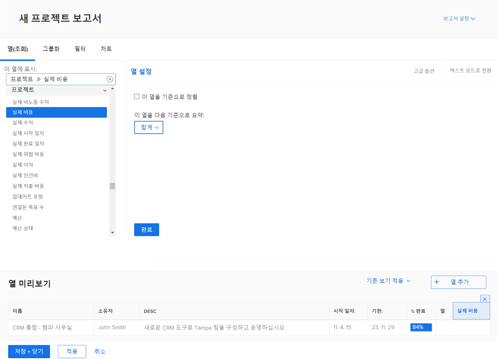
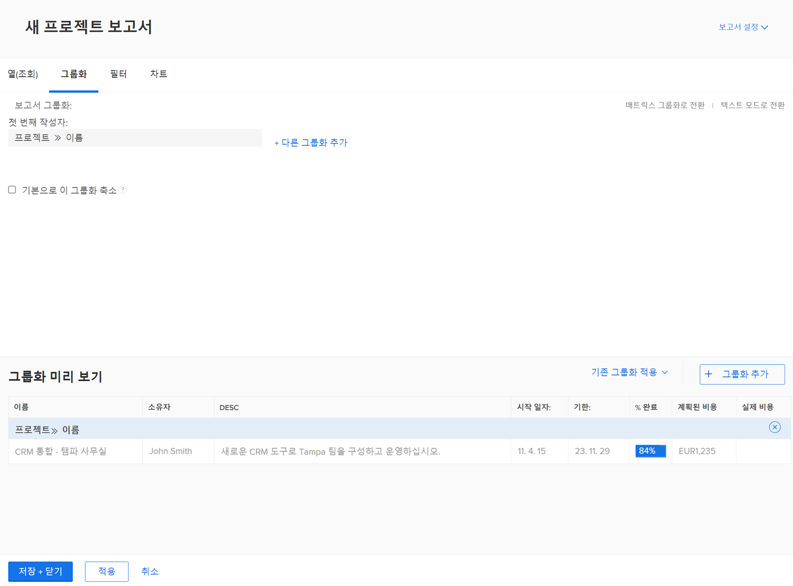
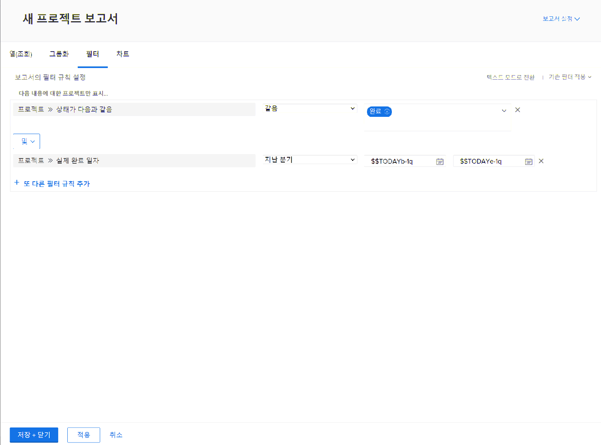
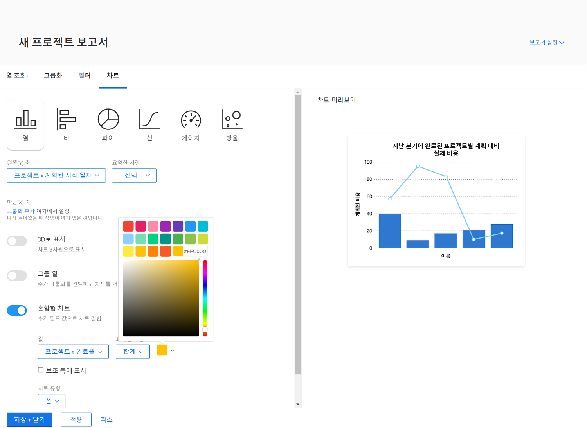

# 차트로 보고서 만들기

이 비디오에서는 특히 프로젝트 작업 추적을 위해 차트를 사용하여 데이터를 효과적으로 시각화하는 방법을 설명합니다. &#x200B; Workfront에서 두 가지 유형의 보고서를 만드는 방법을 보여 줍니다.

**프로젝트별 지연 작업 보고서:**

* 목록 보고서로 시작하고 필터를 적용하여 현재 프로젝트에서 완료되지 않은 지연 작업만 표시합니다. &#x200B;
* 프로젝트 이름별로 작업을 그룹화하고 파이 차트를 만들어 프로젝트 간 지연 작업의 분포를 시각화합니다. &#x200B;
* 쉽게 액세스할 수 있도록 차트를 기본 탭으로 설정합니다. &#x200B;

**프로젝트별 작업 및 진행 상태 보고서:**

* 첫 번째 보고서를 복사하고 작업 진행 상태에 대한 다른 그룹화를 추가합니다.
* 모든 작업을 포함하도록 필터를 제거하여 프로젝트 실행 중 진행 상황을 표시합니다.
* 스택이 서로 다른 진행 상태를 나타내는 프로젝트당 총 작업 수를 표시하려면 누적 세로 막대형 차트를 사용합니다.
* 필요한 경우 색상을 사용자 정의하고 보고서를 저장합니다.

이 비디오에서는 원형 및 누적 세로 막대형 차트와 같은 차트를 통해 작업 배포 및 프로젝트 성능에 대한 통찰력을 제공하여 사용자가 프로젝트를 비교하고 작업 진행 상황을 시각적으로 이해하는 데 도움이 되는 방법을 소개합니다. &#x200B;

>[!VIDEO](https://video.tv.adobe.com/v/335155/?quality=12&learn=on)

## 핵심 사항

* **차트 데이터 명확성 향상**: 원형 또는 열 차트와 같은 차트로 데이터를 시각화하면 목록 보고서에 비해 작업 배포 및 프로젝트 진행 상황을 더 쉽게 이해할 수 있습니다. &#x200B;
* **특정 인사이트에 대한 필터링**: 필터(예: 현재 프로젝트에서 미완료, 지연된 작업)를 적용하면 타깃팅된 분석을 위해 관련 데이터에 집중할 수 있습니다. &#x200B;
* **더 나은 조직을 위한 그룹화**: 프로젝트 이름 또는 진행 상태별로 작업을 그룹화하면 데이터가 효과적으로 구성되어 프로젝트 간 의미 있는 비교를 수행할 수 있습니다. &#x200B;
* **차트 사용자 지정 옵션**: 사용자는 차트 종류(예: 원형, 열, 막대)를 선택하고 기본 설정 또는 브랜딩에 맞게 색상을 사용자 지정할 수 있습니다. &#x200B;
* **세부 인사이트에 대한 누적 세로 막대형 차트**: 누적 세로 막대형 차트는 프로젝트 내 작업 진행 상황을 종합적으로 표시하여 전체 작업과 해당 상태를 하나의 시각화로 보여줍니다.

## “차트로 보고서 만들기” 활동

### 활동 1: 보고서에 차트 추가

분기 말이 다가오고 있으며 최근에 완료된 프로젝트가 예산에 어떻게 고정되어 있는지 확인하려고 합니다. 계획된 비용 및 프로젝트의 실제 비용을 보여 주는 보고서를 만듭니다. 지난 분기에 완료된 프로젝트만 보려고 합니다. 사용자 정의 색상을 사용하여 조합 열 차트를 추가합니다.

### 답변 1

1. **[!UICONTROL 메인 메뉴]**&#x200B;에서 **[!UICONTROL 보고서]**&#x200B;를 선택합니다.
1. **[!UICONTROL 새 보고서]** 메뉴를 클릭하고 **[!UICONTROL 프로젝트]**&#x200B;를 선택합니다.
1. **[!UICONTROL 열 (보기)]** 탭에서 **[!UICONTROL 열 추가]**&#x200B;를 클릭합니다.
1. [!UICONTROL 프로젝트] > [!UICONTROL 계획된 비용]을 선택하고 이 열을 **[!UICONTROL 합계]**&#x200B;별로 요약합니다.
1. 다시 **[!UICONTROL 열 추가]**&#x200B;를 클릭합니다.
1. [!UICONTROL 프로젝트] > [!UICONTROL 실제 비용]을 선택하고 이 열을 **[!UICONTROL 합계]**&#x200B;별로 요약합니다.

   

1. **[!UICONTROL 그룹화]** 탭에서 보고서를 [!UICONTROL 프로젝트] > [!UICONTROL 이름]별로 그룹화하도록 설정합니다.

   

1. **[!UICONTROL 필터]** 탭에서 두 개의 필터 규칙을 추가합니다.

   * [!UICONTROL 프로젝트] > [!UICONTROL 동일시된 상태] > [!UICONTROL 완료]
   * [!UICONTROL 프로젝트] >[!UICONTROL &#x200B; 실제 완료 일자] > [!UICONTROL 지난 분기]

   

1. **[!UICONTROL 차트]** 탭에서 차트 유형에 대한 **[!UICONTROL 열]**&#x200B;을 선택합니다.
1. [!UICONTROL 왼쪽 (Y) 축]의 경우, [!UICONTROL 프로젝트] > [!UICONTROL 계획된 비용]을 선택합니다.
1. [!UICONTROL 하단 (X) 축]의 경우, [!UICONTROL 프로젝트] > [!UICONTROL 이름]을 선택합니다.
1. **[!UICONTROL 조합 차트]** 버튼을 클릭하고 **[!UICONTROL 값]** 필드에서 [!UICONTROL 프로젝트] > [!UICONTROL 실제 비용]을 선택합니다.
1. 색상 상자 옆에 있는 화살표를 클릭하여 [!UICONTROL 실제 비용] 색상을 변경합니다. 표시되는 색상 중 하나를 선택하거나 오른쪽 하단에 있는 상자를 클릭하여 색상 팔레트를 불러옵니다.
1. **[!UICONTROL 저장 및 닫기]**&#x200B;를 클릭합니다. 보고서 이름을 입력하라는 메시지가 표시되면 “지난 분기에 완료된 프로젝트별 계획된 비용과 실제 비용의 비교”라고 지정합니다.

   
