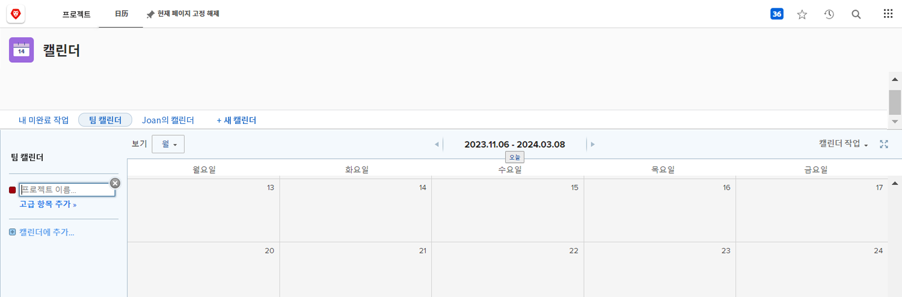
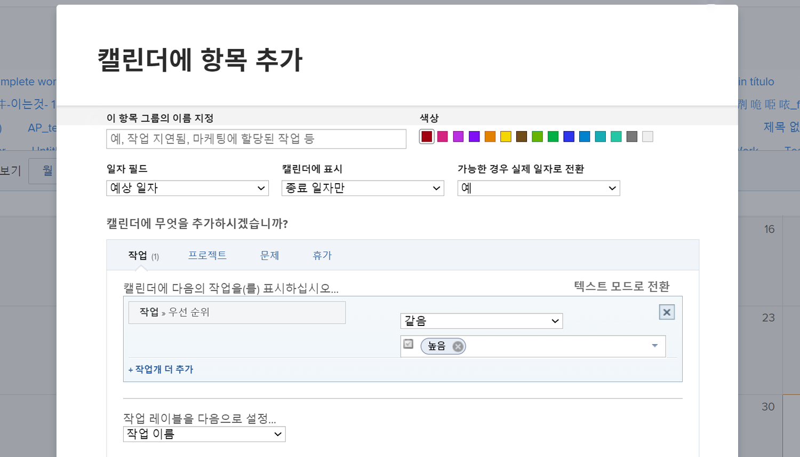
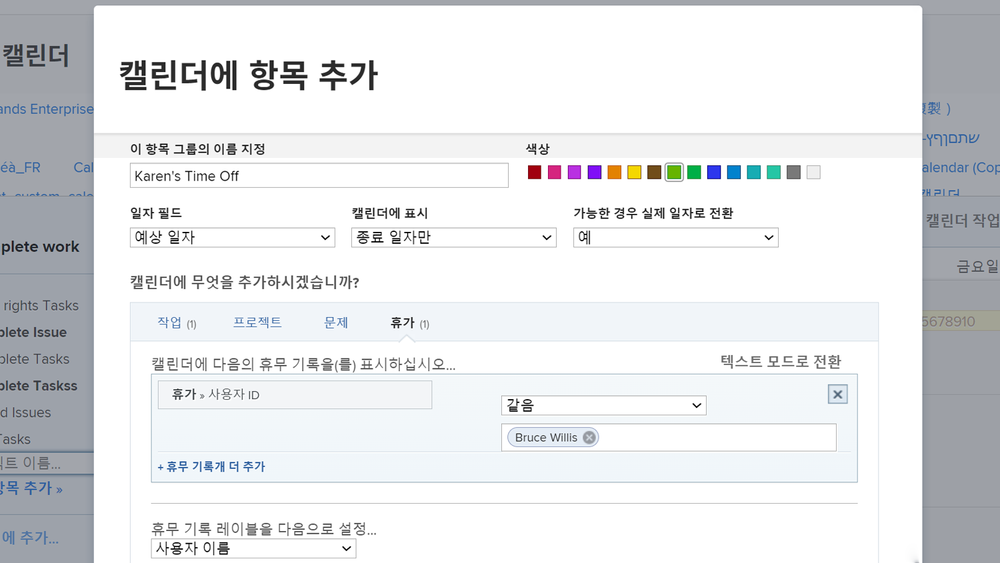

# 사용자 지정 달력 만들기

이 섹션에서는 다음 방법을 배웁니다.

* 새 캘린더 만들기
* 캘린더 그룹화 만들기
* 일정 그룹화에 작업 항목 추가
* 휴무 캘린더 만들기

다음은 사용자 정의 달력을 만드는 방법입니다.

## 먼저 새 캘린더 추가

1. 다음에서 **[!UICONTROL 메인 메뉴]**&#x200B;를 선택하고 **[!UICONTROL 캘린더]** 영역입니다.
1. 다음을 클릭합니다. **[!UICONTROL 새 캘린더]** 옵션을 선택합니다.
1. 달력 이름을 입력하고 키를 누릅니다 **[!UICONTROL 반환]**.

## 두 번째, 캘린더 그룹화 추가

1. 특정 프로젝트와 관련된 항목을 표시하려면 [!UICONTROL 그룹화] 필드(해당 프로젝트와 관련된 모든 작업이 표시됩니다.)
1. 또는 **[!UICONTROL 고급 항목 추가]** 시스템의 다양한 프로젝트에서 작업 항목을 포함하는 옵션입니다.

## 세 번째, 일정 그룹화에 작업 항목 추가

1. 표시할 내용을 반영하도록 그룹화 이름을 지정합니다.
1. 그룹에 대한 색상 지정을 선택합니다.
1. 사용할 날짜 유형 선택—[!UICONTROL 예상 일자], [!UICONTROL 계획된 일자], 또는 [!UICONTROL 사용자 정의]. ([!UICONTROL 사용자 정의] 날짜는 날짜 필드임 [!UICONTROL 사용자 정의 양식].)
1. 캘린더에 표시할 날짜 선택—[!UICONTROL 종료 일자만], [!UICONTROL 시작 일자만], 또는 [!UICONTROL 기간(시작~끝)].
1. 다음을 표시하려는 경우 [!UICONTROL 실제 일자] 해당 정보를 사용할 수 있는 경우 메뉴에서 예 를 선택합니다. 선택한 날짜 유형을 항상 원하는 경우 아니오를 선택합니다([!UICONTROL 예상값], [!UICONTROL 계획됨], 또는 [!UICONTROL 사용자 정의])을 클릭하여 표시합니다.
1. 캘린더에 표시할 항목 정보의 유형을 선택합니다.[!UICONTROL 작업], [!UICONTROL 프로젝트], [!UICONTROL 문제], 또는 [!UICONTROL 휴무].
1. 원하는 정보를 표시하도록 필터를 설정합니다.
1. **[!UICONTROL 저장]**&#x200B;을 클릭합니다.

>[!NOTE]
>
>캘린더에 추가 옵션을 사용하여 기존 캘린더에 그룹화를 추가할 수 있습니다.

## 개인 휴무를 표시하는 캘린더 만들기

[!DNL Workfront] 은 사용자 프로필에 개인 휴무 기능을 사용하여 휴무를 지정하는 방법을 제공합니다. 이 알림은 프로젝트 관리자에게 사용자를 사용할 수 없음을 알려주며, 필요에 따라 계획된 완료 일자가 자동으로 또는 수동으로 조정되도록 합니다.

[달력] 영역에서 이러한 휴무 항목을 표시하는 달력 보기를 만들 수 있습니다.

특정 사용자에 대한 달력을 생성하려면

1. 클릭 **[!UICONTROL 캘린더에 추가]** 왼쪽 패널에서
1. 클릭 **[!UICONTROL 고급 항목 추가]**.
1. 표시할 내용을 반영하도록 그룹화 이름을 지정합니다.
1. 그룹화에 대한 색상 지정을 선택합니다.
1. 설정 [!UICONTROL 날짜 필드] 끝 [!UICONTROL 계획된 일자].
1. 캘린더에 표시할 날짜 선택—[!UICONTROL 기간].
1. 실제 날짜를 사용할 수 없을 경우 정보가 표시되는 방식을 무시합니다. 이는 적용되지 않습니다.
1. 선택 [!UICONTROL 휴무] 을 참조하십시오.
1. 필터의 경우 사용자 ID를 팀원의 이름으로 설정합니다.
1. **[!UICONTROL 저장]**&#x200B;을 클릭합니다.

