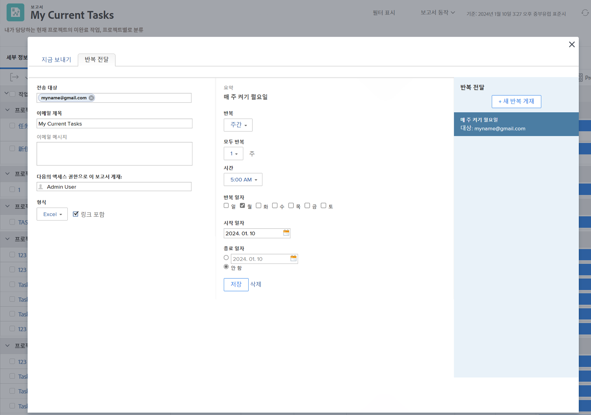

# 보고서 보내기 및 공유

이 비디오를 통해 다음과 같은 사항을 알아볼 수 있습니다.

* 사용자, 팀 또는 이메일 주소로 보고서를 보내는 방법
* 사용자와 보고서를 공유하는 방법
* 수신자가 Workfront 보고서에서 확인하고 수행할 수 있는 사항

>[!VIDEO] (https://video.tv.adobe.com/v/335158/?quality=12&learn=on&enablevpops=0

## 핵심 사항

* **외부 사용자에게 보고서 보내기:** Workfront이 아닌 사용자에게 전자 메일 주소를 입력하여 보고서를 보낼 수 있으므로 조직 외부의 데이터를 쉽게 공유할 수 있습니다. &#x200B;
* **액세스 권한 제어 가시성:** 보고서에 대한 받는 사람의 보기는 설정한 액세스 권한에 따라 다르므로 데이터 보안과 적절한 가시성을 보장합니다. &#x200B;
* **스냅숏에 대한 반복 게재:** 예약된 게재는 특정 시간에 고정 데이터 스냅숏을 제공하므로 추세를 추적하고 프로젝트 데이터의 기록을 유지하는 데 유용합니다. &#x200B;
* **팀과 보고서 공유:** 보고서를 개인, 팀 또는 작업 역할과 공유하여 보기 또는 관리 권한을 부여할 수 있습니다. &#x200B; 공유 보고서는 사용자 &quot;나와 공유&quot; 섹션에 표시됩니다. &#x200B;
* **공개 및 시스템 전체 공유:** 보고서는 외부 사용자에 대한 공개 링크를 통해 공유하거나 모든 Workfront 사용자에 대해 시스템 전체에 표시되도록 할 수 있으므로 데이터 공유에 유연성을 제공합니다.

## “보고서 보내기 및 공유” 활동

### 활동 1: 보고서 보내기

매주 월요일 오전 5시에 Excel 스프레드시트로 자신에게 보고서를 보냅니다. 이는 나중에 트렌드 확인에 사용할 수 있는 주간 보고서를 자동으로 수집하기에 좋은 방법입니다.

### 답변 1

1. 만든 보고서를 보고 **[!UICONTROL 보고서 작업]** 메뉴에서 **[!UICONTROL 보고서 보내기]**&#x200B;를 선택합니다.
1. **[!UICONTROL 반복 게재]** 탭을 클릭합니다.
1. **[!UICONTROL 수신인]** 필드에 자신의 이메일 주소를 입력합니다.
1. 이메일 제목을 입력합니다.
1. 형식을 Excel로 변경합니다.
1. **[!UICONTROL 반복]**&#x200B;을 [!UICONTROL 주별]로 설정합니다.
1. [!UICONTROL 시간]을 오전 5시로 설정합니다.
1. [!UICONTROL 반복 요일]을 월요일로 설정합니다.
1. **[!UICONTROL 저장]**&#x200B;을 클릭합니다.

>[!NOTE]
>
>오른쪽의 [!UICONTROL 반복 게재] 패널에서 새 반복 게재 항목을 확인합니다. 하나의 보고서에 대해 여러 게재를 설정할 수 있으며 모두 여기에 표시됩니다.

**게재 삭제**

방금 만든 게재를 선택하고 ‘삭제’(**[!UICONTROL 저장]** 버튼 옆)를 클릭합니다.
