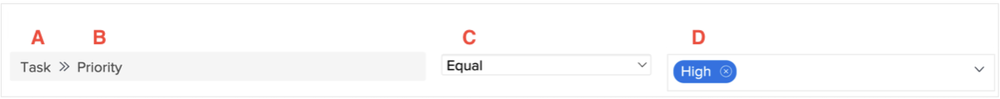

# 보고 구성 요소 이해

이 비디오에서는 필터, 보기 및 그룹화를 만드는 데 필요한 Workfront의 보고 구성 요소의 개념을 설명합니다. 주요 구성 요소는 다음과 같습니다.

* **개체 유형:** 프로젝트, 작업 또는 시간 항목과 같이 처리 중인 Workfront 개체를 지정합니다. &#x200B; 필터, 보기 및 그룹화는 객체 유형에 따라 다릅니다. &#x200B;
* **필드 Source 및 필드 이름:** 필드 원본은 정보가 첨부된 Workfront 항목이고 필드 이름은 특정 정보(예: 프로젝트의 &quot;설명&quot;)입니다. &#x200B;
* **값 필드:** 우선 순위 필드에 대한 &quot;낮음&quot;, &quot;보통&quot;, &quot;높음&quot; 또는 &quot;긴급&quot; 같은 필드의 내용을 나타냅니다. &#x200B;
* **필터 한정자:** 우선 순위가 &quot;높음&quot;인 작업을 표시하는 것과 같이 보고서에 포함하거나 제외할 값을 정의합니다&#x200B;.

>[!VIDEO](https://video.tv.adobe.com/v/3447028/?captions=kor&quality=12&learn=on&enablevpops=0)

## 핵심 사항

* **보고 구성 요소:** Workfront의 보고 구성 요소에는 개체 유형, 필드 원본, 필드 이름, 필터 한정자 및 값 필드가 포함되어 있습니다. 이러한 필드는 필터, 보기 및 그룹화를 만드는 데 필수적입니다. &#x200B;
* **개체 유형 특성:** 필터, 보기 및 그룹화는 프로젝트, 작업 또는 시간 항목과 같은 특정 개체 유형에 연결되어 관련 데이터에 맞게 보고서를 조정할 수 있습니다. &#x200B;
* **필터 규칙:** 필터는 필드 원본, 필드 이름, 한정자 및 값을 사용하여 조건을 정의합니다. &#x200B; 예를 들어 &quot;내 프로젝트&quot; 필터는 로그인한 사용자가 프로젝트 팀의 일부인 현재 프로젝트만 표시합니다. &#x200B;
* **보기 및 그룹화:** 보기는 필드 원본 및 필드 이름 조합을 열에 표시하지만(예: &quot;소유자 이름&quot;) 그룹화는 특정 기준(예: &quot;회사 이름&quot;)에 따라 데이터를 구성합니다&#x200B;.
* **와일드카드 사용:** 필터에 있는 와일드카드를 사용하면 프로젝트 팀 내에서 로그인한 사용자를 식별하고 보고의 개인화를 향상시키는 등 동적 일치를 수행할 수 있습니다. &#x200B;

## 보고 구성 요소 빠른 참조

**A - 필드 소스**

필드 소스 옵션은 선택한 오브젝트 유형에 따라 다릅니다. 종종 필드 소스는 특정 정보(필드 이름이라고도 함)가 속한 Workfront 항목입니다. 경우에 따라 필드 소스가 오브젝트 유형과 동일합니다.
필드 소스는 사용 가능한 필드 이름을 결정합니다.

예: [!UICONTROL 프로젝트], [!UICONTROL 작업], [!UICONTROL 문제], [!UICONTROL 할당 대상]

**B - 필드 이름**

필드 이름은 필드 소스로 선택한 항목에 대해 사용할 수 있는 정보입니다.

입력한 Workfront 필드, 사용자 정의 양식의 필드 또는 Workfront에서 자동으로 캡처하는 정보일 수 있습니다.

필드 이름은 값 필드 옵션을 지원합니다.

예: [!UICONTROL 진행 상태], [!UICONTROL 설명], [!UICONTROL 계획된 완료 일자], 사용자 정의 양식 필드

**C - 필터 한정자**

필터 한정자는 선택한 필드 소스 및 필드 이름 아래에서 볼 수 있는 가능한 결과의 범위를 좁히는 데 도움이 됩니다.

필드 소스 및 필드 이름이 값 필드와 관련되는 방식을 지정합니다.

예: 같음, 포함, Null, 미만

**D - 값**

값은 필드 이름으로 지정된 필드에 입력되는 정보입니다.

값에 대한 옵션은 필드 소스 및 필드 이름에 따라 결정됩니다.

자유 형식 텍스트뿐만 아니라 사용자 및 일자에 대한 와일드카드를 값에 사용할 수 있습니다.

예: 새로 만들기, 현재, $$TODAYbw, 설명

>[!TIP]
>
>Workfront의 특정 필드 이름을 이해하려면 [Adobe Workfront 용어집](https://experienceleague.adobe.com/docs/workfront/using/basics/workfront-terminology-glossary.html?lang=ko-KR)을 참조하십시오.

