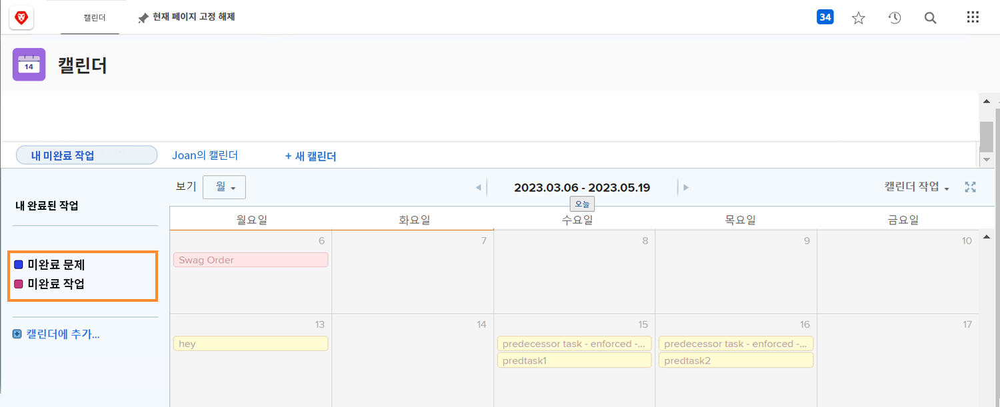
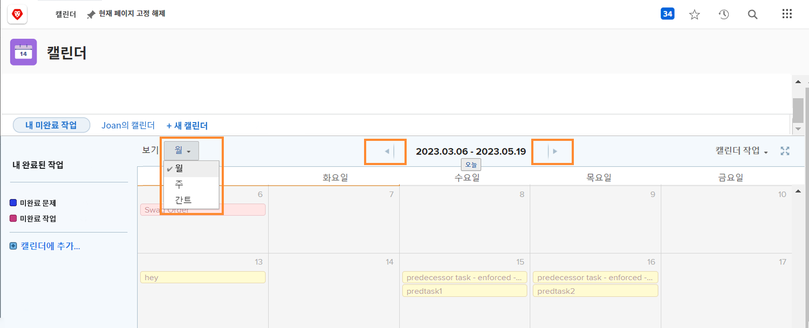
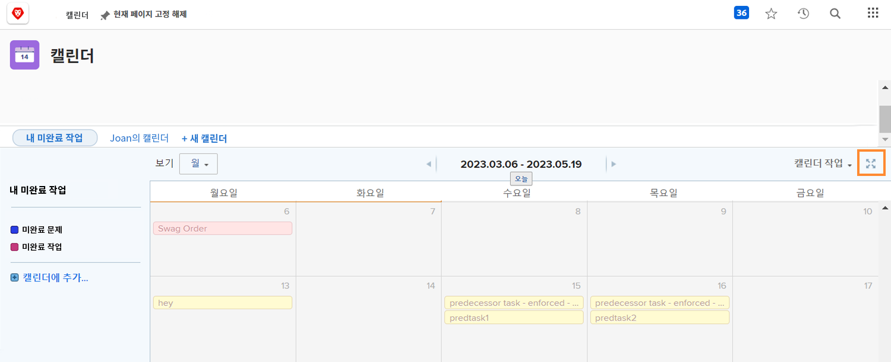
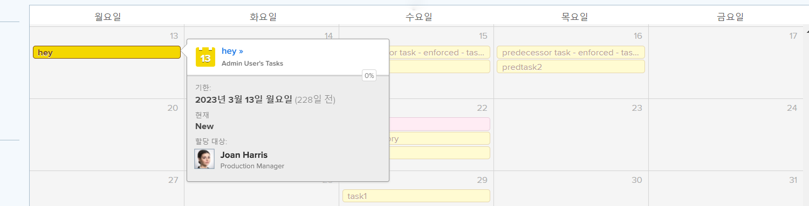
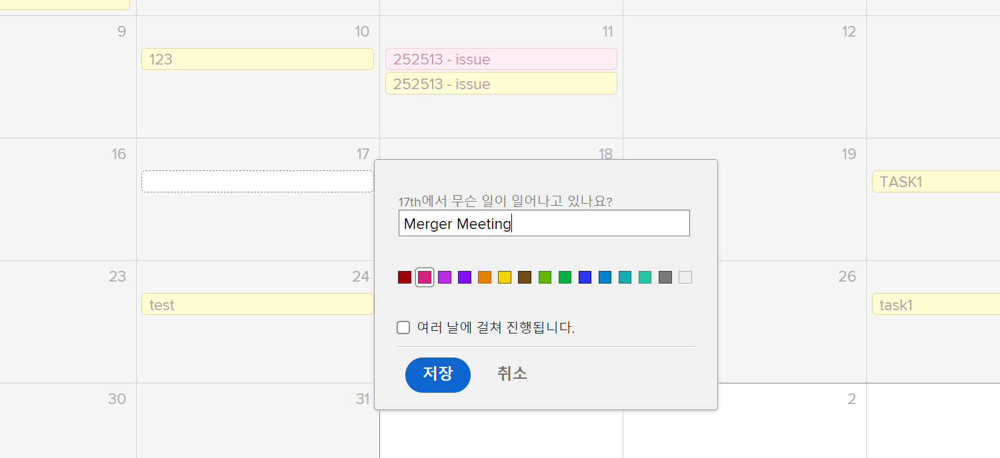

# 달력 인터페이스 이해

이 섹션에서는 다음 사항에 대해 알아봅니다.

* 달력 그룹화
* 달력 보기
* 달력 작업 메뉴
* 임시 달력 항목을 만드는 방법

자신만의 사용자 지정 달력을 만들기 전에 사용자 지정 달력에서 사용할 수 있는 기본 기능을 둘러보겠습니다.

## 달력 그룹화

단일 달력을 개별 작업 항목 그룹으로 구성할 수 있습니다. 각 그룹화는 켜거나 끌 수 있으므로 사용자가 언제든지 가장 중요한 작업 항목에 집중할 수 있습니다.

## 달력 보기

달력은 월, 주 또는 월 단위로 표시될 수 있습니다 [!UICONTROL 간트] 형식 지정 양쪽에 있는 스크롤 막대형 또는 맨 위에 있는 화살표를 사용하여 달력을 이동합니다. 다음 [!UICONTROL 간트] 보기를 사용하면 다른 관점에서 작업을 볼 수 있습니다. 자신에게 가장 적합한 보기를 찾습니다.

![에서 달력 화면의 이미지입니다. [!UICONTROL 간트] 보기](assets/calendar-1-1bb.png)

## [!UICONTROL 달력 작업] 메뉴

다른 작업 항목과 마찬가지로 달력에 [!UICONTROL 작업] 메뉴를 통해 달력에서 주일을 볼 수 있습니다. 달력 삭제 또는 복사 개별 Workfront 사용자, 시스템 전체 또는 외부 사용자와 달력을 공유합니다. 캘린더를 [!UICONTROL 즐겨찾기] 메뉴 아래의 제품에서 사용할 수 있습니다.

![의 이미지 [!UICONTROL 달력 작업] screen](assets/calendar-1-1c.png)

## 전체 화면 모드

전체 화면 아이콘을 클릭하여 전체 화면 모드로 달력을 봅니다. 다시 클릭하여 원래 크기로 돌아갑니다.

## 요약 정보

달력에서 항목을 선택하여 이름, 원래 프로젝트, 상태, 할당, 진행 상태 및 만기 일자를 포함하여 해당 항목의 요약 상세내역을 표시합니다.

## 애드혹 이벤트

일정이나 기타 작업 항목을 나타내는 임시 이벤트를 달력에 만들려면 두 번 클릭합니다.

>[!NOTE]
>
>Ad Hoc 이벤트를 만들더라도 Workfront에서 작업이 생성되지 않습니다.

