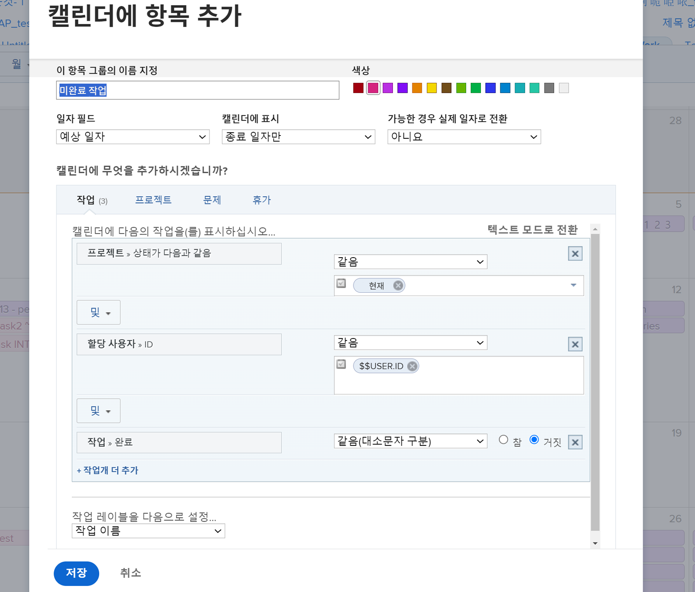
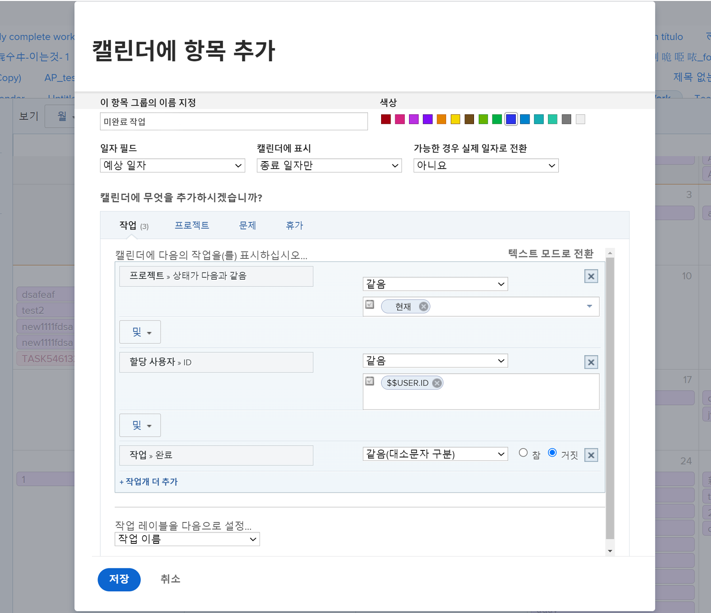
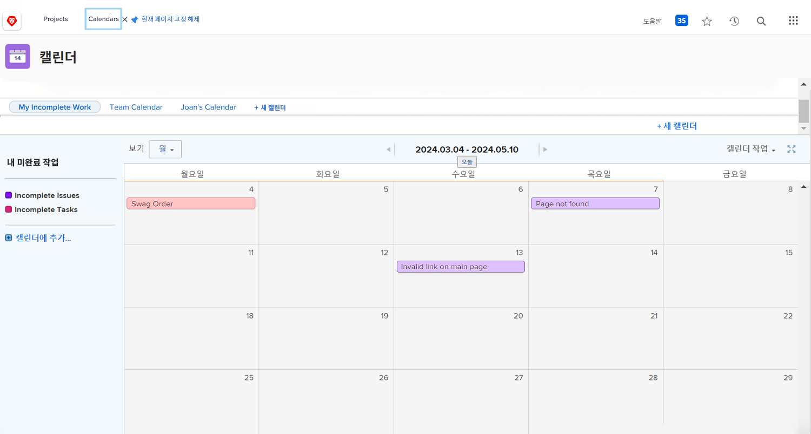

# 캘린더 보고서를 만들 차례입니다.

이 활동에서는 나만의 캘린더를 만드는 경험을 하게 됩니다.

## 활동: 캘린더 만들기

&quot;내 미완료 작업&quot;이라는 고객 캘린더를 만듭니다.

현재 프로젝트에서 사용자에게 할당된 모든 미완료 작업을 표시하는 &quot;미완료 작업&quot;이라는 캘린더 그룹을 포함합니다.

이러한 항목의 색상으로 빨간색을 선택합니다.

현재 프로젝트에서 사용자에게 할당된 모든 미완료 문제를 표시하는 &quot;미완료 문제&quot;라는 다른 달력 그룹을 포함하십시오. 이 항목에 대한 색상으로 파란색을 선택합니다.

## 답변

1. 메인 메뉴에서 캘린더 영역으로 이동합니다.
1. 새 캘린더 버튼을 클릭하고 캘린더의 이름을 &quot;My Incomplete Work&quot;로 지정합니다.
1. 첫 번째 그룹화에서 고급 항목 추가를 클릭합니다.
1. 표시되는 캘린더에 항목 추가 창에서 그룹 이름을 &quot;Incomplete Tasks&quot;로 지정합니다.
1. 빨간색을 색상으로 선택합니다.
1. 일자 필드를 계획된 일자로 변경합니다.
1. 캘린더에서 필드를 종료 날짜로만 표시합니다.
1. 사용 가능한 경우 실제 일자로 전환 필드를 아니요로 설정합니다.

   

1. 캘린더에 무엇을 추가하시겠습니까? 섹션에서 작업을 선택합니다.
1. 세 개의 필터 규칙 추가:

   * 프로젝트 > 상태와 같음 > 같음 > 현재
   * 할당 사용자 > ID > 같음 > $$USER.ID
   * 작업 > 완료됨 > 같음 > False

1. 저장을 클릭합니다.

   

1. 캘린더에 추가를 클릭하여 두 번째 그룹화를 만듭니다.
1. 이 그룹화에서 고급 항목 추가를 클릭합니다.
1. 표시되는 캘린더에 항목 추가 창에서 그룹 이름을 &quot;Incomplete Issues&quot;로 지정합니다.
1. 색상을 파란색으로 선택합니다.
1. 일자 필드를 계획된 일자로 변경합니다.
1. 캘린더에서 필드를 종료 날짜로만 표시합니다.
1. 사용 가능한 경우 실제 일자로 전환 필드를 아니요로 설정합니다.
1. 캘린더에 무엇을 추가하시겠습니까? 섹션에서 문제를 선택합니다.
1. 다음 세 가지 필터 규칙을 추가합니다.

   * 프로젝트 > 상태와 같음 > 같음 > 현재
   * 할당 사용자 > ID > 같음 > $$USER.ID
   * 문제 > 완료 > 같음 > 거짓

1. 저장을 클릭합니다.

   

필터에서 $$USER.ID를 사용했으므로 이 캘린더를 다른 사용자와 공유할 수 있으며 해당 사용자에게는 완료되지 않은 작업 및 문제가 표시됩니다.
