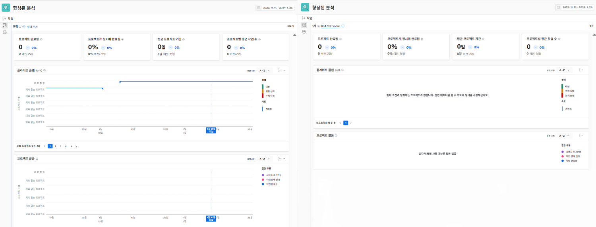

# 의 KPI 이해 [!UICONTROL 향상된 분석]

이 비디오에서는 다음 사항에 대해 알아봅니다.

* KPI 데이터에서 가치를 얻는 방법

>[!VIDEO](https://video.tv.adobe.com/v/335046/?quality=12)

## KPI 비교

KPI는 현재 상황에 대한 중요한 정보를 제공할 뿐만 아니라 사용자에게 시간에 따른 활동의 변화나 포트폴리오, 프로그램, 프로젝트 소유자 또는 사용된 다른 필터 간의 차이를 비교할 수 있는 권한을 제공합니다.

예를 들어 두 개의 브라우저 탭에서 분석을 가져와서 KPI를 비교할 수 있습니다.
