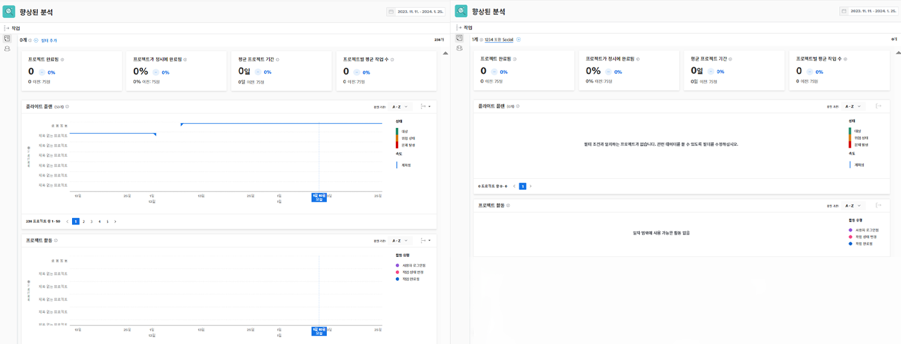

# KPI 이해

이 비디오를 통해 다음과 같은 사항을 알아볼 수 있습니다.

* KPI 데이터에서 가치를 창출하는 방법

>[!VIDEO](https://video.tv.adobe.com/v/335046/?quality=12&learn=on&enablevpops=1)

## KPI 비교

KPI는 현재 일어나고 있는 일에 대한 귀중한 정보를 제공할 뿐만 아니라 사용자에게 시간 경과에 따른 활동의 변화나 포트폴리오, 프로그램, 프로젝트 소유자 또는 사용된 다른 필터 간의 차이를 비교할 수 있는 기능을 제공합니다.

예를 들어 브라우저 탭 두 개에서 분석을 열어 KPI를 비교할 수 있습니다.
