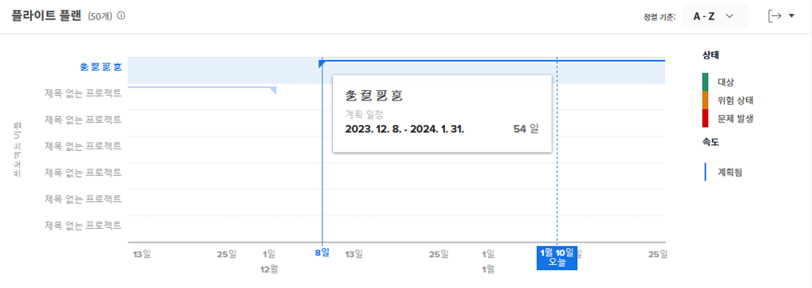
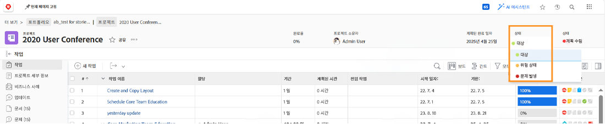
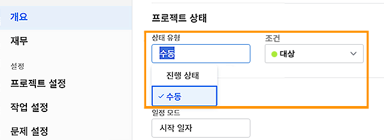

# 에서 프로젝트 탐색 및 검토 이해 [!UICONTROL Enhanced Analytics]

이 비디오에서는 다음을 학습합니다.

* 비행 계획 차트를 읽는 방법

>[!VIDEO](https://video.tv.adobe.com/v/335047/?quality=12&learn=on)

## 비행 계획 차트

차트에서 다음을 볼 수 있습니다.

1. 프로젝트 이름은 왼쪽에 있습니다.
1. 날짜가 하단에 표시됩니다.
1. 세로 파란색 선은 마우스가 가리키는 특정 날짜를 보여줍니다.
1. 수평 파란색 선은 프로젝트의 계획된 시작 및 종료 날짜를 보여줍니다.
1. 녹색 선은 프로젝트가 Target 상태임을 나타냅니다.
1. 주황색 선은 프로젝트가 위험 상태임을 나타냅니다.
1. 빨간색 줄은 프로젝트가 문제 상태임을 나타냅니다.

프로젝트에 대한 다음 정보를 확인하면 다음을 결정하는 데 도움이 됩니다.

* 계획된 완료 일자 이후에 프로젝트를 확장하는 이벤트는 무엇입니까?
* 프로젝트에 문제가 발생하기 시작하면
* 동일한 기간 동안 열려 있는 프로젝트 수입니다.
* 활성 상태인 프로젝트 수입니다.
* 추가 관심이나 지원이 필요한 프로젝트

## 조건은 진행 상태를 기반으로 합니다

프로젝트 조건은 프로젝트가 진행되는 방식을 시각적으로 보여줍니다. Workfront은 프로젝트 내의 작업 진행 상태를 기반으로 조건을 결정합니다.

프로젝트의 조건은 다음과 같이 설정할 수 있습니다.

* **수동으로**: 프로젝트의 조건 유형이 수동으로 설정된 경우 프로젝트를 관리할 수 있는 액세스 권한이 있는 사용자가 프로젝트를 관리합니다. 따라서 프로젝트의 조건을 중요한 경로와 별도로 설정할 수 있습니다.
* **자동**: Workfront에서 프로젝트의 조건 유형이 진행 상태로 설정된 경우.

Workfront에서는 작업 진행 상태에 따라 프로젝트의 실제 진행 상황을 명확하게 나타낼 수 있도록 조건 유형을 진행 상태로 설정할 것을 권장합니다.

이 경우 프로젝트 조건은 다음과 같습니다.

* **Target 시**—중요한 경로에 있는 마지막 작업의 진행 상태가 [설정] 상태일 때 프로젝트의 조건은 Target이 됩니다. 그 프로젝트는 예정대로 끝나야 한다.
* **위험**- 중요한 경로에 있는 마지막 작업의 진행 상태가 &quot;후방&quot; 또는 &quot;위험&quot; 상태인 경우 프로젝트의 상태는 &quot;위험 상태&quot;입니다. 그 프로젝트는 늦게 끝나려고 진행 중이지만 아직 늦지 않았다.
* **문제 발생**- 중요한 경로에 있는 마지막 작업의 진행 상태가 늦으면 프로젝트의 조건이 문제 있음 입니다. 기한은 이미 지났고 이제 프로젝트가 늦었다.

>[!NOTE]
>
>조건을 환경에 맞게 사용자 지정할 수 있으므로 3개 이상의 옵션을 찾을 수 있으며, 이름이 위의 옵션과 다를 수 있습니다. 조건 사용자 지정에 대한 자세한 내용은 사용자 지정 조건 만들기 또는 편집 문서를 참조하십시오.
