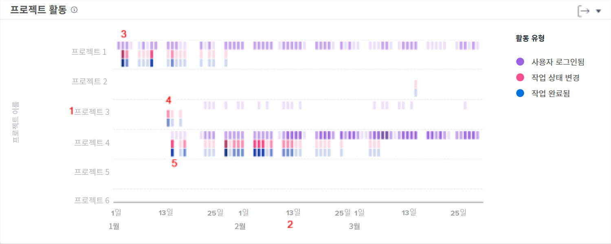

# 프로젝트 활동 탐색 및 검토 이해

이 비디오를 통해 다음과 같은 사항을 알아볼 수 있습니다.

* 로그인한 사용자, 작업 상태 변경 및 완료된 작업을 기반으로 프로젝트를 비교하는 방법

>[!VIDEO](https://video.tv.adobe.com/v/3437443/?quality=12&learn=on&enablevpops=1&captions=kor)

## 프로젝트 작업 비교

프로젝트 활동 차트를 사용하면 로그인한 사용자, 작업 상태 변경 및 완료된 작업과 같은 프로젝트 활동을 이해하고 Workfront의 다른 프로젝트와 비교할 수 있습니다. 프로젝트 활동은 일정 기간 동안의 활동을 요약하기 위해 다양한 색상으로 표시됩니다.

이 정보를 보면 다음과 같은 사항을 확인할 수 있습니다.

* 특정 프로젝트에 대한 활동.
* 다른 프로젝트와 비교한 하나의 프로젝트 활동.
* 프로젝트 작업을 하는 사용자 및 빈도

차트에서 다음과 같은 사항을 조회할 수 있습니다.

1. 왼쪽의 프로젝트 이름.
1. 하단에 표시된 이름.
1. 보라색 상자는 해당 일자에 로그인한 프로젝트에 할당된 사용자를 나타내며, 어두운 음영은 더 많은 수의 로그인 사용자를 나타냅니다.
1. 분홍색 상자는 사용자가 해당 일자에 프로젝트의 작업 상태를 변경했음을 보여 주며, 음영이 짙을수록 더 많은 수의 작업 상태가 변경되었음을 나타냅니다.
1. 파란색 상자는 사용자가 프로젝트에 대한 작업을 완료했음을 나타내며 어두운 음영은 더 많은 작업이 완료되었음을 나타냅니다.
