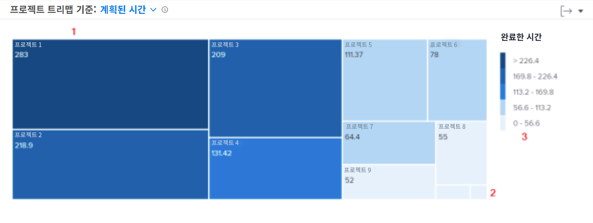

# 탐색에 대해 자세히 알아보기

이 비디오를 통해 다음과 같은 사항을 알아볼 수 있습니다.

* 작업자가 각 프로젝트에 할애하는 시간을 빠르게 확인하는 방법

>[!VIDEO](https://video.tv.adobe.com/v/3437806/?quality=12&learn=on&enablevpops&captions=kor)

## 프로젝트에 소요된 시간 검토

프로젝트 트리맵을 사용하면 사용자가 프로젝트에 할애한 시간을 파악할 수 있습니다. 상자는 프로젝트를 나타냅니다. 상자 크기는 다른 프로젝트와 비교하여 프로젝트에 소요된 시간을 보여 줍니다. 상자가 클수록 더 많은 시간이 소요됩니다.

이 정보를 보면 다음과 같은 사항을 확인할 수 있습니다.

* 선택한 날짜 범위 동안 작업 중인 항목의 우선 순위
* 사용자가 시간을 할애하는 작업
* 사용자가 올바른 항목에 집중하는지 여부
* 특정 프로젝트를 선택한 경우 해당 기간 동안 프로젝트 범위가 변경된 정도

차트에서 다음과 같은 사항을 조회할 수 있습니다.

1. 완료 시간이 많은 필터링된 시간의 프로젝트는 더 큰 상자와 진한 파란색으로 표시됩니다.
1. 완료 시간이 더 적은 필터링된 시간의 프로젝트는 더 작은 상자와 연한 파란색으로 표시됩니다.
1. 차트 오른쪽의 범례는 각 파란색 음영의 완료 시간 범위를 보여 줍니다.
