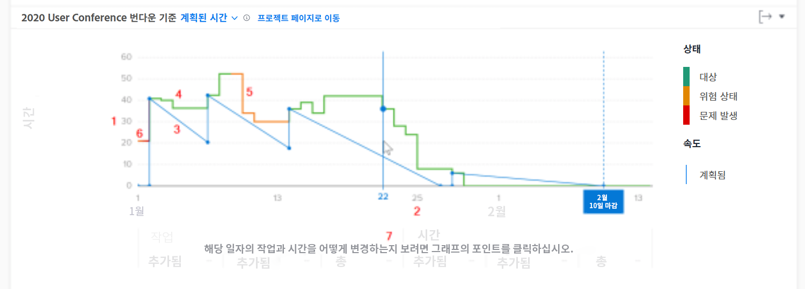

# 번다운 액세스 및 검토 이해

이 비디오에서는 다음 사항에 대해 알아봅니다.

* 번다운 차트에 액세스하는 방법
* 프로젝트에 대한 남은 시간, 프로젝트 상태 및 속도 간의 관계를 이해하는 방법

>[!VIDEO](https://video.tv.adobe.com/v/335051/?quality=12&learn=on)

## 프로젝트 속도 추적

번다운 차트를 통해 남은 시간, 프로젝트 상태 및 속도 간의 관계를 이해할 수 있습니다. 실선은 프로젝트에 소요된 시간 및 매일 프로젝트의 상태를 보여 줍니다. 작업의 날짜가 변경됨에 따라 시작 날짜부터 계획된 완료 날짜까지의 계획된 속도가 표시되는 파선이 조정됩니다.

이 정보를 보면 다음을 결정하는 데 도움이 됩니다.

* 문제 발생(계획되지 않은 작업)이 계획된 작업에 미치는 영향.
* 계획된 완료 일자를 지나 프로젝트를 확장한 이벤트는 무엇입니까?

차트에서 다음을 확인할 수 있습니다.

1. 왼쪽의 시간 수.
1. 선택한 날짜 범위에 프로젝트의 계획된 완료 날짜가 표시되는 경우 이를 포함하여 날짜가 맨 아래에 표시됩니다.
1. 파란색 실선은 프로젝트의 계획된 완료 일자에 도달하면 파선으로 바뀌는 프로젝트의 속도(계획된 시간 또는 시간에 따른 기간)를 보여 줍니다.
1. 녹색 선은 프로젝트 상태가 타겟에 있는 시기를 나타냅니다.
1. 주황색 선은 프로젝트 상태가 위험 상태일 때를 나타냅니다.
1. 빨간색 선은 프로젝트 상태가 문제 발생 시점을 나타냅니다.
1. 차트에서 특정 지점을 클릭하면 특정 날짜의 작업 및 시간(합계, 추가된 금액 및 완료된 금액)에 대한 정보가 x축 아래에 표시됩니다.
