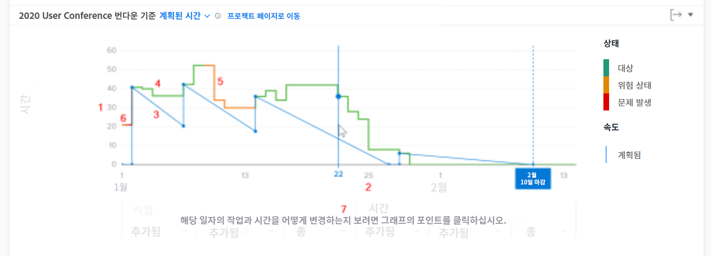

# 번다운 액세스 및 검토 이해

이 비디오를 통해 다음과 같은 사항을 알아볼 수 있습니다.

* 번다운 차트에 액세스하는 방법
* 남은 시간, 프로젝트 상태 및 프로젝트 속도 간의 관계를 이해하는 방법

>[!VIDEO](https://video.tv.adobe.com/v/335051/?quality=12&learn=on&enablevpops=1)

## 프로젝트 속도 추적

번다운 차트를 사용하면 남은 시간, 프로젝트 상태 및 속도 간의 관계를 이해할 수 있습니다. 실선은 시간 경과에 따라 프로젝트에 소요된 시간과 매일 프로젝트 상태를 보여 줍니다. 파선은 시작 일자부터 계획된 완료 일자까지의 계획된 속도를 보여 주며 작업 일자가 변경됨에 따라 조정됩니다.

이 정보를 보면 다음과 같은 사항을 확인할 수 있습니다.

* 들어오는 문제(계획되지 않은 작업)가 계획된 작업에 미친 영향.
* 프로젝트가 계획된 완료 일자를 초과하도록 유발한 이벤트.

차트에서 다음과 같은 사항을 조회할 수 있습니다.

1. 왼쪽의 시간.
1. 선택한 날짜 범위에 표시되는 경우 프로젝트의 계획된 완료 일자를 포함하여 일자가 아래쪽에 표시됩니다.
1. 파란색 실선은 프로젝트의 속도(계획된 시간 또는 시간 경과에 따른 기간)를 나타내며 프로젝트의 계획된 완료 일자에 도달하면 세로 점선으로 바뀝니다.
1. 녹색 선은 프로젝트 상태가 “대상 유지”일 때를 나타냅니다.
1. 주황색 선은 프로젝트 상태가 ‘위험 상태’일 때를 나타냅니다.
1. 빨간색 선은 프로젝트 상태가 ‘문제 발생’일 때를 나타냅니다.
1. 차트의 특정 지점을 클릭하면 특정 일자의 작업 및 시간(총계, 추가된 양 및 완료된 양)에 대한 정보가 x축 아래에 표시됩니다.
