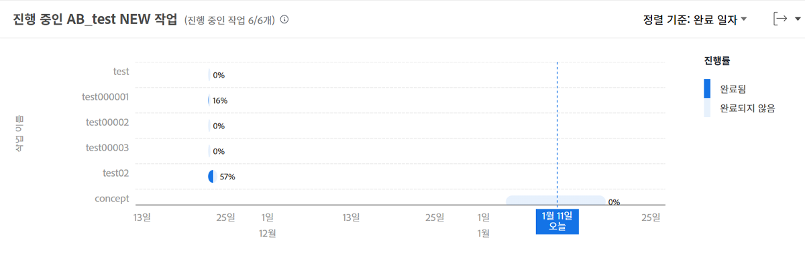

# 전송 중인 작업 검토

이 비디오를 통해 다음과 같은 사항을 알아볼 수 있습니다.

* 전송 중인 작업 차트에 액세스하는 방법
* 프로젝트에서 완료되지 않은 작업을 빠르게 확인하는 방법

>[!VIDEO](https://video.tv.adobe.com/v/335052/?quality=12&learn=on)

## 작업 수준의 데이터

전송 중인 작업 차트를 사용하면 특정 프로젝트의 작업을 자세히 분석하여 각 활성 작업에 대해 완료된 작업의 양과 작업 일정을 확인할 수 있습니다. 차트를 통해 프로젝트에서 완료해야 하는 작업과 이러한 작업의 완료율을 이해할 수 있습니다.

이 정보를 통해 다음을 확인할 수 있습니다.

* 사람들이 작업하는 항목.
* 프로젝트를 위험에 빠뜨릴 수 있는 작업.
* 작업 완료에 대한 근접치.
* 특정 작업에 대해 이야기해야 하는 사람.

차트에서 다음과 같은 사항을 조회할 수 있습니다.

1. 왼쪽에 있는 작업 이름.
1. 하단의 일자.
1. 작업 표시줄 내의 진한 파란색은 완료된 작업량을 나타냅니다.
1. 작업 표시줄 내의 밝은 파란색은 완료해야 하는 작업량을 나타냅니다.
1. 작업 표시줄 오른쪽에 있는 숫자는 작업의 완료율을 나타냅니다.
