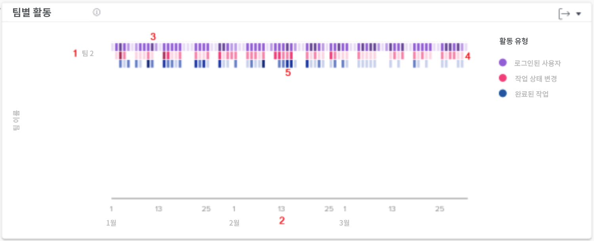

# 팀 차트별 활동 이해

팀별 활동 차트를 사용하면 조직의 홈 팀이 Workfront에서 보내는 시간을 파악할 수 있습니다. Workfront 사용자는 여러 팀에 있을 수 있지만 하나의 홈 팀에만 있을 수 있습니다. 사람 차트에서 사용되는 팀은 해당 팀이 홈 팀으로 지정된 사용자만 구성합니다.

활동—로그인한 사용자, 작업 상태 변경 내용 및 작업 완료—필터링된 기간 동안 이러한 이벤트를 요약하기 위해 다른 색상으로 표시됩니다.

다음 정보를 확인하면 다음을 결정하는 데 도움이 됩니다.

* 홈 팀 내에서 그리고 어느 비율로 발생하는 활동입니다.
* 어떤 홈팀이 과로 중이거나 더 많이 사용하고 있는가.
* 홈 팀에 적합한 작업 배포라면

차트에서 다음을 볼 수 있습니다.

1. 왼쪽에 홈팀 이름.
1. 하단의 날짜는 선택한 날짜 범위에서 가져옵니다.
1. 자주색 상자에서는 해당 날에 로그인한 프로젝트에 할당된 사용자가 더 어두운 색조를 사용하여 로그인한 사용자가 더 많다는 것을 보여줍니다.
1. 분홍 상자는 사용자가 해당 날에 프로젝트의 작업 상태를 변경했으며, 세부 색조가 더 많은 작업 상태가 변경되었음을 나타냅니다.
1. 파란색 상자는 사용자가 프로젝트에 대한 작업을 완료했음을 보여 주고, 세부 음영으로 완료되는 작업이 더 많음을 나타냅니다.
