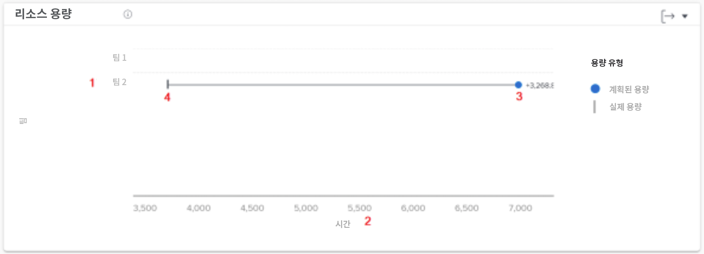
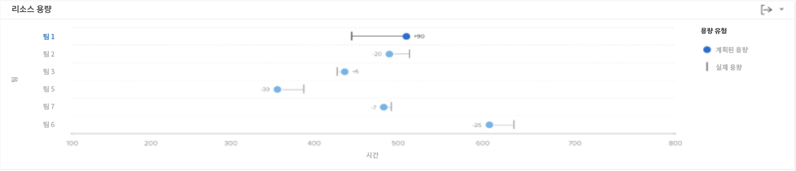

# 의 리소스 용량 차트 이해 [!UICONTROL Enhanced Analytics]

자원 능력 차트는 필터링된 기간 내에 홈 팀에 지정된 계획 시간의 수를 팀의 총 가용 시간과 비교하여 보여줍니다.

이 비교를 통해 팀에 충분한 작업을 할당하지 않거나 과중한 작업 로드에서 과로로 인해 과부하가 발생할 수 있는지 확인할 수 있습니다. 팀 이름을 클릭하면 팀 용량 차트가 나타나고 필터링된 기간 동안의 팀 능력에 대한 자세한 정보가 표시됩니다.

다음 정보를 확인하면 다음을 결정하는 데 도움이 됩니다.

* 홈 팀이 초과 할당되었거나 할당 미만일 경우.
* 어떤 홈팀이 일할 수 있나요?

차트에서 다음 주요 세부 사항을 볼 수 있습니다.

1. 홈 팀 이름은 왼쪽에 있습니다.
1. 시간은 바닥을 가로질러 있다. 차트의 x축이고 위의 팀에 표시되는 시간 범위로 계산됩니다.
1. 원은 홈 팀에 지정된 계획 시간 수를 표시합니다.
1. 세로줄은 홈 팀에서 사용할 수 있는 총 시간 수를 보여줍니다.

## 차트로 이동하는 방법

1. 을(를) 클릭합니다. [!UICONTROL 사람] 왼쪽 패널에서 탭을 클릭합니다.
1. 를 사용하십시오 [!UICONTROL 필터] 검사할 하나 이상의 홈 팀을 선택합니다.
1. 이 표시됩니다 [!UICONTROL 자원 능력] 차트가 팀 활동 차트 아래에 나타납니다.

## 차트 사용 방법

필터를 추가하고 날짜 범위를 선택하여 차트에서 데이터를 표시해야 합니다 [!UICONTROL 향상된 분석] Workfront 영역. 이전에 필터를 추가한 경우 필터를 제거할 때까지 활성화됩니다.

자원 능력 차트에서 다음을 수행할 수 있습니다.

* 홈 팀 라인 위로 마우스를 가져가면 계속 예약할 수 있는 시간, 홈 팀이 완료할 수 있도록 계획된 시간, 완료된 총 작업 시간(위로, 아래로 또는 용량으로 표시됨)을 확인할 수 있습니다.
* 차트의 오른쪽 위 모서리에 있는 내보내기 단추를 사용하여 차트 데이터를 내보냅니다.
* 홈 팀 이름을 클릭하여 팀 용량 차트를 엽니다. 팀 용량 차트에서 더 작은 범위로 확대하면 리소스 용량 차트에 나타나는 데이터가 업데이트됩니다.
