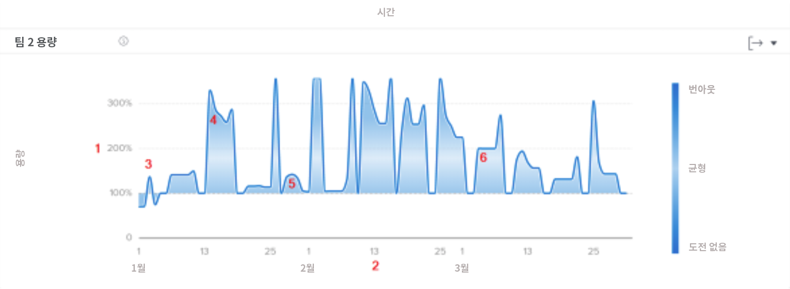
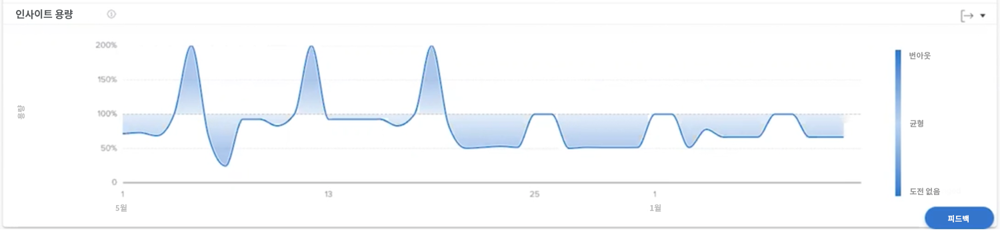

# 의 팀 용량 이해 [!UICONTROL Enhanced Analytics]

팀 용량 차트는 홈 팀이 초과 할당 또는 초과 할당된 시점을 보여줍니다. 이 차트는 홈 팀에 지정된 날짜에 할당된 작업의 양을 표시하며 번아웃에 근접하거나 사용자에게 도전하지 않을 때 짙은 파란색을 지정합니다. 보다 가볍고 투명한 색상은 작업 로드가 더 균형 있게 조정되었음을 나타냅니다.

다음 정보를 확인하면 다음을 결정하는 데 도움이 됩니다.

* 홈 팀이 초과 할당 또는 초과 할당 받은 경우
* 홈 팀이 일별로 초과 할당 또는 미할당 상태인 경우.
* 홈 팀의 작업 로드가 얼마나 일관됩니까?
* 새 작업에 용량 문제를 만드는 경우

차트에서 다음을 볼 수 있습니다.

1. 홈팀 출력의 비율은 왼쪽이다.
1. 하단의 날짜는 선택한 날짜 범위에서 가져옵니다.
1. 어두운 파란색 채우기 색상은 홈 팀이 불꺼짐(4)을 경험했거나 문제가 없음을 나타냅니다.
1. 밝은 파란색이나 더 투명한 파란색은 홈 팀의 작업 부하가 균형을 잡음을 나타냅니다

## 차트로 이동하는 방법

1. 을(를) 클릭합니다. [!UICONTROL 사람] 왼쪽 패널에서 탭을 클릭합니다.
1. 를 사용하십시오 [!UICONTROL 필터] 검사할 홈 팀을 선택합니다.
1. 팀 용량 차트가 아래에 표시됩니다 [!UICONTROL 자원 능력] 차트.

## 차트 사용 방법

Analytics 영역의 사람 섹션에 차트에 데이터를 표시하려면 필터를 추가하고 날짜 범위를 선택해야 합니다. 필터를 이전에 추가한 경우 제거할 때까지 활성 상태가 됩니다.

팀 용량 차트에서 다음을 수행할 수 있습니다.

* 차트의 한 지점 위로 마우스를 가져가면 날짜 라인이 표시됩니다.
* 그래프 라인의 한 지점을 마우스로 가리키면 지정된 날짜에 대한 예약된 시간 및 계획된 시간과 능력 백분율과 현재 홈 팀이 끝났는지, 아래에 있는지 또는 용량인지 확인할 수 있습니다.
* 을 클릭하고 마우스를 프로젝트의 특정 지점 위로 드래그하여 날짜를 확대합니다. (이 작업은 동일한 날짜 범위에서 확대하도록 다른 모든 차트를 업데이트합니다.)
* 차트의 오른쪽 위 모서리에 있는 내보내기 버튼을 사용하여 차트 데이터를 내보냅니다.
