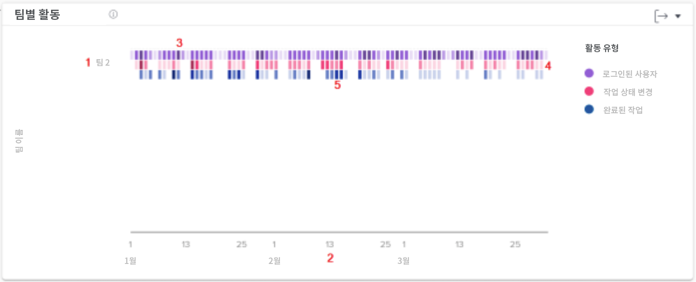

# 작업 및 사용자 차트 이해

작업 차트는 프로젝트 및 작업 관점에서의 활동을 보여 주는 반면 사용자 차트는 홈 팀의 관점에서 활동을 보여 줍니다.

왼쪽 패널 메뉴에서 보려는 Analytics 차트 유형(작업 또는 사용자)을 선택합니다.

## 작업 차트

![[!DNL Workfront Classic]](assets/section-1-1.png)의 [!UICONTROL Analytics] 기능을 찾는 이미지

‘작업’ 차트로 이동하면 기본적으로 다음이 표시됩니다.

1. KPI 통계
1. 플라이트 플랜
1. 프로젝트 활동
1. 프로젝트 트리맵 (위에 표시되지 않음)

데이터를 드릴다운하면 ‘번다운’ 및 ‘작업’이 플라이트 차트로 표시됩니다.

* ‘플라이트 플랜’ 보기에서 프로젝트를 클릭하면 해당 프로젝트의 ‘번다운’ 보기가 그 아래에 표시됩니다.
* ‘트리맵’ 보기에서 프로젝트를 클릭하면 ‘번다운’과 ‘작업’이 플라이트 보기로 그 아래에 표시됩니다.

## 사용자 차트 - 팀별 활동

차트에서 다음과 같은 사항을 조회할 수 있습니다.

1. 왼쪽의 홈 팀 이름.
1. 하단의 일자는 선택한 날짜 범위의 일자를 사용합니다.
1. 보라색 상자는 해당 일자에 로그인한 프로젝트에 할당된 사용자를 나타내며, 어두운 음영은 더 많은 수의 로그인 사용자를 나타냅니다.
1. 분홍색 상자는 사용자가 해당 일자에 프로젝트의 작업 상태를 변경했음을 보여 주며, 음영이 짙을수록 더 많은 수의 작업 상태가 변경되었음을 나타냅니다.
1. 파란색 상자는 사용자가 프로젝트에 대한 작업을 완료했음을 나타내며 어두운 음영은 더 많은 작업이 완료되었음을 나타냅니다.

