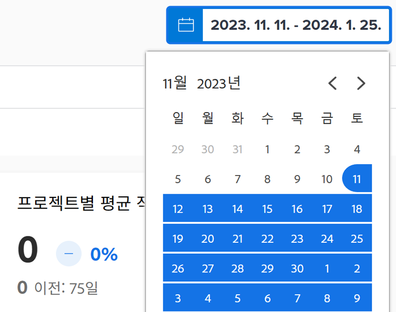
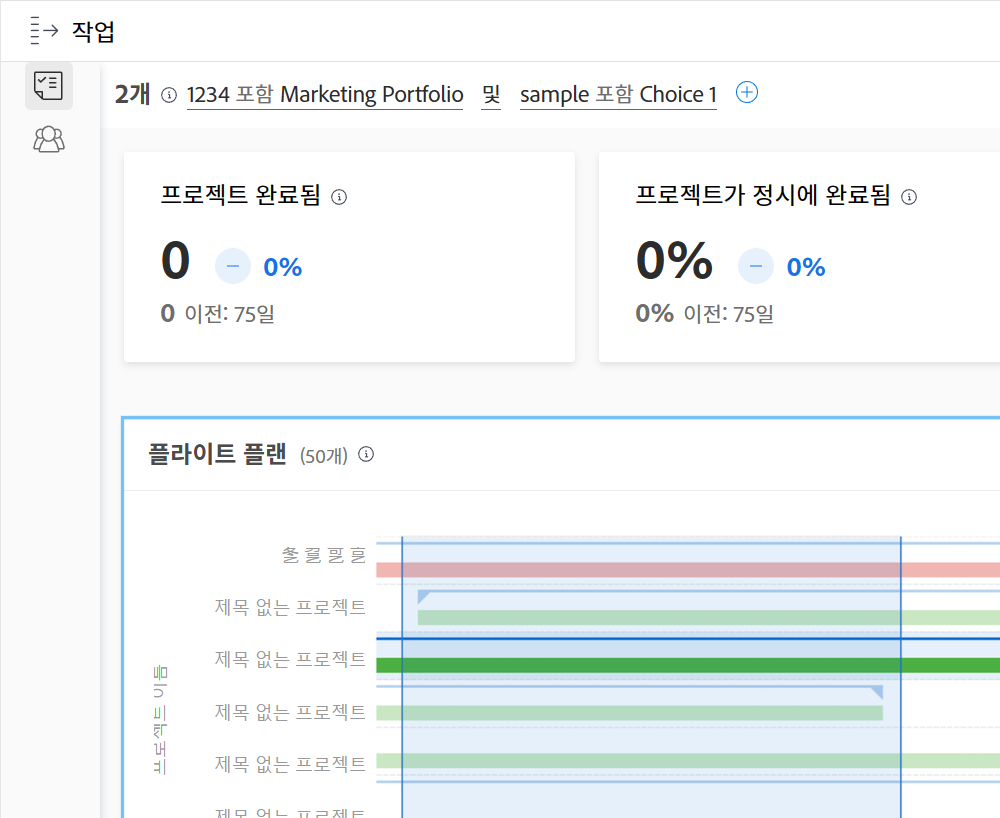

# 의 날짜 범위 및 기간을 이해합니다 [!UICONTROL Enhanced Analytics]

를 볼 때 [!DNL Enhanced analytics] 차트, 날짜 범위는 달력 위젯을 사용하여 지정됩니다. 를 클릭하고 드래그하여 특정 영역을 정의할 때 차트 내에 타임프레임이 생성되므로 해당 기간 동안의 정보를 확대하여 보다 자세한 정보를 볼 수 있습니다.

## 날짜 범위

달력에서 날짜를 클릭하여 범위에서 한 날짜를 표시한 다음 날짜를 클릭하여 범위의 다른 끝을 표시합니다. 시작 날짜와 종료 날짜가 같은 달에 없는 경우 달력 상단에 있는 화살표를 사용하여 다른 달로 이동합니다.

의 차트 [!DNL Analytics] 최근 60일 및 다음 15일 동안의 데이터를 기본적으로 표시합니다. 새 날짜 범위를 선택하고 사용 중인 모든 차트에 적용할 수 있습니다 [!DNL Analytics].

페이지를 새로 고치거나, 멀리 탐색하거나, Workfront에서 로그아웃하거나, 로그인하면 날짜 범위가 기본값으로 재설정됩니다.

## 시간대

타임라인 을 클릭하고 원하는 섹션을 드래그하여 시간대 필터를 만듭니다. 이제 이 기간은 작업 영역의 모든 차트에 적용되며 필터 막대의 다른 필터 옆에 표시됩니다. 영역을 클릭하고 끌어 일정을 업데이트하여 차트에 더 깊이 있습니다. 시간대 필터를 제거하려면 필터 막대에서 해당 필터를 마우스로 가리킨 다음 표시되는 X를 클릭합니다.

페이지를 새로 고치거나, 멀리 탐색하거나, Workfront에서 로그아웃하면 일정이 제거되고 날짜 범위가 재설정됩니다.

>[!NOTE]
>
>프로젝트 트리맵 및 자원 능력 차트에는 이 일정 옵션을 사용할 수 없습니다.
