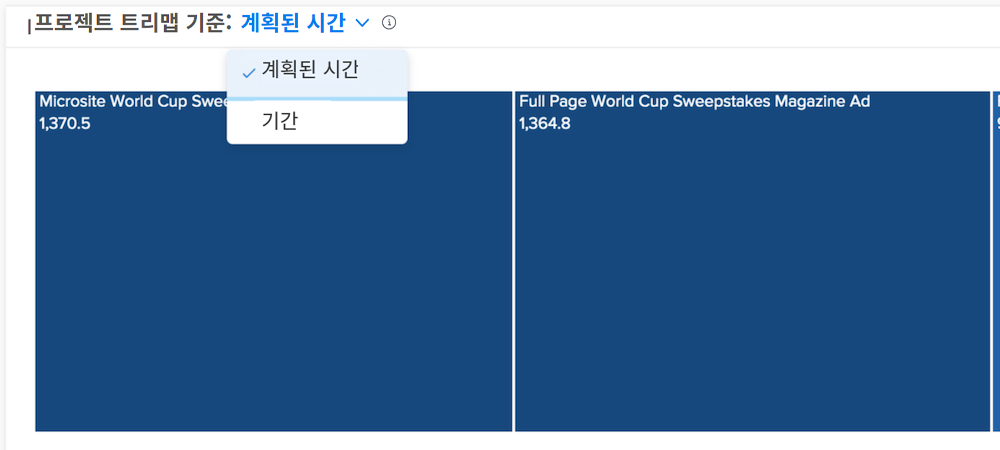

# 에서 계획된 시간 및 기간 보기 이해 [!UICONTROL Enhanced Analytics]

Burndown 및 Project 트리맵 차트에서는 Workfront 환경에 대해 더 정확하게 간주되는 내용에 따라 계획된 시간이나 기간별로 정보를 볼 수 있습니다.

계획 시간은 기본값입니다. 지속 시간으로 전환하는 경우 다음 위치에서 멀리 탐색하는 경우 계속 유지됩니다 [!DNL Analytics] Workfront 로그인 간 및 돌아올 수 있습니다.

## 상자 크기와 색상은 무엇을 의미합니까?

작고 연한 파란색 상자는 적은 시간을 나타내고 더 큰 상자와 더 어두운 색상은 비교에서 더 많은 시간을 나타냅니다. 자세한 내용은 [프로젝트 트리맵 시각화 이해](https://experienceleague.adobe.com/docs/workfront/using/reporting/enhanced-analytics/project-treemap-overview.html?lang=en).
