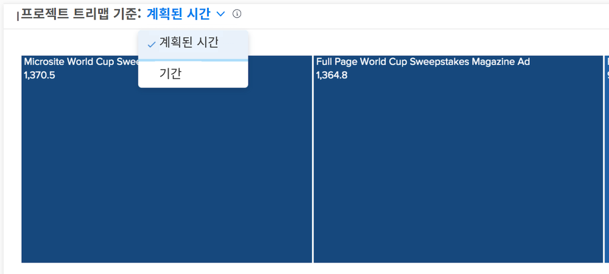

# 계획된 시간 및 기간 보기 이해

번다운 및 프로젝트 트리맵 차트에서 더 정확하다고 생각하는 Workfront 환경에 대한 항목에 따라 계획된 시간 또는 기간별로 정보를 조회할 수 있습니다.

계획된 시간이 기본값입니다. 기간으로 전환하면 [!DNL Analytics]에서 벗어나 다른 곳으로 이동(Workfront 로그인이 전환되는 동안)하는 동안 기간이 적용됩니다.

## 상자 크기와 색상 음영은 무엇을 의미합니까?

더 작고 밝은 파란색 상자는 더 적은 시간을 나타내는 반면, 더 큰 상자와 어두운 파란색 음영은 상대적으로 더 많은 시간을 나타냅니다. 자세한 내용은 [프로젝트 트리맵 시각화 이해](https://experienceleague.adobe.com/docs/workfront/using/reporting/enhanced-analytics/project-treemap-overview.html?lang=ko-KR)를 참조하십시오.
