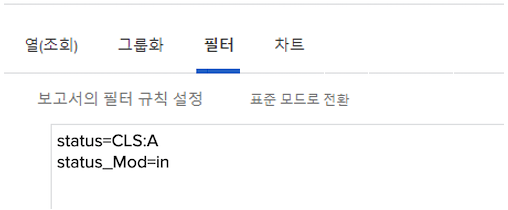

# 필터에 대한 기본 텍스트 모드 이해

이 비디오에서는 다음을 학습합니다.

* 텍스트 모드는 무엇입니까?
* 낙타의 예는 무엇인가요
* 보고서 필터에서 사용할 수 있는 몇 가지 기본 &quot;플러그인 및 재생&quot; 텍스트 모드

>[!VIDEO](https://video.tv.adobe.com/v/336820/?quality=12)

다음 텍스트 모드에서는 사용자가 &quot;Done with My Part&quot;로 표시된 작업을 제외합니다. 작업 필터를 만들고 원하는 필터 규칙을 추가한 다음 텍스트 모드로 전환한 다음 필터에 표시되는 텍스트 모드 뒤에 아래 코드를 붙여 넣으면 됩니다.

```
EXISTS:1:$$OBJCODE=ASSGN  
EXISTS:1:taskID=FIELD:ID  
EXISTS:1:status=DN  
EXISTS:1:status_Mod=notin  
EXISTS:1:assignedToID=$$USER.ID 
```

## 활동: 텍스트 모드 질문

1. &quot;ID로 입력됨&quot;이라는 제목의 필드에 대한 낙타사례를 어떻게 쓰실 건가요?
1. 문제 보고서에서 닫힌 것으로 표시되었지만 승인 보류 중인 문제를 표시하는 필터를 만듭니다.

## 답변

1. &quot;Entered By ID&quot; 필드에 대한 카멜 대소스는 다음과 같이 기록해야 합니다. enteredByID
1. 텍스트 모드는 문제 보고서 필터의 다음과 같습니다.

   
