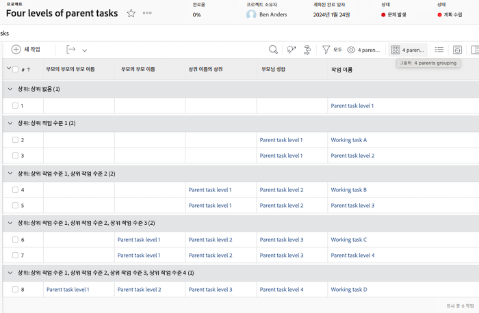
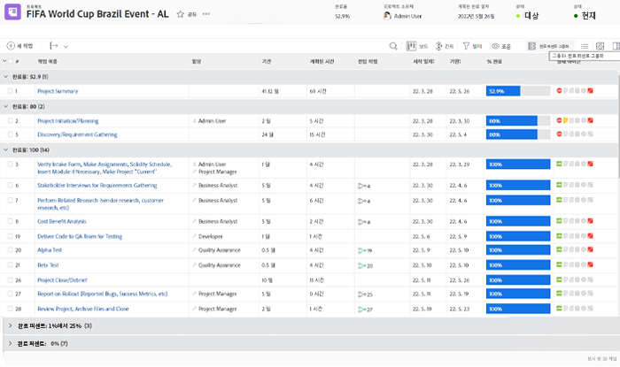
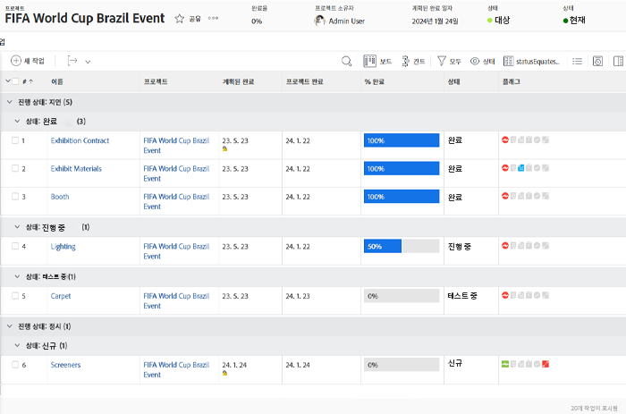
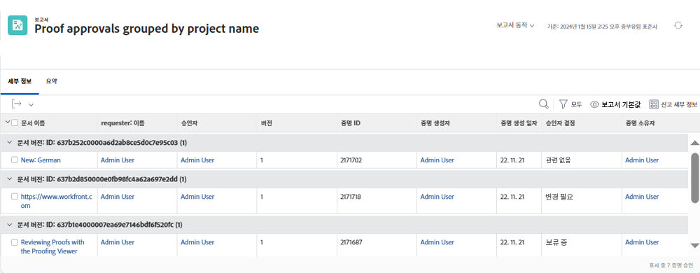
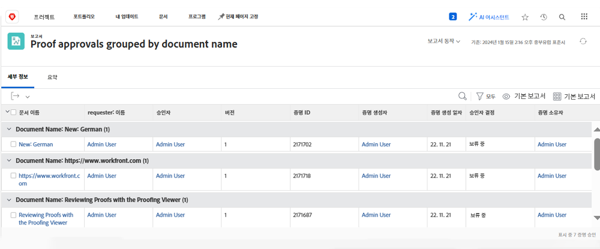

# 그룹화의 기본 텍스트 모드 이해

>[!PREREQUISITES]
>
>* [보고 요소 이해](https://experienceleague.adobe.com/docs/workfront-learn/tutorials-workfront/reporting/basic-reporting/reporting-elements.html?lang=ko)
>* [보고 구성 요소 이해](https://experienceleague.adobe.com/docs/workfront-learn/tutorials-workfront/reporting/basic-reporting/reporting-components.html?lang=ko)
>* [기본 그룹화 만들기](https://experienceleague.adobe.com/docs/workfront-learn/tutorials-workfront/reporting/basic-reporting/create-a-basic-grouping.html?lang=ko)


>[!TIP]
>
>* 텍스트 모드에 대해 자세히 알아보려면 한 시간 길이의 녹화된 웨비나 이벤트인 [전문가에게 질문하기 - 텍스트 모드 보고 소개](https://experienceleague.adobe.com/en/docs/events/classics/reporting-and-dashboards/introduction-to-text-mode-reporting)를 시청하는 것이 좋습니다.
>* 텍스트 모드에 대해 자세히 알아보려면 총 5시간 30분 길이의 [고급 보고](https://experienceleague.adobe.com/docs/workfront-learn/tutorials-workfront/reporting/advanced-reporting/welcome-to-advanced-reporting.html?lang=ko) 튜토리얼을 시청하는 것이 좋습니다.
>* [[!UICONTROL API 탐색기]](https://developer.adobe.com/workfront/api-explorer/)에 액세스하려면 여기를 클릭하십시오.

이 비디오를 통해 다음과 같은 사항을 알아볼 수 있습니다.

* 텍스트 모드의 정의
* 카멜 표기법의 정의
* 보고서 그룹화에 사용할 수 있는 _텍스트 모드 코드 블록_

>[!VIDEO] (https://video.tv.adobe.com/v/3410641/?quality=12&learn=on&enablevpops=0

## “그룹화의 기본 텍스트 모드 이해하기” 활동

### 작업 - 4개의 상위 그룹화

다음 텍스트 모드는 최대 4개의 상위 수준을 기준으로 작업을 그룹화하고 존재하지 않는 상위 항목은 비워 둡니다.

```
textmode=true
group.0.name=Parents
group.0.valueexpression=CONCAT({parent}.{parent}.{parent}.{parent}.{name},IF(ISBLANK({parent}.{parent}.{parent}.{parent}.{name}),"",", "),{parent}.{parent}.{parent}.{name},IF(ISBLANK({parent}.{parent}.{parent}.{name}),"",", "),{parent}.{parent}.{name},IF(ISBLANK({parent}.{parent}.{name}),"",", "),IF(ISBLANK({parent}.{name}),"No parent",{parent}.{name}))
group.0.linkedname=parent
group.0.namekeyargkey.0=parent
group.0.namekeyargkey.1=name
group.0.valueformat=string
```




### 작업 - 완료율 그룹화

다음 텍스트 모드는 완료율을 기준으로 작업을 그룹화합니다. 작업은 그룹화될 때 다음 카테고리 중 하나에 속합니다.

* 0%
* 1~25%
* 26~50%
* 51~75%
* 76~99%
* 100%

```
group.0.linkedname=direct
group.0.namekey=percentComplete
group.0.valueexpression=IF({percentComplete}<1,"0%",IF({percentComplete}<26,"1% to 25%",IF({percentComplete}<51,"26% to 50%",IF({percentComplete}<76,"51% to 75%",IF({percentComplete}<100,"76% to 99%",IF({percentComplete}=100,"100","***"))))))
group.0.valueformat=doubleAsString
textmode=true
```



### 작업 - statusEquatesWith, 상태

다음 텍스트 모드는 statusEquatesWith와 상태별로 작업을 그룹화합니다.

```
group.0.enumclass=com.attask.common.constants.TaskStatusEnum
group.0.enumtype=TASK
group.0.linkedname=direct
group.0.name=State
group.0.type=enum
group.0.valuefield=statusEquatesWith
group.0.valueformat=val
group.1.enumclass=com.attask.common.constants.TaskStatusEnum
group.1.enumtype=TASK
group.1.linkedname=direct
group.1.namekey=status
group.1.type=enum
group.1.valuefield=status
group.1.valueformat=val
textmode=true
```




### 교정쇄 승인 - 프로젝트 이름별로 그룹화

```
group.0.valueformat=HTML
group.0.valuefield=documentVersion:document:project:name
group.0.displayname=Project Name
```




### 교정쇄 승인 - 문서 이름별로 그룹화

```
group.0.displayname=Document Name
group.0.valuefield=documentVersion:document:name
group.0.valueformat=HTML
```



