# 보기의 기본 텍스트 모드 이해


>[!IMPORTANT]
>
>전제 조건:
>
>* [보고 요소 이해](https://experienceleague.adobe.com/docs/workfront-learn/tutorials-workfront/reporting/basic-reporting/reporting-elements.html?lang=ko-KR)
>* [보고 구성 요소 이해](https://experienceleague.adobe.com/docs/workfront-learn/tutorials-workfront/reporting/basic-reporting/reporting-components.html?lang=ko-KR)
>* [기본 보기 만들기](https://experienceleague.adobe.com/docs/workfront-learn/tutorials-workfront/reporting/basic-reporting/create-a-basic-view.html?lang=ko-KR)

>[!TIP]
>
>* 텍스트 모드에 대해 자세히 알아보려면 한 시간 길이의 녹화된 웨비나 이벤트인 [전문가에게 질문하기 - 텍스트 모드 보고 소개](https://experienceleague.adobe.com/docs/workfront-events/events/reporting-and-dashboards/introduction-to-text-mode-reporting.html?lang=ko-KR)를 시청하는 것이 좋습니다.
>* 텍스트 모드에 대해 자세히 알아보려면 총 5시간 30분 길이의 [고급 보고](https://experienceleague.adobe.com/docs/workfront-learn/tutorials-workfront/reporting/advanced-reporting/welcome-to-advanced-reporting.html?lang=ko-KR) 튜토리얼을 시청하는 것이 좋습니다.
>* [[!UICONTROL API 탐색기]](https://developer.adobe.com/workfront/api-explorer/)에 액세스하려면 여기를 클릭하십시오.

이 비디오를 통해 다음과 같은 사항을 알아볼 수 있습니다.

* 텍스트 모드의 정의
* 카멜 표기법의 정의
* 보기에서 사용할 수 있는 몇 가지 기본 “플러그 앤 플레이” 텍스트 모드

>[!VIDEO](https://video.tv.adobe.com/v/3410571/?quality=12&learn=on)

## 과제 - 상위 항목 4개 보기

작업 이름 및 상위 이름에 대한 열을 먼저 만들고, 다음 텍스트 모드를 사용하여 세 개의 다른 열을 만듭니다.

### 작업 - 상위의 상위 이름

```
displayname=Parent of Parent Name
linkedname=parent
namekey=view.relatedcolumn
namekeyargkey.0=parent
namekeyargkey.1=name
querysort=parent:parent:name
textmode=true
valuefield=parent:parent:name
valueformat=HTML
```

### 작업 - 상위의 상위의 상위 이름

```
displayname=Parent of Parent of Parent Name
linkedname=parent
namekey=view.relatedcolumn
namekeyargkey.0=parent
namekeyargkey.1=name
querysort=parent:parent:parent:name
textmode=true
valuefield=parent:parent:parent:name
valueformat=HTML
```

### 작업 - 상위의 상위의 상위의 상위 이름

```
displayname=Parent of Parent of Parent of Parent Name
linkedname=parent
namekey=view.relatedcolumn
namekeyargkey.0=parent
namekeyargkey.1=name
querysort=parent:parent:parent:parent:name
textmode=true
valuefield=parent:parent:parent:parent:name
valueformat=HTML
```

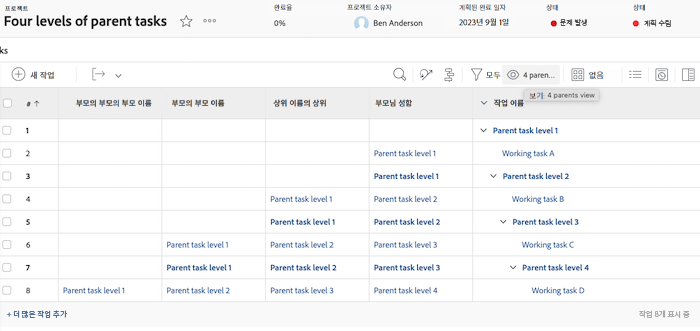

## 사용자 - 사용자 보기에 목록을 보여 주는 반복

### 사용자 - 모든 작업 역할

```
displayname=All job roles
listdelimiter=<p>
listmethod=nested(userRoles).lists
textmode=true
type=iterate
valuefield=role:name
valueformat=HTML
```

### 사용자 - 기본을 보여 주는 모든 작업 역할

```
displayname=All Job Roles showing primary
listdelimiter=<p> 
listmethod=nested(userRoles).lists 
textmode=true
type=iterate 
valueexpression=IF({user}.{roleID}={role}.{ID},CONCAT("** ",{role}.{name}," **"),{role}.{name})
valueformat=HTML
```

### 사용자 - 모든 팀

```
displayname=All teams
listdelimiter=<p>
listmethod=nested(teams).lists
textmode=true
type=iterate
valueexpression={name}
valueformat=HTML
```

>[!NOTE]
>
>모든 팀을 쉼표로 구분하여 표시하는 UI를 통해 액세스할 수 있는 팀 필드가 있지만, 위의 텍스트 모드를 사용하면 각 팀이 별도의 줄에 표시됩니다.


### 사용자 - 모든 그룹

```
displayname=All groups
listdelimiter=<p>
listmethod=nested(userGroups).lists
textmode=true
type=iterate
valuefield=group:name
valueformat=HTML
```

### 사용자 - 홈 그룹을 표시하는 모든 그룹

```
displayname=All groups showing home group
listdelimiter=<p>
listmethod=nested(userGroups).lists
textmode=true
type=iterate
valueexpression=IF({user}.{homeGroupID}={group}.{ID},CONCAT("** ",{group}.{name}," **"),{group}.{name})
valueformat=HTML
```


### 사용자 - 부하 직원

```
displayname=Direct reports
listdelimiter=<p>
listmethod=nested(directReports).lists
textmode=true
type=iterate
valueexpression={name}
valueformat=HTML
```

### 사용자 - 향후 PTO

```
displayname=Future PTO
listdelimiter=<br>
listmethod=nested(reservedTimes).lists
namekey=group.plural
textmode=true
type=iterate
valueexpression=IF({startDate}>$$TODAY,CONCAT({startDate}," - ",{endDate}),"")
valueformat=HTML
width=150
```

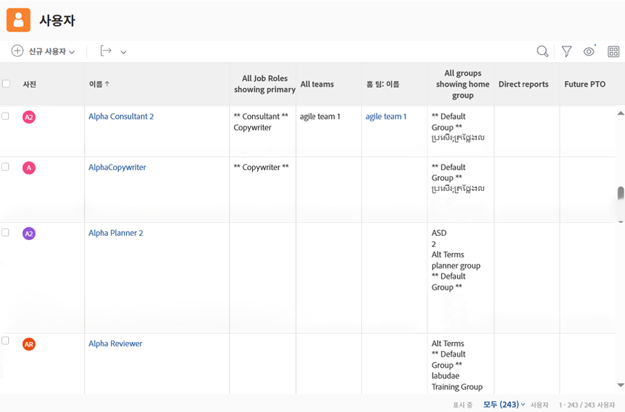

## 작업 - 작업 할당 및 작업 상태를 보여 주는 방법

```
displayname=Assignments and Status
listdelimiter=<br>
listmethod=nested(assignments).lists
namekey=group.plural
textmode=true
type=iterate
valueexpression=CONCAT({assignedTo}.{name},IF(ISBLANK({assignedTo}.{name}),"",IF({status}="AA"," - Requested",IF({status}="AD"," - Working"," - Done"))))
valueformat=HTML
width=150
```

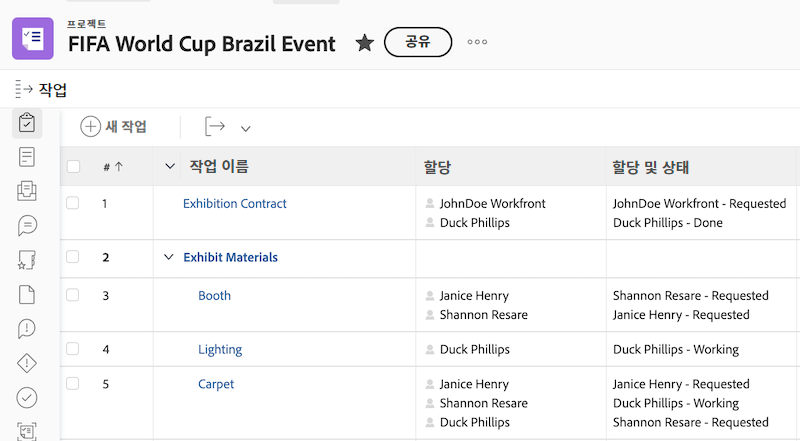


## 작업 - 여러 작업 할당에 대한 역할 및 할당을 표시하는 방법

### 작업 - 역할 + 시간

```
displayname=Role+hours
listdelimiter=<li>
listmethod=nested(assignments).lists
textmode=true
type=iterate
valueexpression=CONCAT({role}.{name}," (",round({workRequired}/60,2),")")
valueformat=HTML
```

### 작업 - 할당 + 백분율 할당

```
displayname=Assignment+percent
valueexpression=CONCAT({assignedTo}.{name}," (",{assignmentPercent},")")
listdelimiter=<li>
listmethod=nested(assignments).lists
valueformat=HTML
textmode=true
type=iterate
```

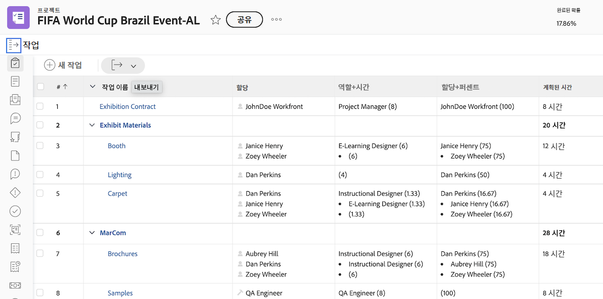

## 작업 - 프로젝트 간 전임 작업 및 후임 작업

### 작업 필터(옵션)

**현재 프로젝트에서 하나 이상의 프로젝트 간 전임 작업 또는 하나 이상의 프로젝트 간 후임 작업이 있는 모든 작업 표시**

```
predecessorsMM:ID_Mod=notblank
predecessorsMM:projectID=FIELD:projectID
predecessorsMM:projectID_Mod=ne
project:statusEquatesWith=CUR
project:statusEquatesWith_Mod=in
OR:1:project:statusEquatesWith=CUR
OR:1:project:statusEquatesWith_Mod=in
OR:1:successorsMM:ID_Mod=notblank
OR:1:successorsMM:projectID=FIELD:projectID
OR:1:successorsMM:projectID_Mod=ne
```

### 작업 - 전임 작업 이름 및 프로젝트 전임 작업의 위치 표시

```
displayname=Predecessor names
listdelimiter=<br>
listmethod=nested(predecessors).lists
namekey=group.plural
textmode=true
type=iterate
valueexpression=CONCAT("TASK = ",{predecessor}.{name}," >> PROJECT = ",{predecessor}.{project}.{name})
valueformat=HTML
width=150
```

### 작업 - 후임 작업 이름 및 프로젝트 후임 작업의 위치 표시

```
displayname=Successor names
listdelimiter=<br>
listmethod=nested(successors).lists
namekey=group.plural
textmode=true
type=iterate
valueexpression=CONCAT("TASK = ",{successor}.{name}," >> PROJECT = ",{successor}.{project}.{name})
valueformat=HTML
width=150
```

### 작업 - 전임 작업의 예상 완료 일자 표시

```
displayname=Predecessor projected completion dates
valueformat=atDate
listdelimiter=
textmode=true
width=90
stretch=0
valuefield=predecessor:projectedCompletionDate
type=iterate
listmethod=nested(predecessors).lists
shortview=false
```

### 작업 - 전임 작업의 진행 상태 표시

```
displayname=Predecessor progress status
listdelimiter=<br>
listmethod=nested(predecessors).lists
shortview=false
stretch=0
textmode=true
type=iterate
valueexpression=IF({predecessor}.{progressStatus}="OT","On Time",IF({predecessor}.{progressStatus}="LT","Late",IF({predecessor}.{progressStatus}="BH","Behind","At Risk")))
valueformat=HTML
width=90
```

### 작업 - 프로젝트 간 전임 작업의 프로젝트 완료율 표시

```
displayname=Predecessor project percent complete
listdelimiter=<br>
listmethod=nested(predecessors).lists
namekey=group.plural
textmode=true
type=iterate
valueexpression=IF({isCP}=true,CONCAT({predecessor}.{project}.{percentComplete},"%"),"")
valueformat=HTML
width=150
```

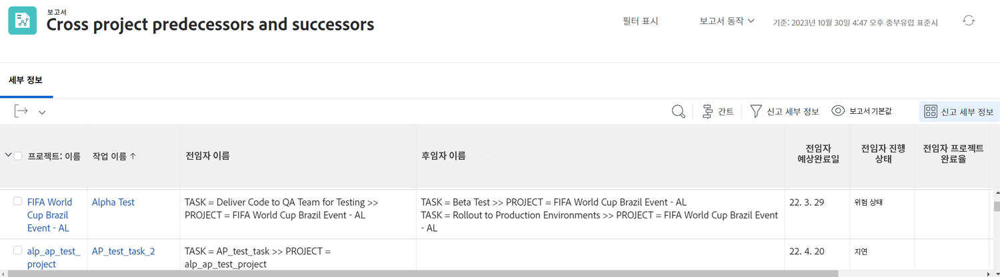


## 작업 - 할당된 모든 사용자 및 각 사용자를 할당한 모든 사용자를 보여 주는 반복

```
displayname=All assignees and requesters
listdelimiter=<p>
listmethod=nested(assignments).lists
textmode=true
type=iterate
valueexpression=CONCAT("Assigned To: ",{assignedTo}.{name},"; Requested By: ",{assignedBy}.{name})
valueformat=HTML
```

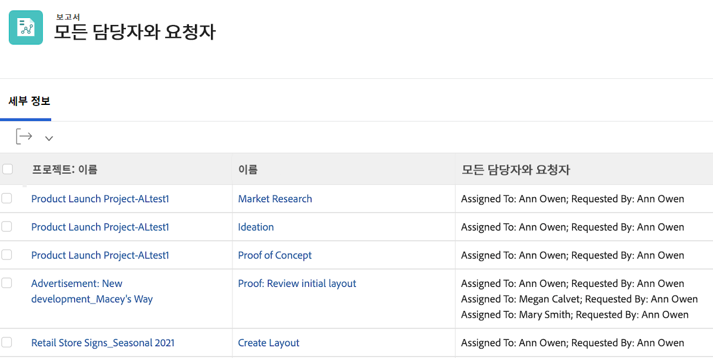

## 작업/프로젝트 - 프로젝트 또는 작업에 대한 모든 사용자 정의 양식을 보여 주는 반복

```
displayname=All Forms Assigned
listdelimiter=<p>
listmethod=nested(objectCategories).lists
textmode=true
type=iterate
valuefield=category:name
valueformat=HTML
```

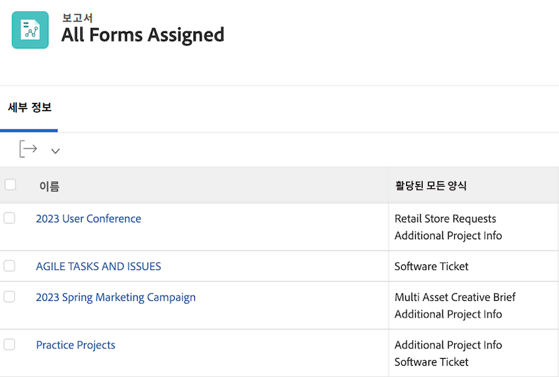


## 프로젝트 - 프로젝트 보기에서 해결 가능한 항목의 모든 기본 연락처를 보여 주는 반복

```
displayname=Requestor
listdelimiter=<br>
listmethod=nested(resolvables).lists
namekey=group.plural
textmode=true
type=iterate
valuefield=owner:name
valueformat=HTML
width=150
```

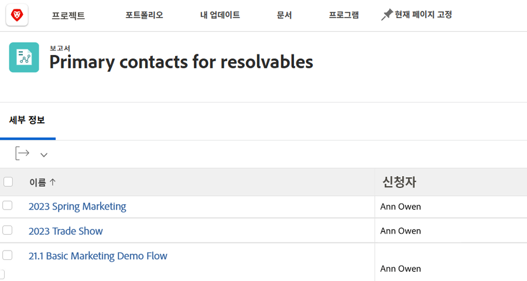

## 프로젝트 - 모든 프로젝트 팀원을 보여 주는 반복

```
displayname=Project Team Members
listdelimiter=<br>
listmethod=nested(projectUsers).lists
namekey=group.plural
textmode=true
type=iterate
valuefield=user:name
valueformat=HTML
```

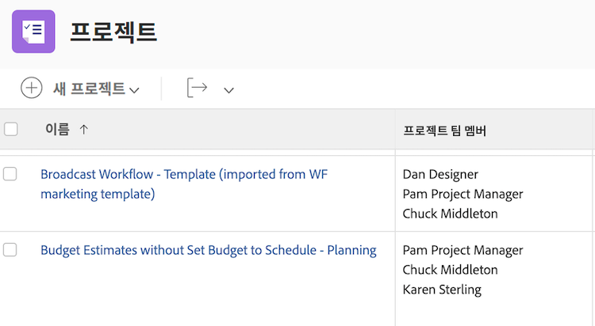

## 프로젝트 - 해결 가능한 프로젝트의 모든 문제에 대한 entryDate를 보여 주는 반복

```
displayname=Resolvables entry date
linkedname=direct
listdelimiter=<br>
listmethod=nested(project.resolvables).lists
listsort=string(description)
querysort=description
section=0
textmode=true
type=iterate
valuefield=entryDate
valueformat=HTML
```

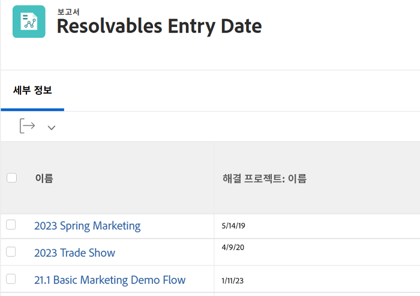

## 프로젝트 - 원래 프로젝트 요청자의 홈 그룹 표시

```
displayname=Requestor home group
linkedname=direct
namekey=name
querysort=convertedOpTaskOriginator:homeGroup:name
textmode=true
valuefield=convertedOpTaskOriginator:homeGroup:name
valueformat=HTML
```

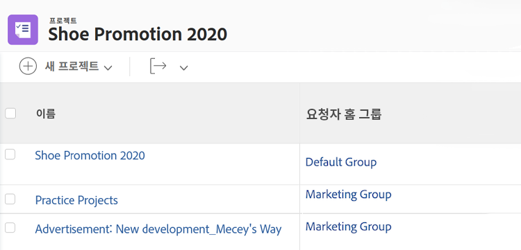

## 프로젝트 - 프로젝트가 요청 대기열인지 여부 표시

```
querysort=queueDef:isPublic
valueformat=val
description=0 (None), 1 (Public), 2 (Private), 3 (Company), 4 (Group)
linkedname=direct
textmode=true
enumtype=PROJ
valuefield=queueDef:isPublic
namekey=status
type=enum
enumclass=com.attask.common.constants.ProjectStatusEnum
displayname=Public Selection
```

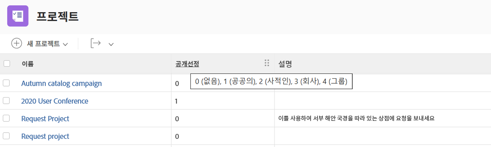

## 문제 - 모든 해결 프로젝트 팀원을 보여 주는 반복

```
displayname=Resolve Project: Team Members
listdelimiter=<br>
listmethod=nested(resolveProject.projectUsers).lists
namekey=group.plural
textmode=true
type=iterate
valuefield=user:name
valueformat=HTML
width=150
```

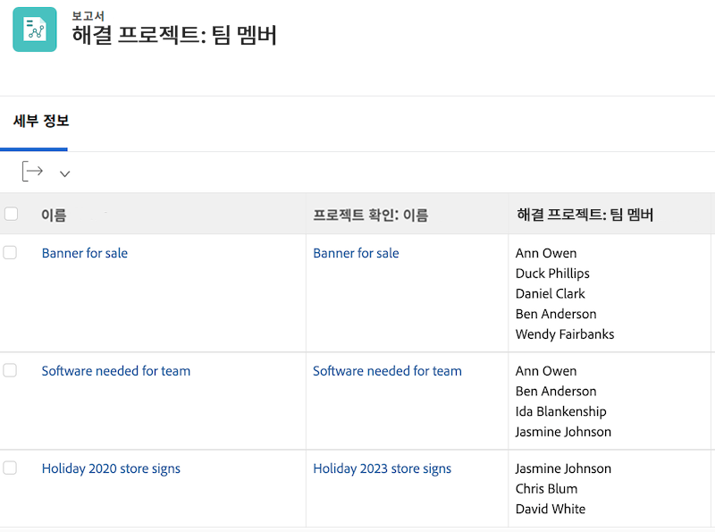

## 문제 - 문제의 기본 연락처의 모든 팀을 보여 주는 반복

```
displayname=Requestor Teams
listdelimiter=<br>
listmethod=nested(owner.teams).lists
namekey=group.plural
textmode=true
type=iterate
valuefield=name
valueformat=HTML
width=150
```


## 문서 - 문서 보고서에 폴더를 보여 주는 반복

```
displayname=Folder
listdelimiter=<br><br>
listmethod=nested(folders).lists
textmode=true
type=iterate
valuefield=name
valueformat=HTML
```

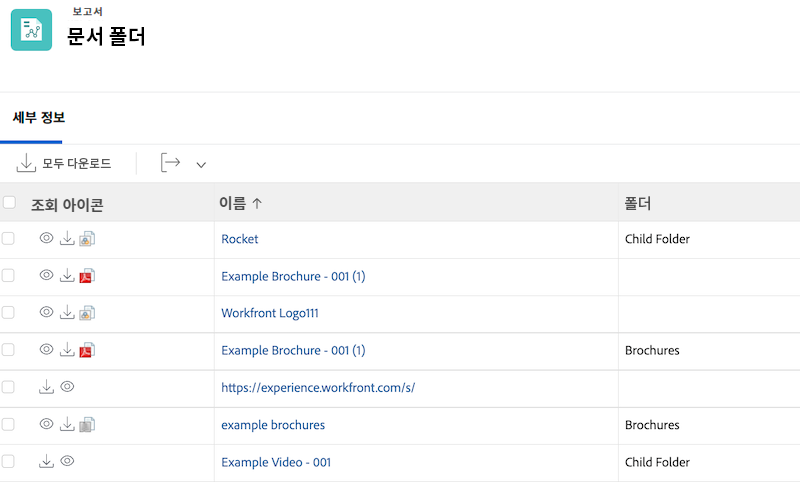

## 문서 - 문서 보고서에 상위 폴더를 보여 주는 반복

```
displayname=Parent Folder
listdelimiter=<br><br>
listmethod=nested(folders).lists
textmode=true
type=iterate
valuefield=parent:name
valueformat=HTML
```

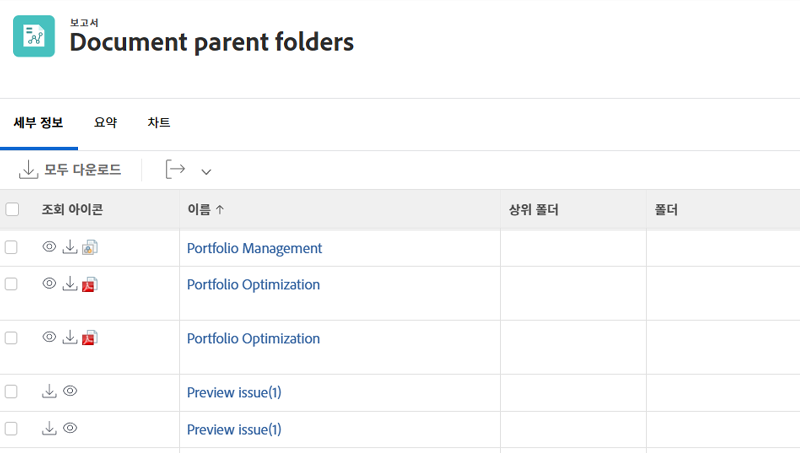

## 문서 - 문서 승인 일자

```
displayname=Document approval dates
valueformat=HTML
listdelimiter=<br>
linkedname=direct
textmode=true
listsort=string(description)
valuefield=approvalDate
type=iterate
listmethod=nested(approvals).lists
shortview=false
section=0
```

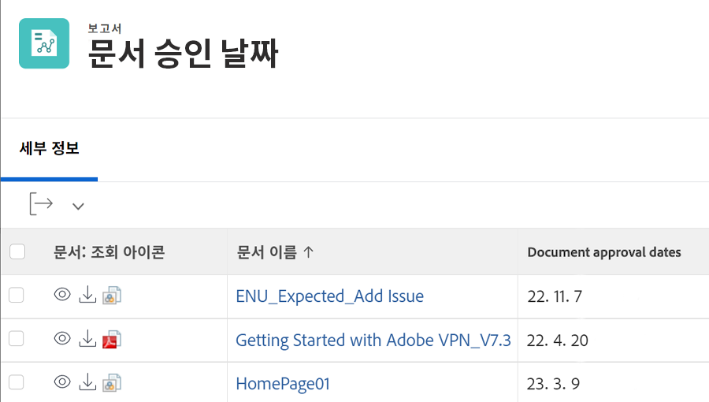

## 증명 승인

### 증명 승인 - 프로젝트 이름 표시

```
displayname=Project Name
textmode=true 
valuefield=documentVersion:document:project:name 
valueformat=HTML
```

### 증명 승인 - 작업 이름 표시

```
displayname=Task Name
textmode=true 
valuefield=documentVersion:document:task:name 
valueformat=HTML
```

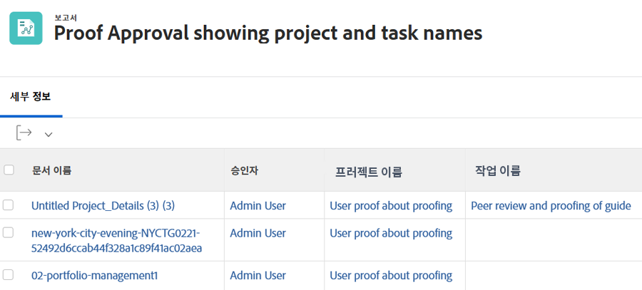
