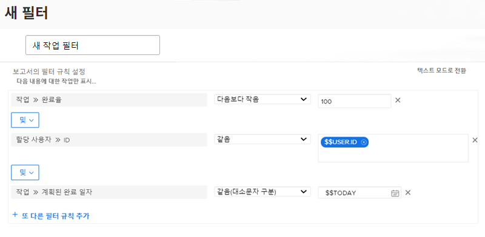

# 일자 기반의 와일드카드로 필터 만들기

이 비디오에서는 다음 방법을 배우게 됩니다.

* 일자 기반의 와일드카드를 사용하는 시기 파악
* Workfront의 두 가지 일자 기반의 와일드카드 간의 차이점 이해
* 필터에 일자 기반의 와일드카드 추가
* 와일드카드, 속성, 연산자 및 수정자를 사용하여 사용자 정의 일자 만들기
* 와일드카드를 사용하여 사용자 정의 날짜 범위 만들기

>[!VIDEO](https://video.tv.adobe.com/v/336812/?quality=12&learn=on)

## &quot;날짜 기반 와일드카드로 필터 만들기&quot; 활동

### 활동 질문

1. 기한이 어제 또는 오늘인 문제를 원하는 경우, 필터 규칙을 어떻게 빌드합니까?
1. 지난주 마감인 프로젝트를 찾으려면 필터 규칙을 어떻게 빌드합니까?
1. 다음 필터 규칙은 정기적으로 사용하는 작업 보고서의 일부입니다. 이 보고서에서 어떤 유형의 결과를 얻을 수 있습니까?

### 답변

1. [!UICONTROL $$TODAY-1d] 및 [!UICONTROL $$TODAY] 사이에 계획된 완료 일자가 있는 문제를 필터링합니다.
1. [!UICONTROL $$TODAYb-1w] 및 [!UICONTROL $$TODAYe-1w] 사이에 계획된 완료 일자가 있는 프로젝트를 필터링합니다.
1. 이 보고서는 귀하에게 할당된 아직 완료되지 않고(완료율이 100 미만) 기한이 지났거나 오늘 예정인 작업을 찾습니다. 작업의 계획된 완료 일자에 대한 필터 규칙은 기한이 오늘 일자와 같거나 그 이전인 작업을 살펴보도록 합니다.
