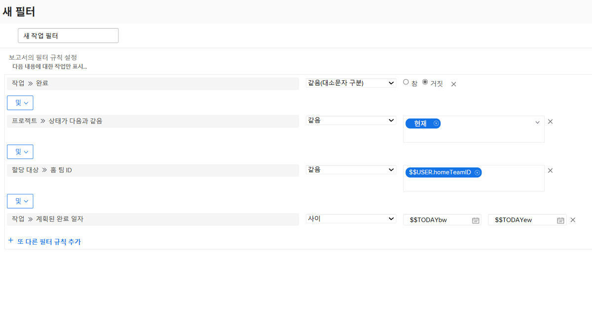

# 사용자 기반의 와일드카드로 필터 만들기

이 비디오에서는 다음 방법을 배우게 됩니다.

* 와일드카드를 사용하는 이유 이해
* 사용자 기반의 와일드카드로 필터 빌드

>[!VIDEO](https://video.tv.adobe.com/v/336810/?quality=12&learn=on&enablevpops=0)

>[!TIP]
>
>작업 또는 문제 할당 정보를 조회하는 필터를 빌드할 때 할당 사용자 >> ID 필드 소스 및 이름을 사용합니다. 이 옵션은 &quot;소유자&quot; 또는 기본 할당자뿐만 아니라 작업 또는 문제에 할당된 모든 사용자를 살펴봅니다.

>[!TIP]
>
>필터를 직접 빌드할 때도 이름 대신 $$USER.ID를 사용합니다. 이렇게 하면 다른 사람이 해당 필터를 보고 “나도 공유해 줘”라고 요청할 경우, 필터를 보는 각 사용자에게 해당하는 정보가 표시됩니다.

>[!TIP]
>
>사용자 기반의 와일드카드를 사용할 때는 항상 Equal 필터 한정자를 사용해야 합니다.

## “사용자 기반의 와일드카드로 필터 만들기” 활동

### 활동 1

이번 주에는 약간의 여유 시간이 있으므로 팀에 할당 작업에 도움을 줄 수 있는 사람이 있는지 확인하려 합니다. 작업 필터를 만들어 홈 팀에 할당된 작업 중 이번 주에 만료되고 아직 완료되지 않은 작업을 찾습니다.

### 답변 1

성공적으로 팀원들을 도와주었습니다. 아래 이미지와 같이 필터를 설정하면 아래와 같은 작업을 찾을 수 있습니다.

* 완료되지 않은 작업(즉, [!UICONTROL 완료] 상태 또는 [!UICONTROL 완료]에 해당하는 상태가 아님)
* [!UICONTROL 현재] 상태인 프로젝트에 있는 작업 (아직 시작되지 않은 프로젝트에 대한 작업은 필요하지 않으므로)
* Workfront 팀 설정 따라 홈 팀의 사용자에게 할당된 작업
* 완료 일자가 이번 주인 작업 (이 규칙은 사전 설치된 날짜 필터를 사용하여 “이번 주”를 정의함)

목록을 좀 더 제한해야 하는 경우, 몇 가지 추가 필터를 추가해야 할 수도 있습니다. 예를 들어 팀에서 작업하는 특정 프로그램이나 포트폴리오를 보는 필터 규칙을 추가할 수 있습니다.
