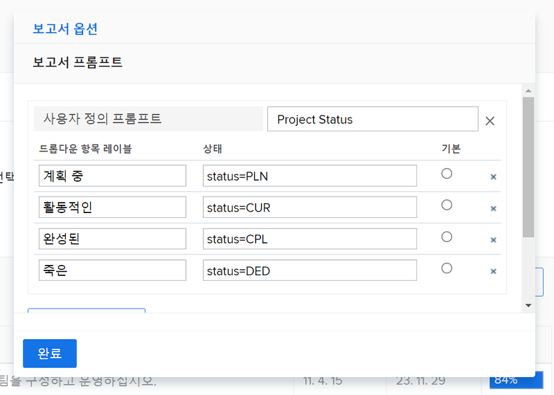
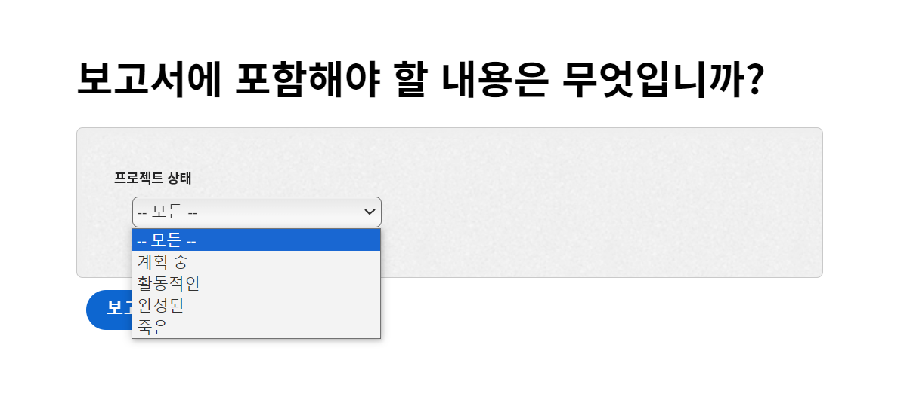
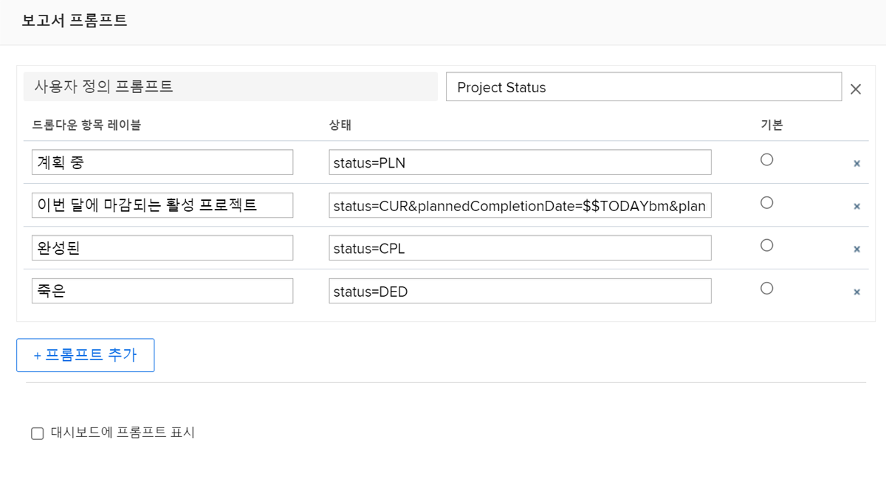

# 사용자 정의 프롬프트 만들기

이 비디오를 통해 다음과 같은 사항을 알아볼 수 있습니다.

* 사용자 정의 프롬프트란
* 텍스트 모드를 사용하여 사용자 정의 프롬프트를 만드는 방법
* 보고에 사용할 수 있는 몇 가지 예

>[!VIDEO](https://video.tv.adobe.com/v/336822/?quality=12&learn=on)

## “사용자 정의 프롬프트 만들기” 활동


### 활동: 사용자 정의 프롬프트 만들기

1. 프롬프트 드롭다운 메뉴에서 다음 프로젝트 상태를 표시하는 사용자 정의 프롬프트를 만듭니다.
   * 계획 수립
   * 현재
   * 완료됨
   * 중단
1. 이번 달 마감인 현재 프로젝트를 표시하도록 프롬프트를 수정합니다.

### 답변

1. 사용자 정의 프롬프트는 이와 유사하게 표시되어야 하며 텍스트 모드는 다음과 같습니다.

   

   사용자 정의 프롬프트를 저장하면 프롬프트 드롭다운 메뉴가 다음과 같이 표시됩니다.

1. 사용자 정의 프롬프트의 텍스트 모드는 다음과 같아야 합니다.



```
   status=CUR&plannedCompletionDate=$$TODAYbm&plannedCompletionDate_Mod=between&plannedCompletionDate_Range=$$TODAYem 
```

활성 프롬프트의 드롭다운 레이블은 다음과 같이 코드의 변경 사항을 반영하도록 업데이트되어야 합니다.


