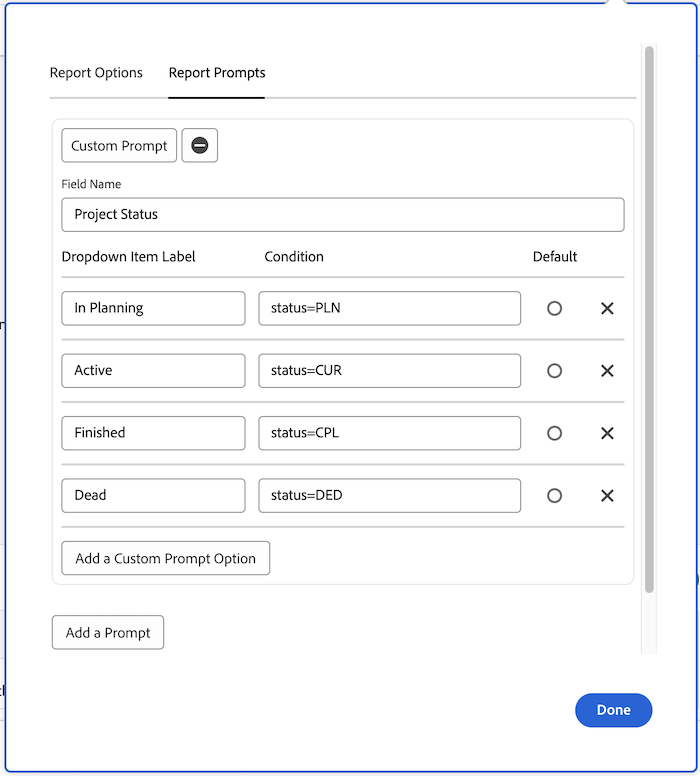
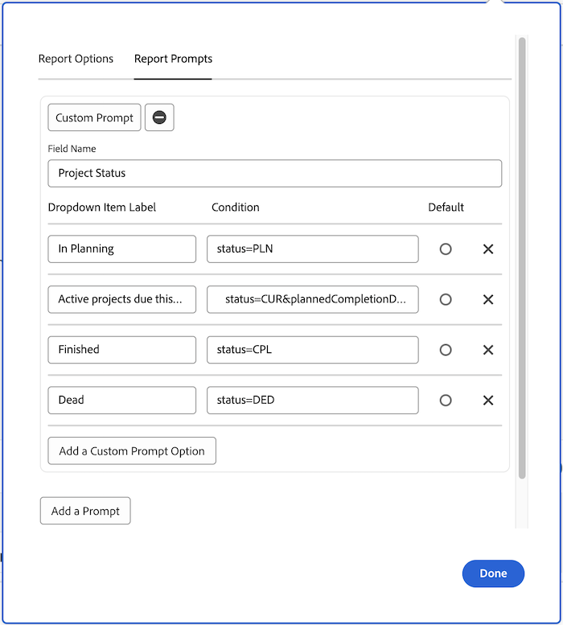

# 사용자 정의 프롬프트 만들기

이 비디오에서는 다음을 학습합니다.

* 사용자 지정 프롬프트 정의
* 텍스트 모드를 사용하여 사용자 정의 프롬프트를 만드는 방법
* 보고에서 사용할 수 있는 몇 가지 예입니다

>[!VIDEO](https://video.tv.adobe.com/v/336822/?quality=12)

## 활동: 사용자 정의 프롬프트 만들기

1. 프롬프트 드롭다운 메뉴에 다음 프로젝트 상태를 표시하는 사용자 지정 메시지를 만듭니다.
   * 계획 수립
   * 현재
   * 완료됨
   * 중단
1. 이번 달에 만기되는 현재 프로젝트를 표시하도록 메시지를 수정합니다.

## 답변

1. 사용자 지정 프롬프트는 다음과 유사하고 다음 텍스트 모드가 있어야 합니다.

   

   사용자 지정 프롬프트를 저장하면 프롬프트 드롭다운 메뉴는 다음과 같이 표시됩니다.

1. 사용자 지정 프롬프트의 텍스트 모드는 다음과 같습니다.


```
   status=CUR&plannedCompletionDate=$$TODAYbm&plannedCompletionDate_Mod=between&plannedCompletionDate_Range=$$TODAYem 
```

또한 다음과 같이 코드에서 변경 사항을 반영하도록 활성 프롬프트에 대한 드롭다운 레이블을 업데이트해야 합니다.


