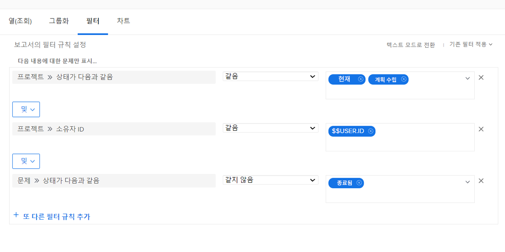
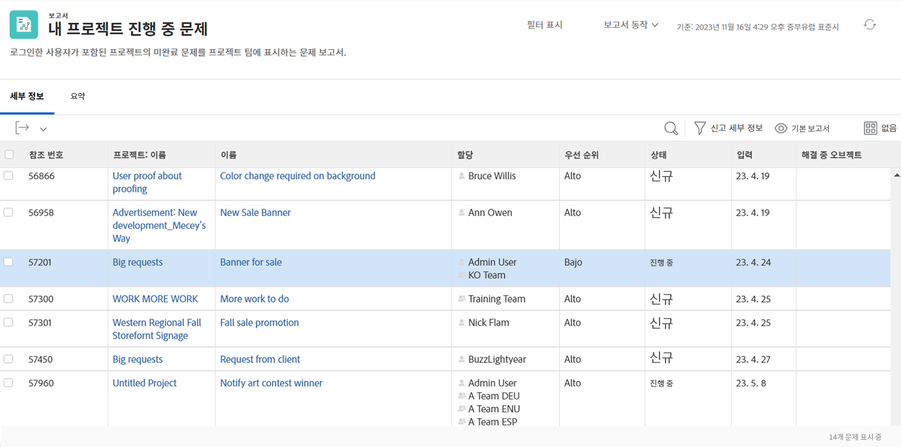

# 기본 제공 문제 필터 이해

이 비디오에서는 다음과 같은 작업을 수행합니다.

* 기본 제공 문제 필터를 검토하여 빌드 방법 확인
* 몇 가지 유용한 문제 보고 요소에 대해 알아보기
* 고유한 문제 필터를 만드는 방법 알아보기

>[!VIDEO](https://video.tv.adobe.com/v/3412681/?quality=12&learn=on&captions=kor)

## “기본 제공 문제 필터 이해하기” 활동

### 활동: 문제 보고서 만들기

해결 중인 오브젝트와 관련된 문제를 포함하여 소유한 모든 활성 프로젝트에서 여전히 해결해야 하는 모든 문제를 확인하고자 합니다. 문제 보고서를 만들고 이름을 “소유한 프로젝트에서 해결되지 않은 문제”로 지정합니다.

### 답변

필터는 다음과 같이 표시됩니다.

“내 미해결 문제” 기본 제공 필터에서 필터 규칙 중 하나를 사용하여 해결 중인 오브젝트가 있는 모든 문제를 제외했습니다. 누군가 이미 해결을 위한 프로젝트, 작업 또는 문제를 만들었으므로, 이러한 문제들에는 더 이상 신경 쓸 필요가 없기 때문입니다. 하지만 이러한 문제는 아직 미해결 상태입니다. 이 예에서는 이들 문제가 포함되어 있어 손쉽게 식별하고 진행 상태를 확인해 볼 수 있습니다.

이렇게 하려면 보기 탭에서 “문제 >> 해결 중인 오브젝트” 열을 추가해야 합니다. 프로젝트, 작업 또는 문제 여부에 관계없이 해결 중인 오브젝트의 이름이 있는 경우 이를 표시합니다. 이름을 클릭하면 해결 중인 오브젝트로 이동합니다.

프로젝트 이름을 기준으로 목록을 그룹화할 수 있습니다.

보고서는 다음과 같이 표시됩니다.

