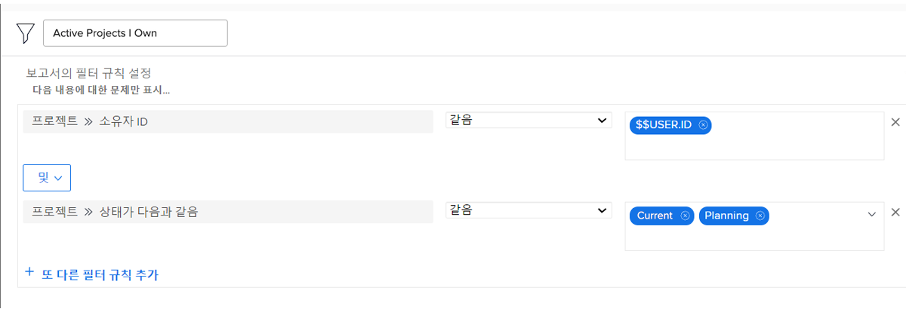

# 기본 제공 프로젝트 필터 이해

이 비디오에서는 다음 방법을 배우게 됩니다.

* 기본 제공 프로젝트 필터를 검토하여 빌드 방법 확인
* 학습한 내용을 사용하여 나만의 프로젝트 필터 만들기

>[!VIDEO](https://video.tv.adobe.com/v/336817/?quality=12&learn=on)

## “기본 제공 프로젝트 필터 이해하기” 활동

### 활동: 프로젝트 필터 만들기

소유하고 있는 모든 활성 프로젝트를 보고 싶습니다. 여기서 “활성”은 프로젝트 상태가 계획 또는 현재와 동일함을 의미합니다. 프로젝트 영역에서 “내가 소유한 활성 프로젝트”라는 이름의 프로젝트 필터를 만듭니다.

### 답변

필터는 다음과 같아야 합니다.

특정 프로그램 또는 포트폴리오에서 프로젝트 찾기와 같은 추가 필터 규칙을 포함할 수 있습니다. 이 작업을 수행할 때 Workfront는 필터 이름을 “마케팅 포트폴리오의 내가 소유한 활성 프로젝트”와 같이 적절한 설명이 포함된 이름으로 바꿀 것을 권장합니다.
