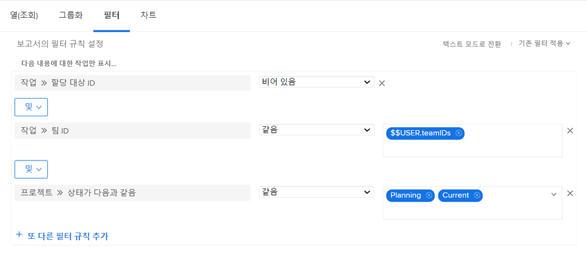
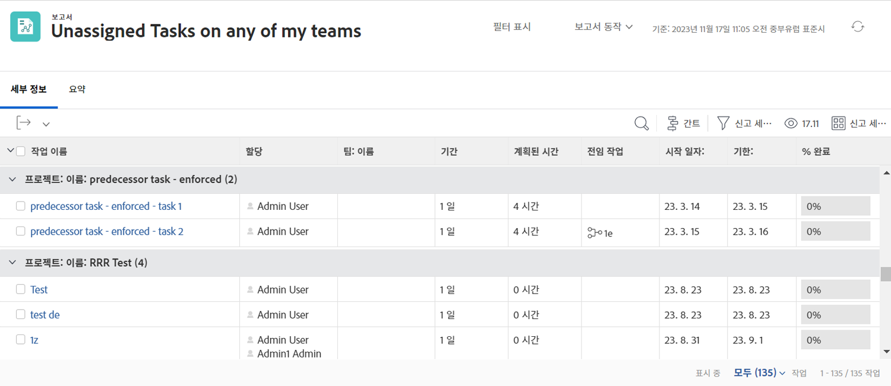

# 기본 제공 작업 필터 이해

이 비디오에서는 다음과 같은 작업을 수행합니다.

* 기본 제공 작업 필터를 검토하여 빌드 방법 확인
* 몇 가지 유용한 작업 보고 요소에 대해 알아보기
* 고유한 작업 필터를 만드는 방법 알아보기

>[!VIDEO](https://video.tv.adobe.com/v/336818/?quality=12&learn=on&enablevpops)

## 활동: 작업 보고서 만들기

아직 아무도 작업에 동의하지 않은 팀 중 하나에 할당된 작업을 알고 있는지 확인하려고 합니다. “내 팀의 미할당 작업”이라는 작업 보고서를 만듭니다.

## 답변

필터는 다음과 같이 표시됩니다.

관심 있는 필드 또는 인라인 편집을 원하는 필드를 포함하도록 열 보기를 설정합니다. 예를 들어 할당 열을 포함하여 보고서에서 직접 팀원을 작업에 할당할 수 있습니다.

각 작업에 할당된 팀의 이름을 기준으로 목록을 그룹화할 수 있습니다.

보고서는 다음과 같이 표시됩니다.

